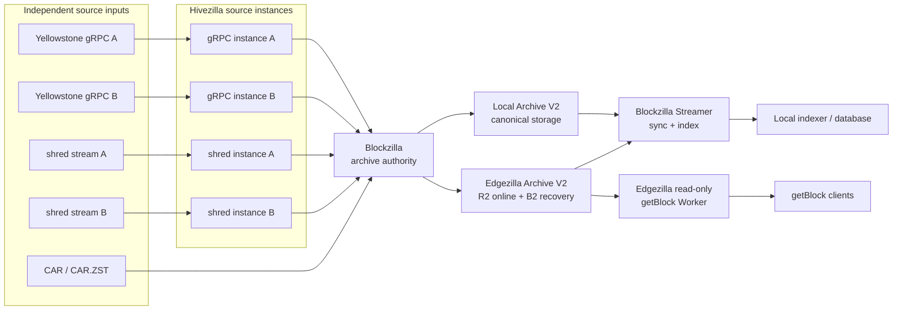

# Blockzilla system schema

Status: **proposed target architecture**. The current implementation status is
listed below the diagram.

The repeated Hivezilla boxes are deliberate: each source instance has its own
identity, cursor, WAL, and failure boundary. They meet at Blockzilla, which owns
deduplication, repair, ordering, validation, and canonical publication.

There is no Hivezilla-to-Streamer path. Streamer consumes only committed
Blockzilla archives. There is also no Edgezilla write path: Blockzilla writes
and verifies both edge copies; Edgezilla stores and serves them read-only.

## Responsibilities

- **Hivezilla** captures one network source per independently supervised
  instance and preserves replay evidence when downstream processing fails.
- **Blockzilla** is the main product and sole archive authority. It accepts CAR
  or Hivezilla evidence and produces canonical Archive V2.
- **Edgezilla** is the replicated read boundary: one Archive V2 generation is
  copied to R2 for online reads and B2 for recovery, then exposed by a read-only
  Worker.
- **Blockzilla Streamer** is the planned indexer-facing path. It reads compact
  blocks from verified local or edge storage for backfill and follow.

## Current implementation

| Path | Status on current `main` |
| --- | --- |
| CAR/CAR.ZST → Blockzilla → local Archive V2 | Implemented |
| Current Hivezilla capture directory → Blockzilla → local Archive V2 | Implemented prototype path |
| Yellowstone capture and durable-ingest foundations | Implemented under `hivezilla/` |
| Multiple production gRPC instances | Planned |
| Shred Hivezilla implementation | Planned |
| Blockzilla server, scheduler, and R2/B2 publisher | Planned |
| R2 → read-only Edgezilla Worker → `getBlock` | Implemented |
| Experimental CAR-backed Edgezilla compatibility Worker | Restored and buildable; intentionally outside the canonical schema above |
| Independently verified B2 publication/recovery | Planned |
| `blockzilla sync` and `blockzilla stream` | Planned |

See the [system overview](system-overview.md), the
[Streamer contract](local-streaming.md), and the
[roadmap](../../ROADMAP.md) for the boundaries behind this schema.

The repository also contains a read-only experimental Old Faithful CAR-backed
Worker. It is useful for compatibility and reference testing, but it is not a
Blockzilla Archive V2 authority and is intentionally omitted from the main
product flow above.
