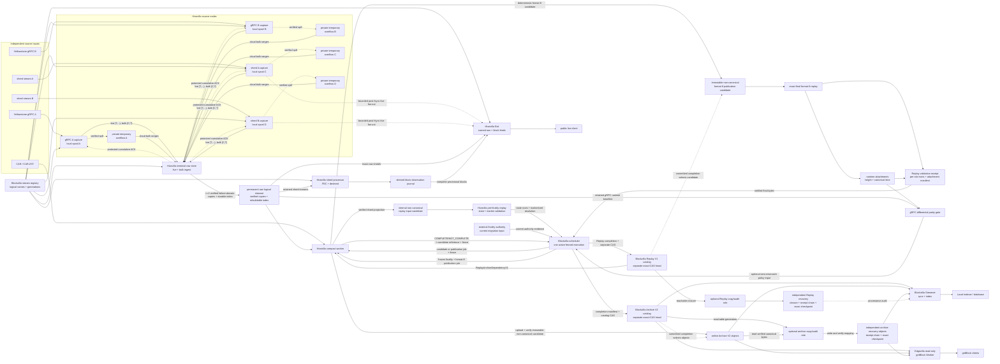

# Blockzilla system schema

Status: **proposed target architecture**. The current implementation status is
listed below the diagram.

```mermaid
flowchart LR
    subgraph SOURCES["Independent source inputs"]
        direction TB
        G1["Yellowstone gRPC A"]
        G2["Yellowstone gRPC B"]
        S1["shred stream A"]
        S2["shred stream B"]
        CAR["CAR / CAR.ZST"]
    end

    subgraph HIVES["Hivezilla source nodes"]
        direction TB
        HG1["gRPC A capture<br/>local spool A"]
        HG2["gRPC B capture<br/>local spool B"]
        HS1["shred A capture<br/>local spool C"]
        HS2["shred B capture<br/>local spool D"]
        OG1["private temporary<br/>overflow A"]
        OG2["private temporary<br/>overflow B"]
        OS1["private temporary<br/>overflow C"]
        OS2["private temporary<br/>overflow D"]
        HG1 -. "verified spill" .-> OG1
        HG2 -. "verified spill" .-> OG2
        HS1 -. "verified spill" .-> OS1
        HS2 -. "verified spill" .-> OS2
    end

    REG["Blockzilla stream registry<br/>logical names + generations"]
    INGEST["Hivezilla terminal raw store<br/>live + bulk ingest"]
    RAW["permanent raw logical dataset<br/>verified copies + rebuildable index"]
    PROC["Hivezilla shred processor<br/>FEC + deshred"]
    OBS["derived block-observation journal"]
    EXIT["Hivezilla Exit<br/>named raw + block feeds"]
    SCHED["Blockzilla scheduler<br/>one active fenced execution"]
    EXTFIN["external finality authority<br/>current migration input"]
    CATALOG["Blockzilla Archive V2 catalog<br/>separate exact-CAS head"]
    COMPACT["Hivezilla compact worker"]
    REPLAYINPUT["internal non-canonical<br/>replay input candidate"]
    REPLAYOBJ["immutable non-canonical<br/>format-8 publication candidate"]
    REPLAY["Hivezilla pre-finality replay<br/>state + marker validation"]
    FINALREPLAY["exact final format-8 replay"]
    RECEIPT["Replay validation receipt<br/>per-slot roots + attachment manifest"]
    ATTACH["runtime attachments<br/>height + canonical time"]
    PARITY["gRPC differential parity gate"]
    REPLAYCAT["Blockzilla Replay V1 catalog<br/>separate exact-CAS head"]
    LIVE["public live client"]
    ONLINE["online Archive V2 objects"]
    COPY["optional archive copy/audit role"]
    RECOVERY["independent archive recovery objects<br/>receipt chain + exact checkpoint"]
    RCOPY["optional Replay copy/audit role"]
    RRECOVERY["independent Replay recovery<br/>closure + receipt chain + exact checkpoint"]
    STREAM["Blockzilla Streamer<br/>sync + index"]
    DB["Local indexer / database"]
    WORKER["Edgezilla read-only<br/>getBlock Worker"]
    RPC["getBlock clients"]
    G1 --> HG1
    G2 --> HG2
    S1 --> HS1
    S2 --> HS2
    REG --> HG1
    REG --> HG2
    REG --> HS1
    REG --> HS2
    REG --> INGEST
    REG --> PROC
    REG --> EXIT
    HG1 -->|"live [T,...), bulk [C,T)"| INGEST
    HG2 -->|"live [T,...), bulk [C,T)"| INGEST
    HS1 -->|"live [T,...), bulk [C,T)"| INGEST
    HS2 -->|"live [T,...), bulk [C,T)"| INGEST
    OG1 -->|"cloud bulk ranges"| INGEST
    OG2 -->|"cloud bulk ranges"| INGEST
    OS1 -->|"cloud bulk ranges"| INGEST
    OS2 -->|"cloud bulk ranges"| INGEST
    INGEST -->|">=2 verified failure-domain copies + durable index"| RAW
    INGEST -. "protected cumulative ACK" .-> HG1
    INGEST -. "protected cumulative ACK" .-> HG2
    INGEST -. "protected cumulative ACK" .-> HS1
    INGEST -. "protected cumulative ACK" .-> HS2
    RAW -->|"retained shred streams"| PROC
    HS1 -. "bounded post-fsync live fan-out" .-> EXIT
    HS2 -. "bounded post-fsync live fan-out" .-> EXIT
    RAW -->|"exact raw shreds"| EXIT
    PROC --> OBS -->|"complete provisional blocks"| EXIT
    EXIT --> LIVE
    CAR --> COMPACT
    RAW --> COMPACT
    SCHED -->|"candidate or publication job + fence"| COMPACT
    COMPACT -->|"verified shred projection"| REPLAYINPUT
    REPLAYINPUT --> REPLAY
    REPLAY -->|"state roots + marker/cert resolution"| SCHED
    EXTFIN -->|"current authority evidence"| SCHED
    SCHED -->|"frozen finality + format-8 publication job"| COMPACT
    COMPACT -->|"deterministic format-8 candidate"| REPLAYOBJ
    REPLAYOBJ --> FINALREPLAY
    FINALREPLAY --> RECEIPT
    FINALREPLAY --> ATTACH --> PARITY
    ATTACH --> RECEIPT
    RECEIPT -->|"verified final bytes"| SCHED
    RAW -->|"retained gRPC runtime baseline"| PARITY
    PARITY -->|"optional zero-mismatch policy input"| SCHED
    SCHED -->|"Replay completion + separate CAS"| REPLAYCAT
    REPLAYCAT -->|"reachable closure"| RCOPY --> RRECOVERY
    REPLAYCAT -. "committed completion selects candidate" .-> REPLAYOBJ
    REPLAYCAT -->|"ReplayArchiveDependencyV1"| COMPACT
    COMPACT -->|"upload + verify immutable non-canonical candidate"| ONLINE
    COMPACT -->|"COMPLETE/NOT_COMPLETE + candidate reference + fence"| SCHED
    SCHED -->|"completion manifest + catalog CAS"| CATALOG
    CATALOG -. "committed completion selects objects" .-> ONLINE
    CATALOG -->|"reachable generation"| COPY
    ONLINE -->|"read verified canonical bytes"| COPY
    COPY -->|"write and verify mapping"| RECOVERY
    CATALOG --> STREAM
    ONLINE --> STREAM --> DB
    RECOVERY --> STREAM
    RRECOVERY -. "provenance audit" .-> STREAM
    CATALOG --> WORKER
    ONLINE --> WORKER --> RPC
    RECOVERY --> WORKER
```

The repeated Hivezilla boxes are deliberate: each source instance has its own
identity, cursor, local spool, private temporary-cloud namespace, and failure
boundary. A verified overflow object may free that source's local disk only
after its receipt, range catalog, and `local_evicted_through` checkpoint are
durable; the logical range remains in its spool. Only the configured terminal
raw store's protected cumulative ACK makes it eligible for retirement, and the
source records that ACK plus its retirement anchor before deletion from local
or cloud tiers.

`C` is the terminal store's `protected_through` cursor. On reconnect, a source quiesces the
writer, seals and validates its tail, durably advances the checkpoint to the
sealed footer `T`, starts live delivery at `T`, and backfills the immutable range
`[C,T)` in large bounded ranges from local disk or its private overflow. The
terminal role may stage both lanes out of order but ACKs only their largest
exact contiguous prefix after the terminal-object receipts, required physical
copies, and rebuildable range index satisfy the configured durability policy.

Blockzilla is a control plane, not the archive executor. It persists a finite
job under the
[centralized compaction contract](../design/blockzilla-compaction-job-v1.md) and
grants one active fenced execution. The Hivezilla worker reads the permanent raw
dataset, constructs and validates Archive V2, and uploads immutable candidate
objects plus a non-canonical candidate manifest. Blockzilla makes the result
canonical only by writing the distinct completion manifest and conditionally
advancing the catalog whose job, fence, input, policy, and predecessor still
match. Worker-local files are staging/cache, and a source overflow bucket is
never an archive bucket.

Replay V1 is a second finite product, not another raw stream and not an Archive
V2 entry. The same singular Blockzilla authority may schedule its projection and
stateful replay on the one active fenced Hivezilla worker, but publishes it
through a separately provisioned Replay catalog head. The signed-message
projection is built from verified shreds; state-dependent marker checks and
Bank/account hashes run on an internal candidate before finality is frozen.
Current deployments may select an external finality authority; the shred-only
target instead selects marker/certificate resolution after an independent
future-epoch parity/cutover and optional rollback horizon. These policies never
rewrite a frozen manifest.
Blockzilla then issues a separate deterministic format-8 publication job; the
pre-finality candidate is never a catalog object. The worker decodes and
statefully replays the exact final format-8 bytes and emits a per-slot validation
receipt before Replay catalog CAS. Retained gRPC runtime output remains the
differential oracle until the replay cutover gates pass. A later Archive V2 job
pins that committed Replay dependency and selected attachment, while
signatures/transaction IDs still come from bound raw signed evidence.

There is no direct capture/processor-to-Streamer path. Streamer consumes only
committed Blockzilla catalog entries and their verified objects. There is also
no Edgezilla publication path: the optional least-privilege archive copier alone
writes the non-canonical recovery namespace and exact recovery checkpoint;
readers otherwise remain read-only.
The public exit is a separate disposable read-plane process. It serves a named
raw-shred or derived block-observation stream and never makes it canonical.
The permanent raw dataset is the exact historical fallback for acknowledged
shreds. Public exits never read a capture spool: an uncustodied record is
replayable only while it remains in the exit's live cache. Outside that cache it
is `HISTORY_PENDING` only when authenticated status proves source
recoverability, `HISTORY_LOST` when loss is explicitly declared, and
`UNAVAILABLE` when state is unknown or transient. Retained observation history is the
exact fallback for derived observations. Archive V2 answers canonical
historical queries but cannot reproduce either live stream.

## Responsibilities

- **Hivezilla capture** records one network source per independently supervised
  instance and owns that stream across a local spool and private temporary
  cloud overflow until terminal ACK.
- **Hivezilla terminal custody** reconnects live-first, backfills history, and
  ACKs only after exact objects, their rebuildable range index, and every copy
  required by the immutable durability policy are verified in the permanent
  cloud-backed raw dataset.
- **Hivezilla processors and compact workers** consume durable evidence. A
  processor emits explicitly provisional signed observations; the one leased
  finite worker may upload either a Replay V1 or Archive V2 candidate and run
  deterministic replay. Neither may ACK raw input or commit either catalog.
- **Hivezilla Exit** serves named raw-shred and block-observation feeds from
  bounded caches. It has no custody, fork-choice, or publication authority.
- **Blockzilla** is the scheduler and sole canonical catalog authority. It
  publishes the centralized live-stream registry, fences the active finite job,
  and conditionally commits a verified result to the distinct Replay V1 or
  Archive V2 head. One writer does not make those product chains one catalog.
  Registry failure does not stop existing source or custody sessions.
- **Product copy/audit** reads one Archive or Replay catalog-reachable closure,
  writes and verifies its provider-specific recovery mapping in an independent
  failure domain, and advances that target's exact checkpoint. It cannot compact, commit the
  catalog, ACK raw custody, overwrite immutable objects, or delete; its only
  mutable authority is exact CAS on its configured recovery-checkpoint key.
- **Edgezilla** is the replicated read boundary: one Archive V2 generation is
  read from the committed online copy and, when configured, an independently
  verified recovery copy, then exposed by a read-only Worker.
- **Blockzilla Streamer** is the planned indexer-facing path. It reads compact
  blocks from verified local or edge storage. Its canonical archive contract is
  distinct from Hivezilla's provisional live-observation contract.

## Current implementation

| Path | Status on current `main` |
| --- | --- |
| CAR/CAR.ZST → Blockzilla → local Archive V2 | Implemented |
| Current Hivezilla capture directory → Blockzilla → local Archive V2 | Implemented prototype path |
| Yellowstone capture and durable-ingest foundations | Implemented under `hivezilla/service/` |
| Multiple production gRPC instances | Planned |
| Raw shred receiver, durable spool, replication, and reconstruction foundations | Implemented prototypes; rooted promotion and normalized handoff planned |
| Per-node private temporary-cloud overflow and ACK-driven cleanup | Verified upload/receipt foundation implemented; unified replay and retirement planned |
| Blockzilla stream registry, lineage, and gap-event contract | Specified; durable snapshot authority and clients planned |
| Blockzilla finite archive scheduler and read-only status API | Restored, buildable, and experimental; canonical catalog fencing remains planned |
| Hivezilla terminal durable receiver | Implemented foundation; live-first cutover, bulk backfill, and deployment remain planned |
| Permanent terminal raw objects + policy copies + rebuildable range/copy index | Planned |
| Internal Yellowstone bounded relay | Implemented; isolated general public exit remains planned |
| Continuous shred-to-block observation processor and journal | Planned; diagnostic FEC/deshred foundations exist |
| Replay V1 projection, product catalog, deterministic runtime replay, and gRPC parity gate | Specified; implementation planned |
| Hivezilla compact worker upload + Blockzilla catalog commit | Planned |
| R2 → read-only Edgezilla Worker → `getBlock` | Implemented |
| Experimental CAR-backed Edgezilla compatibility Worker | Restored and buildable; intentionally outside the canonical schema above |
| Independently verified Archive and Replay publication/recovery copies | Planned |
| `blockzilla sync` and `blockzilla stream` | Planned |

See the [system overview](system-overview.md), the
[Streamer contract](local-streaming.md), and the
[Hivezilla V1 implementation plan](hivezilla-v1-implementation-plan.md) for the
boundaries behind this schema.

The repository also contains a read-only experimental Old Faithful CAR-backed
Worker. It is useful for compatibility and reference testing, but it is not a
Blockzilla Archive V2 authority and is intentionally omitted from the main
product flow above.
