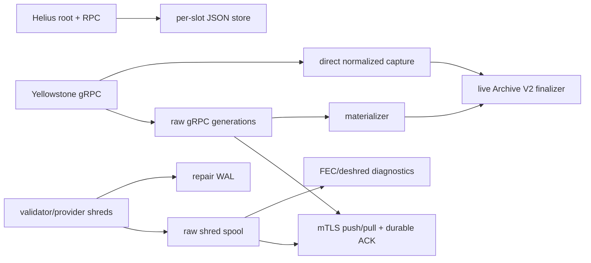

# Hivezilla convergence architecture

Status: **non-normative current-state map and implementation plan**, 2026-07-27.

The normative raw-data contract is the
[Hivezilla V1 source-spool and custody-transfer specification](../design/hivezilla-record-and-sync-protocol.md).
The source-neutral processing boundary is the
[minimal Blockzilla block candidate](../design/blockzilla-block-candidate-v1.md).
The public read path is the
[Hivezilla V1 public exit protocol](../design/hivezilla-public-exit-protocol.md).
The archive job and publication boundary is the
[Blockzilla V1 compaction job and canonical commit protocol](../design/blockzilla-compaction-job-v1.md).
Deployable responsibilities are summarized in the
[Hivezilla node-role schema](hivezilla-node-roles.md).
The code-to-target gap and ordered build backlog are in the
[Hivezilla V1 implementation assessment](hivezilla-v1-implementation-plan.md).

## Decision

Hivezilla is the data plane. The same binary can run independently bounded
capture, terminal raw-store, processing, live-exit, and archive
compaction/replay roles. Blockzilla is the control plane for canonical history:
one globally fenced scheduler serializes Replay-resolution, Replay-publication,
and Archive work, and Blockzilla alone advances the separate Replay V1 and
Archive V2 catalog heads.

V1 has:

- many source-specific Hivezilla capture nodes;
- one private temporary overflow bucket or namespace per capture node;
- exactly one configured deletion-authorizing logical terminal raw dataset,
  protected by its immutable multi-target durability policy;
- zero or more processors and public live exits;
- one active Blockzilla-issued finite-work lease across all product kinds;
- one active Blockzilla scheduler/two-catalog authority and one centralized
  stream registry; and
- optional replaceable Archive and Replay copy/audit roles for independently
  verified recovery failure domains.

There is no general P2P mesh, dynamic membership, consensus, compactor
election, or multi-custodian ACK policy in V1.

```mermaid
flowchart LR
    SRC["Solana validators and stream providers"] --> CAP["Hivezilla CAPTURE nodes"]
    CAP --> LOCAL["node-local source spools"]
    LOCAL -->|"pressure overflow"| TEMP["one private temporary bucket per node"]

    LOCAL -->|"live from T + bulk C..T"| INGEST["Hivezilla terminal raw store"]
    TEMP -->|"bulk ranges"| INGEST
    INGEST -->|"same immutable object"| R1["raw target A\nfailure domain A"]
    INGEST -->|"same immutable object"| R2["raw target B\nfailure domain B"]
    R1 --> RAW["one logical permanent raw dataset\nrebuildable range/copy index"]
    R2 --> RAW
    INGEST -->|"one contiguous ACK per source stream"| CAP
    CAP -->|"ACK-driven cleanup"| LOCAL
    CAP -->|"ACK-driven cleanup"| TEMP

    RAW --> PROC["Hivezilla processors\nsource-labelled observations"]
    CAP -. "raw-shred streams only\nbounded post-fsync live fan-out" .-> XRAW
    RAW --> XRAW["Hivezilla live exit\nraw feeds"]
    PROC --> XOBS["Hivezilla live exit\nobservation feeds"]

    BZ["Blockzilla\nregistry + one scheduler + two catalogs"] -->|"stream registry"| CAP
    BZ -->|"stream registry"| INGEST
    BZ -->|"stream registry"| PROC
    BZ -->|"stream registry"| XRAW
    BZ -->|"stream registry"| XOBS
    BZ -->|"one globally fenced finite-work lease"| CW["Hivezilla compact/replay worker"]
    RAW --> CW
    FINITE["finite content-addressed\nCAR / CAR.ZST inputs"] --> CW
    CW -->|"pre-finality candidate + validation result"| BZ
    BZ -->|"frozen Replay publication job"| CW
    CW -->|"format-8 objects + final-byte receipt"| BZ
    BZ -->|"separate exact CAS"| RCAT["canonical Replay V1 catalog"]
    RCAT -->|"ReplayArchiveDependencyV1"| CW
    CW -->|"upload immutable non-canonical candidate"| ARCH["online Archive V2 storage"]
    CW -->|"object digests + result"| BZ
    BZ -->|"conditional commit"| CAT["canonical Archive V2 catalog"]
    CAT -->|"reachable generation"| COPY["optional archive copy/audit"]
    ARCH --> COPY
    COPY --> RECOVERY["independent recovery objects<br/>receipt chain + checkpoint"]
    RCAT --> RCOPY["optional Replay copy/audit"]
    RCOPY --> RRECOVERY["independent Replay recovery<br/>receipt chain + checkpoint"]
    CAT --> READ["Blockzilla / Edgezilla archive reads"]
    ARCH --> READ
    RECOVERY --> READ

    XRAW --> USERS["public consumers"]
    XOBS --> USERS
    READ --> USERS
```



Temporary source overflow, the permanent exact-raw dataset, and compact Archive
V2 storage are separate namespaces, responsibilities, and lifecycles even when
the same cloud vendor is used.

## Precise safety boundary

The raw contract is **no deletion-authorized data loss**, subject to the configured
terminal store meeting its durability promise:

- capture begins only after the source journal crosses its local durability
  boundary;
- before terminal ACK, the source is responsible for every captured record
  across its local and temporary-cloud tiers;
- a verified overflow object plus durable receipt, range catalog, and
  `local_evicted_through` checkpoint may authorize local eviction, but not
  logical retirement;
- only the configured terminal raw dataset's protected cumulative ACK transfers
  responsibility and makes covered data eligible for deletion; the source must
  fsync the exact accepted-ACK receipt and its receipt-bound retirement
  checkpoint before deleting from either tier;
- processing, range completion, archive upload, catalog commit, and public
  subscriber receipt never authorize raw deletion; and
- every detected source discontinuity, queue/socket drop, corruption,
  capacity failure, or stalled transfer is explicit and alerted.

A packet never delivered to Hivezilla is outside this guarantee, as is
destruction of the sole pre-ACK source copy. The terminal dataset is one
logical permanent raw archive with a rebuildable range/copy index. Its store ID
and stream manifest bind an immutable `DurabilityPolicyV1`; V1 requires at
least two verified copies in distinct declared failure domains before a prefix
is protected or ACKable. Those targets are evidence behind one ACK identity,
not independent consumers. Simultaneous loss of enough policy failure domains
remains a residual risk. The source's temporary bucket is deliberately deleted
only after the covering ACK receipt and retirement checkpoint are durable, and
never counts as one of the terminal copies. Adding another protocol-visible ACK
authority is deferred.

The single compaction worker is a liveness risk, not a committed-archive loss
risk. Its failure pauses archive progress while raw capture and custody
continue. A worker upload is not canonical until Blockzilla conditionally
commits it under the current lease; a retry can rebuild or reuse verified
immutable objects. A stale worker result cannot replace a committed catalog
entry.

Public delivery is a separate bounded read-plane promise. Subscribers are not
custodians. Exact raw replay comes from the exit's live cache or the permanent
raw dataset. If an unACKed cursor has left the cache, the exit returns
`HISTORY_PENDING` only when the range is explicitly known recoverable; a
declared pre-protection loss returns `HISTORY_LOST`. It never reads a capture
spool or private overflow bucket.
A retained derived journal can recover a block observation. Archive V2 only
answers canonical-by-slot queries and cannot recreate exact raw/event history.

## What exists now

The repository contains useful pieces, but they use different layouts and
lifecycle rules.



| Area | Keep | Convergence gap |
| --- | --- | --- |
| Yellowstone | Raw recording, reconnect/replay, rotation, borrowed protobuf conversion | Raw journal and direct normalized capture are separate modes |
| Helius/RPC | Finalized-root wake-up, catch-up, produced/skipped coverage | Separate files, cursor, transfer, and retention model |
| Shreds | Exact UDP capture, bounded queues, loss telemetry, FEC/deshred, repair | Ordinary and repair journals are separate; continuous trusted observation output is unfinished |
| Local durability | Checksummed segmented spool, fsync, recovery, quotas | Not every adapter uses one homogeneous journal contract |
| Replication | mTLS pull, cumulative ACK WAL, response-loss recovery | Current wire is raw-gRPC-shaped and stop-and-wait; it lacks live-first fixed-range backfill |
| Cloud/retention | Verified upload helpers, pressure supervision, alerts | Mostly shell-orchestrated; cloud semantics are not yet one per-node temporary tier with ACK-driven deletion |
| Stream discovery | Static deployment configuration | No durable Blockzilla-authored registry snapshot, lineage, or public projection |
| Terminal raw dataset | Durable local receiver foundations | No permanent raw-object, rebuildable range/copy index, independent-target policy, or terminal ACK boundary |
| Processing | gRPC normalization plus shred recovery foundations | Inputs do not yet converge through the frozen candidate contract |
| Blockzilla | Archive V2 readers/writers, finite local scheduling, and frozen compaction/job/catalog value contracts | No remote compact-worker, lease, finality resolver, completion, or catalog-CAS runtime |
| Public egress | Internal Yellowstone relay, bounded replay, and frozen strict public-exit protobuf bindings | No isolated public raw/observation exit or exact history gateway runtime |

The generic `LiveProducerApp` / `PendingSource` `run` path remains a scaffold.
It should not become a second framework; replace it only when the real journal
runtime covers the explicit commands.

## Correctness gates

Before a converged runtime publishes canonical metadata:

1. **Closed in Gate 0:** both Yellowstone converters preserve the real source
   parent blockhash and reject a missing non-genesis parent.
2. **Partially closed:** stopped raw-gRPC materialization now requires complete
   PoH indexes, counts, prefix sums, and final hash, and the candidate
   constructor enforces source-neutral structure. Real gRPC/RPC/shred adapters
   and the future compact worker must still share a proof-bearing promotion
   boundary rather than creating a permissive route.
3. **Closed for legacy publication:** the unsafe legacy live finalizer and its
   scheduler route are disabled; the degraded path cannot encode missing PoH or
   shredding evidence as verified empty.
4. **Still open (Gate 4B):** ordinary, repaired, and reconstructed shreds must pass scheduled-leader,
   signature, Merkle/FEC-root, completion-marker, and full-PoH gates before
   candidate promotion.
5. **Still open (Gate 5):** the fixed compact job/result/catalog values exist,
   but the worker, finality resolver, fenced lease, validation, and conditional
   catalog-commit runtime do not.

## Runtime responsibilities

### Capture and source-spool controller

For each homogeneous source stream, a Hivezilla capture role:

- creates an immutable stream manifest before its first record;
- drains its adapter into a bounded queue and appends immutable exact payloads;
- records every known reset, lineage transition, and detected gap explicitly;
- exposes progress only after fsync/group commit;
- seals immutable segments and maintains one chain cursor;
- spills sealed ranges to its own verified temporary bucket before reserve
  exhaustion;
- continues serving cloud-only ranges as part of the same logical spool; and
- persists the terminal ACK and retirement anchor before deleting covered
  local files or overflow objects.

Spill and retirement updates must be serialized. A late upload completing after
a range is retired is deleted and cannot resurrect that range in the source
catalog.

### Terminal raw store

The configured terminal dataset connects to each authorized source stream and:

- resumes live at an atomic cutover `T` before draining old backlog;
- fetches the fixed missed range `[C,T)` in bounded immutable ranges from local
  disk or temporary cloud;
- durably stages live and bulk records even when they arrive out of order;
- verifies record chains and advances only one contiguous cursor from `C`;
- writes self-describing immutable objects to the permanent raw dataset;
- verifies enough copies in distinct policy failure domains and persists a
  rebuildable range/copy index before ACKing; and
- preserves exact replay for every ACKed producer stream indefinitely.

The store may physically deduplicate equal blobs or replicate internally, but
must retain the mappings required to reproduce every stream, sequence, and
prefix. A dataset reset or policy change creates a new store ID **and** a new
source stream generation. The old store remains the only possible ACK authority
for the old stream; the replacement cannot inherit cleanup authority.

### Processor

A Hivezilla processor tails only durable named input, writes immutable derived
results to its own journal before publishing, and preserves incomplete,
invalid, conflicting, and forked work explicitly. It has no raw-retention,
canonical fork-choice, catalog, or publication authority.

A non-genesis shred-derived block observation is eligible only after
scheduled-leader identity, shred signatures, proof/root chaining, FEC
reconstruction, slot completion markers, and complete PoH all validate. Slot
zero instead must match the descriptor-pinned deterministic entry/PoH
construction from digest-bound genesis data. Failing or incomplete work is
quarantined, not emitted as an empty or complete block.

Exact duplicates may merge only after capture, at the candidate/compaction
boundary, with all provenance retained. Raw shreds and reconstructed block
observations remain distinct stream families.

### Public exit

A Hivezilla exit runs outside capture and storage failure boundaries. It serves
one registry-named raw or derived stream with bounded replay and per-client
limits, disconnects slow clients, and returns an explicit recovery response
when its cache and authorized permanent history cannot satisfy a cursor. It
may receive post-fsync raw records through a bounded non-custodial live fan-out,
but never reads private source storage or sends a custody ACK.

### Compact worker and Blockzilla

Blockzilla persists the canonical encoding of an immutable job containing its
exact input ranges, finality manifest, validation policy, one complete published
epoch, any bounded descendant lookahead needed to validate finality, epoch
schedule, output format, fixed zero-based epoch-local ID order, predecessor,
unique job ID, and monotonic fence, then grants one active lease. A Hivezilla
compact worker:

1. reads the exact permanent raw ranges and finite content-addressed inputs
   pinned by the job;
2. normalizes them through the candidate boundary;
3. groups by `(slot, final_poh_hash)`, partitions era-defined consensus/shred
   block-ID variants, retains conflicts/forks, and validates completeness and
   PoH;
4. uploads immutable Archive V2 objects; and
5. returns a candidate manifest and result containing the named object
   identities, digests, coverage, and validation result.

Blockzilla accepts the result only under the current fence, verifies the exact
job/result/object/finality contract, writes the completion manifest, then
compare-and-swaps the predecessor-bound catalog head. Retry is idempotent;
stale or losing objects remain unreferenced, and deletion is deferred until
catalog reachability tooling proves them orphaned. The worker is never a raw custodian merely because it read or
compacted records.

## Live-first reconnect invariant

Let `C` be the terminal store's `protected_through` cursor. Under the source writer and
cutover lock, the source revalidates `C`, fsyncs and seals/rotates the current
segment, records its validated sealed-footer cursor as `T`, and establishes live replay at `T`.
It then releases the lock and transfers two independently budgeted lanes:

```text
bulk: [C, T)
live: [T, infinity)
```

The terminal store partitions `[C,T)` into exact record-boundary ranges and
fetches them oldest-first with bounded parallelism. The live lane stays
low-latency. The terminal store may receive later records first, but its
cumulative ACK cannot cross a hole. Completing a range has no custody meaning;
an ACK at or beyond `T` is the only bulk-completion signal.
Reconnect creates a new fixed cutover from the last protected ACK; reply loss
causes safe inclusive replay.

## Minimal persisted state

Per source stream, the capture side needs only:

1. the immutable stream manifest, descriptors, policy binding, lineage, and
   chained durable tail;
2. open/sealed journal segment metadata;
3. the range-to-overflow-object catalog and verified upload receipts;
4. `local_evicted_through` with its prefix anchor;
5. the digest-chained receipts for the configured deletion-authorizing terminal
   dataset; and
6. the latest receipt-bound retirement checkpoint.

The terminal dataset stores permanent self-describing exact objects, verified
per-target copy receipts, its rebuildable range/copy index and contiguous
cursor, and bounded out-of-order staging needed to join bulk and live. A
processor may separately keep a bounded rebuildable derived journal.

Blockzilla needs durable stream-registry snapshots and their exact-head
checkpoint, compaction job-spec objects, lease/fence state, results, completion
manifests, catalog-head checkpoints, and the canonical catalog commit. It does
not need source-tier placement state, public subscriber cursors, or
peer-membership consensus.

## Mandatory alert transitions

Emit entry and recovery for:

- source down, source-reported gap, socket/queue/adapter drop, or chain
  corruption;
- local time-to-full soft/critical watermarks and reserve exhaustion;
- overflow start/recovery, cloud-only bytes/age, upload/auth/quota/verification
  failure, and temporary-object deletion failure;
- terminal disconnect, permanent raw object/index failure, oldest-unACKed
  bytes/age, ACK stall, reset/loss, reindex failure, and per-failure-domain raw
  durability deficit;
- live-lane lag, bulk-local and bulk-cloud throughput, backfill ETA/stall, and
  staged-live bytes;
- processor reconstruction lag, incomplete/invalid slots, and derived-journal
  pressure;
- exit overload, replay pressure, disconnects, and replay-unavailable rate;
- registry publication/cache staleness or manifest mismatch; and
- compaction lease expiry, worker failure, archive backlog, unresolved finality,
  stale-fence result, upload failure, completion failure, catalog-CAS stall,
  exact catalog-head backup lag/failure, Archive and Replay recovery-copy
  lag/failure, and verified product-specific checkpoint/copy restoration.

Neither capacity pressure nor alert-delivery failure weakens capture, ACK, or
deletion eligibility. Cloud overflow remains alertable even when it succeeds.

## Implementation order

### P0 — freeze contracts and remove canonical hazards

- Freeze stream/registry identities, record chains, cursors, segment footers,
  terminal objects/policy/ACKs, HiveSync/public wire messages, compact
  jobs/results/completions, and their golden fixtures. Freeze block candidates
  as a shared semantic type with adapter-equality fixtures, not a wire encoding.
- Stop canonical publication of synthesized parent hashes, partial PoH, or
  missing evidence represented as verified-empty.
- Introduce one provider-neutral immutable object-store boundary and fake.
- Test exclusive-writer rejection, unsafe-handoff stream reset, torn-tail
  recovery, corrupt interior data, ACK receipt ordering, and retirement anchors.

Exit: every authority-bearing byte contract has a golden fixture and the known
unsafe canonical publication paths fail closed.

### P1 — one homogeneous journal and registry

- Put Yellowstone, exact ordinary shreds, repair shreds, RPC blocks, and source
  status into separate streams using one journal container.
- Preserve source and locally detected gap/drop events without mixing payload
  formats in one stream.
- Publish immutable stream manifests through monotonically versioned,
  predecessor-linked Blockzilla registry snapshots; exits cache the snapshot.

Exit: every new source adapter has the same exact-record lifecycle.

### P2 — per-node temporary overflow

- Integrate immutable conditional upload, provider-verified checksum or
  read-back, source range catalog, local eviction, restore, ACK-driven cloud
  deletion, and late-upload fencing.
- Keep one private bucket/namespace per capture node and stream prefixes within
  it.

Exit: a cloud-only unACKed range remains exactly retrievable and cannot expire
or disappear before terminal transfer.

### P3 — terminal store and live-first transfer

- Add the separate HiveSync V1 service; keep the existing stop-and-wait pull
  protocol as a migration path rather than silently changing its semantics.
- Add the atomic cutover, session-fenced idempotent bounded range fetches, parallel disk/cloud
  download, independently budgeted live lane, out-of-order staging, and one
  cumulative ACK.
- Write self-describing exact objects, verify the policy's independent physical
  copies, and persist a rebuildable range/copy index before that ACK.
- Prove disconnect/reconnect, response loss, sink reset, and cloud-only restore.

Exit: the source can delete both tiers only after one auditable exact terminal
ACK, while a long outage catches up without losing current live data.

### P4 — processing and public exits

- Turn FEC/deshred diagnostics into a continuous durable-tail processor.
- Require scheduled-leader/signature/proof-root/completion/PoH validation before
  non-genesis promotion and deterministic entry/PoH construction from
  digest-bound genesis data for slot zero.
- Freeze source-labelled observation records and golden fixtures.
- Isolate public raw and observation exits with bounded replay and exact
  recovery instructions; an uncustodied cache miss is `HISTORY_PENDING` only
  when explicitly recoverable, otherwise `HISTORY_LOST` or `UNAVAILABLE`.

Exit: raw and reconstructed feeds remain live independently of archive
compaction, without affecting custody.

### P5 — Hivezilla archive worker

- Implement gRPC/RPC/complete-shred candidate adapters and disk-backed
  grouping/conflict state.
- Move physical Archive V2 building/upload into the Hivezilla compact worker.
- Add the single Blockzilla job lease, monotonic fence, immutable finality/job
  spec for exactly one published epoch plus bounded finality lookahead, result
  validation, completion manifest, durable catalog-head recovery, and
  predecessor-bound catalog CAS.
- Add the optional archive copy/audit role, provider-specific recovery mapping,
  predecessor-linked receipts, and exact recovery-checkpoint CAS without adding
  a second compactor or catalog writer.

Exit: one active leased worker can crash and retry without a double canonical
commit or any effect on raw ACK eligibility; recovery-copy lag is explicit and
does not change the online catalog.

### P5R — Replay V1 and shred-only migration

- Build the deterministic outer-transaction-signature-stripped Replay V1
  projection from verified raw
  shreds, preserving component/entry order, signature mixins, exact messages,
  era-exact 20-byte status-key equivalence, state-changing markers, and distinct
  final-PoH/consensus identities. Use raw singleton address fallbacks; keep
  program-role hints outside canonical format/catalog state.
- Run the pinned historical runtime from verified genesis/checkpoints. Stateful
  replay covers the independently frozen descendant prefix required to settle
  epoch finality; a possibly longer status-only suffix streams collision proof
  through cohort eviction without creating finality validation. Neither suffix
  is published in the epoch. Replay the exact final format bytes and publish
  their per-slot validation receipt through its own catalog head only after
  state/marker checks pass.
- Compare regenerated runtime attachments with retained gRPC output. Keep gRPC
  in production until finality, bootstrap, determinism, parity, capacity, and
  explicit generation-cutover gates all pass. At epoch cutover, change only the
  runtime-attachment choice; raw signed-shred ledger/finality evidence remains.
  Continue complete non-selected gRPC capture through the fixed rollback
  horizon, then require an explicit irreversible production retirement. The
  protected terminal prefix remains auditable but policy-ineligible for
  rollback; a sampled canary is never rollback input.
- Shadow marker/certificate-derived finality against the current external
  authority, then change only a future epoch's immutable finality rule. Keep the
  complete external authority eligible through a separately declared rollback
  horizon if needed; after explicit demotion/retirement, retained evidence is
  audit-only. If shreds/markers cannot settle every slot independently, remain
  shred-primary.
- Feed validated attachments into Compact V2 through an immutable committed
  Replay product dependency; recover original signatures and transaction IDs
  only from bound raw evidence. Never let Replay publication ACK or delete raw
  shreds.

Exit: Hivezilla can produce canonical block content and runtime attachments from
verified shreds/markers plus pinned genesis, protocol, feature, and checkpoint
state alone. If any external RPC, gRPC, Tower/status, or provider finality input
is still required, label the system shred-primary rather than shred-only.

## Migration and reuse

Keep and converge these foundations:

- `services/hivezilla/src/ingest/spool.rs`;
- `services/hivezilla/src/ingest/replication_pull_*`;
- `services/hivezilla/src/grpc_raw.rs`;
- `services/hivezilla/src/helius.rs`;
- `services/hivezilla/src/ingest/shred_udp.rs`;
- `services/hivezilla/src/grpc_relay.rs`, after removing public egress from the
  recorder failure boundary;
- `services/hivezilla/src/grpc.rs` and
  `services/hivezilla/src/ingest/shred_compact.rs` as processing foundations;
- `services/shred-reader/`; and
- Blockzilla Archive V2 validation, writer, and read code.

Add readers and fixtures for old Helius, repair-WAL, and cloud-generation
artifacts. Never rewrite retained source evidence in place. Migrate production
configurations before retiring the placeholder/direct-write paths.

## Explicitly deferred

- dynamic membership, gossip/P2P routing, elections, and consensus; centralized
  Blockzilla stream-registry discovery is required, not deferred;
- more than one deletion-authorizing terminal dataset or a multi-ACK policy;
- terminal custody release/transfer;
- push replication and arbitrary peer graphs;
- merged public feeds, fork retractions, cross-source order, or cross-exit
  cursors;
- a second active compactor, compactor election, or distributed publication
  authority; and
- treating temporary source overflow as permanent raw custody or Archive V2.

The minimal architecture decentralizes capture and public delivery while
keeping the two destructive decisions explicit: the terminal raw ACK retires
source evidence, and the Blockzilla catalog commit makes one compacted result
canonical.
