# Hivezilla node roles and live streams

Status: **proposed minimal V1 topology**, 2026-07-28.

The normative raw-data contract is the
[Hivezilla V1 source-spool and custody-transfer specification](../design/hivezilla-record-and-sync-protocol.md).
The normative archive job/result boundary is the
[Blockzilla V1 centralized compaction protocol](../design/blockzilla-compaction-job-v1.md).
The replay-oriented derived ledger contract is
[Blockzilla Replay Projection V1](../design/blockzilla-replay-projection-v1.md).
This document assigns those contracts to deployable roles.

## Decision

Hivezilla is the data-plane binary. It captures, stores, downloads, processes,
serves, and compacts data according to enabled roles. Blockzilla is the
finite-product control plane: it schedules one fenced finite job at a time and
owns the product-scoped canonical Archive V2 and Replay V1 catalog commits.
Those are separate heads; adding Replay does not add a second scheduler or
active worker.

Roles are composable capabilities, not separate products. Source types are
adapter configurations, not node types. A production deployment may run one
role per process for isolation while a development deployment combines them.

| Owner and role | Responsibility | Authority | V1 deployment |
| --- | --- | --- | --- |
| Hivezilla `CAPTURE` | Connect to one source and append exact records to a homogeneous durable stream | Defines the capture boundary and owns that stream's source spool | Many, across validators and providers |
| Hivezilla `TERMINAL_RAW_STORE` | Resume live, bulk-fetch missed ranges, and write exact streams to the permanent raw dataset before issuing the one deletion-authorizing protected cumulative ACK | Assumes responsibility for every ACKed prefix only after the configured physical durability policy is met | One configured logical dataset; internally shardable/replicated |
| Hivezilla `PROCESS` | Read durable raw input and emit immutable derived observations, such as the signed provisional shred-to-block live feed | No raw-retention, fork-choice, replay-publication, or canonical authority | Zero or many |
| Hivezilla `LIVE_EXIT` | Let public clients subscribe to one named live feed and request bounded replay | No custody or canonical authority | Many, independently scalable |
| Hivezilla `COMPACT_WORKER` | Execute a fenced finite archive or replay-projection job, validate inputs, build objects, and upload them to durable storage | May produce a candidate result; cannot make it canonical or ACK raw custody | One active leased worker in V1 |
| Hivezilla/operations `ARCHIVE_COPY` | Copy the exact catalog-reachable generation to an independent archive failure domain and verify every referenced byte | Recovery mappings/receipts plus exact CAS on its recovery checkpoint only; no catalog, compaction, raw ACK, immutable overwrite, or delete authority | Optional; one replaceable active copier per recovery target |
| Hivezilla/operations `REPLAY_COPY` | Copy the complete Replay catalog closure, including validation, attachments, status evidence, and successor checkpoint, to an independent failure domain | Same product-scoped mapping/receipt/checkpoint authority as `ARCHIVE_COPY`; cannot write either canonical catalog | Optional; one replaceable active copier per Replay recovery target |
| Blockzilla `STREAM_REGISTRY` | Publish the durable mapping from logical names to immutable stream generations, manifest digests, status, and successors; manifests carry descriptors, gap-stream references, and terminal policy binding | Discovery only; no data-path, ACK, or canonical authority | One logical registry, cacheable by nodes and exits |
| Blockzilla `SCHEDULER_CATALOG` | Choose finite archive/replay work, issue the one fenced lease, and conditionally commit a result to its provisioned product-specific catalog head | Sole writer for both distinct heads; cannot append Replay epochs to the Archive V2 chain or vice versa | One active scheduler/catalog authority and one active lease in V1 |
| Blockzilla/Edgezilla `ARCHIVE_READ` | Serve committed historical, query, and bulk reads | Read-only | Many |

Monitoring and alerting are required across every role but are not another data
node. Likewise, local retention is a control loop inside each `CAPTURE` node,
not a network role.

## Raw ownership and temporary cloud overflow

Each `CAPTURE` node owns a logical source spool with two possible physical
tiers:

1. its local journal; and
2. its own private temporary object-storage bucket or IAM-isolated namespace.

Verified overflow upload may permit local eviction when disk pressure rises,
but it does not transfer custody. Until the terminal raw store ACKs a record,
the source node remains responsible for serving it from local disk or its
temporary bucket. Once the source durably records the terminal ACK and
retirement anchor, it may delete the covered data from both tiers.

The temporary bucket is therefore neither a second custodian nor Archive V2.
It must not share lifecycle or naming rules with permanent archive objects.
Cloud-only source ranges, upload failures, stalled ACKs, and deletion failures
all alert.

A freshly captured local-only record has no independent copy yet. Destruction
of that sole pre-ACK disk copy is an explicit V1 residual risk; normal live
terminal ingest minimizes the window, but the specification does not hide it.

V1 configures exactly one deletion-authorizing `TERMINAL_RAW_STORE` dataset per
source stream. It is a permanent cloud-backed exact-raw object set plus a
rebuildable durable range index, separate from temporary source overflow and
compact Archive V2. The source sees one stable store identity and one contiguous
ACK. That logical identity may require multiple independently verified physical
copies before ACK; replicas do not send independent ACKs and therefore do not
create a multi-custodian protocol. Processors, compact workers, and subscribers
cannot authorize source cleanup.

The precise number and independence of physical copies are part of the terminal
store's immutable durability policy. V1 unconditionally requires at least two
verified copies in distinct declared failure domains before protection or ACK,
and distinguishes a merely local `captured_local` record from one that has
crossed that boundary.

## Live-first terminal recovery

After a terminal-store disconnect, recovery must not wait for the old backlog
before receiving current data. Let `C` be the store's `protected_through`
cumulative ACK cursor and `T` the source's atomically captured cutover cursor:

```text
bulk lane: [C, T)
live lane: [T, infinity)
```

The source quiesces pending appends under the cutover lock, seals and validates
the segment, advances its checkpoint to the sealed footer, and defines that
footer cursor as `T`. It makes `[C,T)` available as immutable, bounded ranges.
The live lane starts inclusively at `T`; the terminal role
fetches old ranges from source disk or temporary cloud in parallel. It may stage
the two lanes out of order, but it sends only one fsynced, contiguous cumulative
ACK after exact objects, enough independent policy copies, and their rebuildable
range/copy index are durable in the permanent raw dataset. A later live record
never ACKs across an older hole.

Bulk and live have separate byte, concurrency, CPU, memory, and disk budgets.
Bulk saturation must not starve source capture or the live lane. Range
completion is informational; only the contiguous terminal ACK transfers
custody and permits cleanup.

## Two public live streams

The first public exits advertise two distinct feed kinds, never one silently
merged stream.

| Feed | Contents | Cursor | Exact replay source |
| --- | --- | --- | --- |
| `raw.shred.v1` | Every exact admitted UDP shred datagram, including coding shreds, duplicates, conflicts, and arrival order | Producer `stream_id + sequence + prefix_hash` | Exit live cache, then permanent raw dataset after terminal custody; an uncustodied cache miss is pending only while explicitly recoverable, otherwise lost/unavailable |
| `block.observation.v1` | Immutable complete block observations reconstructed from durable evidence | The common producer `stream_id + sequence + prefix_hash` envelope | Retained derived journal; otherwise exact observation replay is unavailable |

A `LIVE_EXIT` may serve either feed; it need not compact blocks or write Archive
V2. Public subscribers do not send custody ACKs and never affect retention. A
slow client is disconnected before it can backpressure capture, terminal
storage, or processing.

Raw live records enter the bounded exit cache through a post-fsync,
non-custodial capture fan-out. Failure of that fan-out may shorten the exit's
cache but cannot block capture, delete source evidence, or grant replay access
to the source spool.

Archive V2 answers the separate question “which block became canonical for
this slot?” It cannot exactly replay raw packet order, duplicate/coding shreds,
repair traffic, losing forks, or the original order of provisional block
observations. When an exact feed cursor is no longer available at an exit, the
exit returns an explicit feed-specific recovery instruction. A client that
only needs the canonical block for a missed slot may query Blockzilla history.

### Block observation rules

A Hivezilla `PROCESS` node may tail a durable shred stream, perform FEC recovery
and deshredding, and emit a complete source-labelled observation. It must:

- verify the scheduled leader/retransmitter signature and bind accepted
  non-genesis shreds to the applicable leader schedule before trusted
  promotion; slot zero instead must match the descriptor-pinned deterministic
  entry/PoH construction from digest-bound genesis data;
- emit only after ordered-component, completion, parent, and final PoH checks;
- keep partial or invalid slots explicit rather than rendering empty blocks;
- preserve distinct final PoH hashes and era-defined block IDs at the same slot
  as separate fork/evidence observations;
- never retract an immutable emitted observation;
- never invent execution metadata, rewards, block time, or block height from
  shreds; and
- use a new processor stream ID when rebuilt output cannot preserve identical
  bytes and event order.

The derived journal is rebuildable processing state, not a raw custody copy.
Its progress never authorizes raw deletion.

## Duplicate and conflict handling

No captured record identity is deduplicated at capture or custody:

- each producer stream preserves its own exact sequence, including duplicates
  and conflicts;
- the terminal store may deduplicate physical blobs only if it retains the
  mapping needed to reproduce every stream, sequence, and prefix;
- a raw shred and a reconstructed block observation are different record
  families, not duplicate deliveries; and
- processors and compact workers merge equivalent candidates only after exact
  inputs are durable, while retaining all source provenance and conflicts.

This lets one Hivezilla node deliver raw shreds while another reconstructs
blocks without creating an ambiguous consumer ACK or global stream order.

## Shreds, gRPC, Replay V1, and Compact V2

These products overlap, but they are not interchangeable:

| Product | Role | Intentionally retained or omitted |
| --- | --- | --- |
| Raw shred stream | Permanent transport/ledger evidence, FEC repair, fork and capture audit | Retains exact ordinary, coding, and repair datagrams, duplicates, conflicts, proofs, and arrival order |
| `block.observation.v1` / format 6 | Public provisional live block feed reconstructed from shreds | Retains complete signed transactions and PoH/component order; omits runtime results and canonical authority |
| Raw Yellowstone/gRPC stream | Current source of provider-observed blocks and execution results | Retains transaction status, logs, CPI, balances, loaded addresses, rewards, and provider observation semantics; omits shred/FEC evidence |
| Replay V1 / reserved format 8 | Minimal sequential Bank/SVM execution input projected from verified shred candidates after immutable finality resolution | Retains exact signed messages, entry order, PoH signature mixins, parent/block identity, and state-changing markers; omits outer transaction signatures and runtime results |
| Compact V2 | Stable indexer/query archive | Retains canonical indexer-facing block fields, signatures required by that product, and optional runtime attachments |

Hivezilla must consume both shred and gRPC source families today. Shreds are the
independent evidence and future execution input, but they do not directly carry
transaction execution results. gRPC supplies those results while deterministic
historical replay is unfinished, but it cannot repair missing shred evidence.
The overlap is useful: it detects packet gaps, provider omissions, wrong-fork
selection, reconstruction bugs, and runtime-replay differences.

Current production flow:

```text
verified shreds -----> signed-ledger candidate -------┐
                                                      ├-> Compact V2
gRPC block ---------> signed ledger + runtime metadata┘

verified shreds -> Replay V1 -> shadow runtime replay -> compare with gRPC
```

Replay attachment cutover (external finality may still be current):

```text
verified shred candidates ----┐
external finality authority --┴-> frozen finality -> Replay V1 publication
                                                   -> exact deterministic replay
                                                   -> runtime attachments

Replay signed-message core --------------------------------------┐
raw shred evidence -> signatures / transaction identities -------┼-> Compact V2
runtime attachments ----------------------------------------------┘
```

Final shred-only flow after the independent finality cutover:

```text
verified shred candidates -> pre-finality projection/stateful replay
                           -> marker/certificate resolution
                           -> frozen finality -> Replay V1 publication
                                              -> exact deterministic replay
                                              -> runtime attachments
```

Cross-source deduplication never occurs in capture, custody, or ACK state. After
durability, `(cluster, slot, final_poh_hash)` groups comparable ledger-content
candidates; shred evidence is additionally partitioned by the optional
era-defined consensus block ID. An ID-less gRPC/RPC candidate cannot choose
between multiple such variants. Equality between two full signed sources also
requires the same effective parent, ordered components/entries, PoH, transaction
order, and complete canonical transaction wire bytes including outer
signatures. Replay V1 can match only the exact signed-message core plus
structural position, PoH signature mixin/status-key classes, and its raw-evidence
binding: the domain-separated result is `execution_core_digest`. It cannot
establish full signed-transaction equality. Different final PoH hashes remain ledger forks,
different defined block IDs remain distinct shred variants, and the same full
identity with different content is quarantined. Runtime attachments are
compared only when that execution-core digest matches; gRPC metadata first
requires signed-ledger equality with its selected raw candidate. Missing
metadata is not verified-empty metadata. Replay-generated metadata carries its
replay engine, checkpoint, and instrumentation identity rather than silently
replacing a provider observation.

At the Replay attachment epoch-boundary cutover, raw signed-shred ledger and
identity evidence plus the selected finality authority stay unchanged; only
runtime-attachment selection moves from provider observation to final Replay.
Complete non-selected gRPC capture remains rollback-eligible for the fixed
horizon. New production gRPC capture may stop only after an explicit
irreversible retirement at that horizon; this stops capture/source-spool use but
retains the protected terminal raw prefix as audit-only, rollback-ineligible
evidence. A sampled canary cannot support rollback.

External-to-marker finality is a second future-epoch policy cutover. It requires
parity over identities, skips, forks, repairs, and descendant lookahead, plus its
own rollback horizon if rollback is desired. A frozen manifest never changes.
After explicit external-authority demotion/retirement, retained authority
evidence is audit-only and cannot enter a new resolution spec. If shred markers
cannot independently settle the range, Hivezilla remains shred-primary.

**Shred-only** means verified
shreds/markers plus pinned genesis, protocol, feature, and checkpoint state are
the sole continuing ledger, finality, and runtime inputs. If Hivezilla still
needs any RPC, gRPC, Tower/status, or provider finality feed, the system is
**shred-primary**. Permanent raw shreds remain after either cutover.
Shred-derived finality must statefully replay the bounded descendant prefix
needed to settle trailing epoch slots; a longer status-only suffix may be scanned
to close collision cohorts. Neither is emitted into the earlier epoch's Replay
generation, and status-only evidence cannot masquerade as finality validation.

## Topology

```mermaid
flowchart LR
    SRC1["validator / provider A"] --> C1["Hivezilla CAPTURE A"]
    SRC2["validator / provider B"] --> C2["Hivezilla CAPTURE B"]
    C1 --> L1["local source spool A"]
    C2 --> L2["local source spool B"]
    L1 -->|"pressure overflow"| O1["private temporary bucket A"]
    L2 -->|"pressure overflow"| O2["private temporary bucket B"]

    L1 -->|"live plus fixed-range bulk"| STORE["Hivezilla TERMINAL_RAW_STORE"]
    O1 -->|"bulk ranges"| STORE
    L2 -->|"live plus fixed-range bulk"| STORE
    O2 -->|"bulk ranges"| STORE
    STORE -->|"verify policy copies + rebuildable index before ACK"| RAW["one logical permanent raw dataset"]
    STORE -->|"ACK relay"| C1
    STORE -->|"ACK relay"| C2

    RAW --> PROC["Hivezilla PROCESS\nshred to block observation"]
    C1 -. "raw-shred streams only\nbounded post-fsync fan-out" .-> XRAW
    C2 -. "raw-shred streams only\nbounded post-fsync fan-out" .-> XRAW
    RAW --> XRAW["Hivezilla LIVE_EXIT\nraw feed"]
    PROC --> XOBS["Hivezilla LIVE_EXIT\nblock-observation feed"]

    REG["Blockzilla\nstream registry"] -->|"static assignment + stream manifests"| C1
    REG --> C2
    REG --> STORE
    REG --> PROC
    REG --> XRAW
    REG --> XOBS
    BLOCK["Blockzilla\nscheduler + two product catalogs"] -->|"one fenced lease"| WORK["Hivezilla COMPACT_WORKER"]
    RAW --> WORK
    FINITE["finite content-addressed\nCAR / CAR.ZST inputs"] --> WORK
    WORK -->|"verified pre-finality projection"| PRE["internal Replay candidate"]
    PRE --> EXEC["stateful marker + runtime replay"]
    EXEC -->|"validated resolution result"| BLOCK
    BLOCK -->|"frozen finality publication job"| WORK
    WORK -->|"deterministic format-8 candidate"| ROBJ["Replay V1 objects"]
    ROBJ --> FINAL["exact final-byte replay"]
    FINAL --> RECEIPT["validation receipt + runtime attachments"]
    RECEIPT -->|"verified result"| BLOCK
    BLOCK -->|"separate exact CAS"| RCAT["canonical Replay V1 catalog"]
    RCAT --> RCOPY["REPLAY_COPY\noptional independent copier/auditor"]
    RCOPY --> RRECOVERY["independent Replay recovery\nclosure + receipt chain + checkpoint"]
    RCAT -->|"ReplayArchiveDependencyV1"| WORK
    WORK -->|"upload immutable non-canonical candidate"| ARCH["Archive V2 object storage"]
    WORK -->|"COMPLETE/NOT_COMPLETE + candidate reference"| BLOCK
    BLOCK -->|"conditional commit"| CAT["canonical Archive V2 catalog"]
    CAT --> COPY["ARCHIVE_COPY\noptional independent copier/auditor"]
    ARCH --> COPY
    COPY --> RECOVERY["independent recovery objects<br/>mapping + receipt chain + exact checkpoint"]
    CAT --> READ["ARCHIVE_READ"]
    ARCH --> READ
    RECOVERY --> READ

    XRAW --> USERS["public subscribers"]
    XOBS --> USERS
    READ --> USERS
```



Every capture instance has its own bucket/namespace even though only two are
shown. The permanent raw dataset and compact Archive V2 storage are separate
durability domains and lifecycles.

## Deployment rules

- Run public exits in a separate process and resource boundary from capture.
- A processor may share a host only when its CPU, memory, disk, and queues are
  independently bounded.
- Bind every subscription to one explicit producer stream; cross-source order,
  deduplication, and fork choice do not belong in an exit.
- Discover explicit stream IDs and successor generations through the centralized
  stream registry. Nodes cache existing assignments so a registry outage does
  not stop capture or an established custody session.
- Run many captures, processors, exits, and readers, but exactly one configured
  deletion-authorizing terminal raw dataset in V1.
- Run one active Blockzilla scheduler/catalog authority and one active fenced
  finite-work lease in V1. Archive V2 and Replay V1 have distinct provisioned
  heads even though the authority is singular. A stale worker result cannot
  commit.
- No general peer mesh, gossip membership, election, or consensus is required.

## Additions in priority order

1. **Identity and terminal contract** — freeze the stream registry/lineage,
   durability policy, terminal raw object/receipt/index format, crash recovery,
   and exact cumulative ACK boundary.
2. **Common journal and registry** — move each source format onto the shared
   record/cursor lifecycle and publish immutable stream generations centrally.
3. **Per-node temporary overflow** — integrate verified upload, local eviction,
   ACK-driven cloud deletion, and the required pressure/lag alerts.
4. **Terminal raw store** — implement the fixed-cutover live lane, parallel
   immutable bulk ranges, bounded live-object assembly, permanent policy
   copies/index, contiguous ACK, and restore from both source tiers.
5. **Continuous shred processor** — turn the existing FEC/deshred diagnostics
   into a scheduled-leader-verified durable-tail worker with a bounded derived
   journal.
6. **Isolated public exits** — serve registry-discovered named feeds with public
   admission controls, bounded client queues, and explicit recovery responses.
7. **Fenced finite-worker core** — execute one Blockzilla-issued immutable job,
   upload only non-canonical objects, return a verifiable result, and hold no
   catalog or raw-ACK authority.
8. **Replay V1 and shadow execution** — project verified shred candidates,
   resolve and freeze finality from an independent resolution spec, replay the
   exact final format-8 bytes, publish through the separate Replay catalog, and
   compare runtime attachments with retained gRPC.
9. **Replay-backed Archive V2** — pin a committed Replay dependency, rejoin real
   signatures from raw evidence, select a validated runtime attachment, build
   immutable Archive V2 objects, and cut over only at an epoch job-policy
   boundary after parity and capacity gates pass.
10. **Product copy/audit** — independently copy each Archive or Replay
   catalog-reachable closure, persist its exact recovery mapping/receipt chain,
   and CAS only that product/target's recovery checkpoint.
11. **Additional exits and archive readers** — scale public reads without
   changing custody or compaction authority.

Defer a second deletion-authorizing terminal store, a second active compactor,
dynamic membership, and peer-to-peer consensus until measured availability or
recovery requirements justify their protocol cost.
