# Live ingest and storage architecture

Status: **minimal V1 target**.

V1 separates five durability and authority boundaries:

1. each Hivezilla source node owns one exact logical spool across local disk
   and its private temporary-cloud overflow;
2. one configured Hivezilla terminal raw store accepts permanent custody and is
   the only consumer whose protected cumulative ACK may retire source data after its
   physical durability policy is satisfied;
3. Hivezilla processors and exits derive or serve data without affecting raw
   custody; and
4. Blockzilla schedules archive work and owns the canonical catalog, while one
   fenced Hivezilla compact worker performs the work and uploads non-canonical
   candidate objects; and
5. an optional least-privilege archive copy/audit role verifies a committed
   generation in an independent recovery failure domain and owns only its
   receipt chain and exact recovery checkpoint.

```mermaid
flowchart LR
    SOURCE["gRPC, RPC, validator, or provider shreds"] --> CAP["Hivezilla capture<br/>one source stream"]
    REG["Blockzilla stream registry"] --> CAP
    CAP --> LOCAL["node-local segmented spool"]
    LOCAL -. "verified spill" .-> TEMP["this node's private<br/>temporary-cloud overflow"]
    LOCAL --> SYNC["HiveSync<br/>live [T,...), bulk [C,T)"]
    TEMP --> SYNC
    SYNC --> INGEST["Hivezilla terminal raw store"]
    INGEST -->|">=2 verified failure-domain copies + rebuildable index"| RAW["permanent raw logical dataset"]
    INGEST -. "protected cumulative ACK" .-> CAP

    RAW --> PROC["Hivezilla processors"]
    REG --> INGEST
    REG --> PROC
    CAP -. "raw-shred streams only\nbounded post-fsync live fan-out" .-> EXIT
    RAW --> EXIT["raw or provisional live exits"]
    PROC --> EXIT
    REG --> EXIT
    EXIT --> USERS["public subscribers"]

    RAW --> COMPACT["Hivezilla compact worker"]
    SCHED["Blockzilla scheduler<br/>one active fenced lease"] --> COMPACT
    COMPACT -->|"upload + verify non-canonical candidate"| ARCHIVE["permanent Archive V2 objects"]
    COMPACT -->|"COMPLETE/NOT_COMPLETE + candidate reference + fence"| SCHED
    SCHED -->|"completion manifest + catalog CAS"| CATALOG["Blockzilla canonical catalog"]
    CATALOG -. "committed completion selects objects" .-> ARCHIVE
    CATALOG -->|"reachable generation"| COPY["optional archive copy/audit"]
    ARCHIVE -->|"read verified bytes"| COPY
    COPY --> RECOVERY["independent recovery objects<br/>receipt chain + checkpoint"]
    CATALOG --> READ["Archive readers"]
    ARCHIVE --> READ
    RECOVERY --> READ
```

Every capture box in a deployment has its own local spool and private overflow
namespace; the diagram shows one representative instance. Temporary overflow,
the permanent raw dataset, and permanent Archive V2 storage are different
buckets or IAM-isolated namespaces with different retention rules.

## Seven states that must not be conflated

| State | What it proves | What it permits |
| --- | --- | --- |
| `captured_local` | The exact source record and chained cursor are durable in the source journal | Advance the capture cursor |
| `overflow_durable` | A sealed source range has an immutable provider-verified checksum, or was read back and verified, in that source node's overflow | Evict that verified range from local disk |
| `protected` | The record meets the configured independent-failure-domain copy policy | Claim the corresponding durability SLO; by itself it does not authorize source cleanup |
| `ACKed` | Terminal object receipts, all policy-required copies, rebuildable index, and contiguous cursor are durably committed and acknowledged | Make covered source ranges eligible for retirement after the source durably records the ACK and retirement anchor |
| `retired` | The source durably linked the exact accepted-ACK receipt into its retirement checkpoint for this prefix | Delete or finish deleting covered local and temporary-overflow objects without moving the prefix backward |
| `archived` | Blockzilla conditionally committed a verified Archive V2 manifest produced under the current fence | Serve the generation as canonical |
| `archive_recovery_protected` | Every referenced object is independently verified, its canonical-to-recovery mapping and predecessor-linked receipt are durable, and the exact recovery checkpoint covers that generation | Restore it after online-copy loss by starting at that checkpoint and following receipt mappings |

An overflow upload is not raw custody. An Archive V2 upload or catalog commit is
also not raw custody: compact blocks cannot reproduce raw arrival order,
duplicates, coding shreds, repair traffic, or losing forks.

`captured_local` is a local durability boundary, not proof of an independent copy. A
deployment that promises protection immediately after capture must replicate to
another failure domain before reporting `protected`. After ACK, durability
depends on the immutable policy bound to the terminal store identity; production
must state the required copy count, independence, verification, and audit
interval rather than relying on the word “cloud.”

## Source capture and temporary overflow

Each independently supervised source instance has one immutable stream identity
and one `sequence + prefix_hash` cursor. It records exact source-format bytes
before normalization. A Solana slot, shred index, blockhash, or provider cursor
is metadata and never a delivery or deletion cursor.

The local segmented journal is the first durability boundary. Under pressure,
the source moves sealed ranges into its own temporary object-store namespace:

1. seal and fsync the current segment;
2. validate its framing/end cursor and conditionally upload it under an immutable
   node/stream/range key with an end-to-end checksum;
3. verify length and provider-attested checksum, or read the object back when
   the provider cannot attest that checksum; record an opaque version when the
   provider supplies one;
4. fsync the overflow receipt and local range-to-object catalog; and
5. only then evict the covered local file.

The range remains part of the source's logical spool and must still be served
from local disk or cloud. Overflow objects have no independent expiry. A
covering terminal ACK only makes them eligible for deletion: the source first
fsyncs the accepted-ACK receipt and then its receipt-bound retirement
checkpoint before unlinking either tier. Upload, verification, cloud-only
backlog, time-to-full, quota/auth failure, and deletion failure are alerted
transitions. Spill starts before the filesystem is full; an unavailable or
unverified cloud tier never permits local deletion.

Overflow objects and keys are self-describing enough to rebuild the stream/range
catalog. Stable recovery credentials and a history-only source mode let an
operator restore cloud-only ranges after loss of the original host. The
replacement must fence the old writer before serving the same stream; otherwise
new capture starts a successor stream generation. This recovery path is static
operations, not peer membership.

## Live-first terminal recovery

Let `C` be the terminal store's last `protected_through` cumulative ACK cursor.
Reconnect is an
atomic live-first cutover, not a sequential history download:

1. under the shared source writer/cutover/retirement lock, quiesce assignment to
   the old segment, finish every admitted append, seal and validate that segment,
   advance the durable checkpoint to its footer, rotate the writer, and define
   that exact footer/new-segment start as `T`;
2. while holding that lock, confirm `[C,T)` remains recoverable from local disk,
   temporary cloud, or both and install live replay from `T`; and
3. release the lock and fetch an idempotent session-fenced partition of `[C,T)` in large bounded
   record ranges while the new segment continues receiving live records.

The terminal store gives live traffic reserved bandwidth and runs heavy bulk
downloads in the background with separate concurrency, disk, and CPU budgets.
It may durably stage live and bulk ranges out of order, but it sends only one
monotonic cumulative ACK for the largest exact contiguous prefix after terminal
raw-object receipts, required physical copies, rebuildable range index, and the
recovered contiguous cursor are permanent. Live records are assembled into
bounded contiguous objects with maximum bytes, records, and age; a later live
record or completed range cannot jump a hole. Once bulk closes the gap, the ACK
may advance through already staged live data.

The source accepts an ACK only from the one statically configured terminal raw
dataset for that stream. It fsyncs the ACK receipt and retirement cursor before
deleting any covered local segment or temporary-cloud object. Concretely, it
fsyncs the digest-chained accepted-ACK receipt and then the receipt-bound
retirement checkpoint. Public exits,
processors, compact workers, archive uploads, and the Blockzilla catalog never
send this ACK. If the terminal dataset is lost or reset, that is a custody
incident and the replacement receives a new identity.

Transport is inclusive and at least once. Same sequence and same prefix is
idempotent; same sequence and different prefix is fatal. A disconnect loses no
source data: reconnect repeats the cutover from the terminal store's last
protected `C`, and the unserved live suffix joins the new bulk range.

## Processing and public exit

A Hivezilla shred processor tails durable raw custody, verifies the applicable
leader/retransmitter signatures and FEC roots, performs FEC recovery,
deshredding, completion, parent, and final PoH checks, and may write a separate
complete-but-provisional block-observation journal. It retains conflicting fork
observations and never turns partial or unauthenticated shreds into an empty
successful block. Processing progress cannot release raw evidence.

A public exit serves one registry-discovered raw-shred stream or one named
derived observation stream through a bounded cache. Subscribers do not
participate in HiveSync and do not ACK custody. Exact raw history comes only
from the permanent terminal dataset. A cursor absent from both the exit cache
and terminal custody is pending only when explicitly known recoverable, lost
when source status declares pre-protection loss, and unavailable when its state
cannot be proved. Anonymous replay never reads a capture spool. Archive V2
answers the different question of which block became canonical for a slot.

## Archive scheduling and commit

Blockzilla is the control plane and canonical catalog. It creates finite,
idempotent jobs using the normative
[compaction-job contract](../design/blockzilla-compaction-job-v1.md). A job binds every
required input stream's exact start and end prefix plus any immutable finite
CAR/CAR.ZST object inputs, exactly one complete epoch and its pinned epoch
schedule, coverage/finality/fork policy, algorithm and format versions, fixed
zero-based epoch-local ID order, expected catalog predecessor, output namespace,
and monotonic fence, which is also the attempt generation. V1 grants exactly one
active compaction attempt; no
peer-to-peer election or active-active writer is required.

The leased Hivezilla compact worker:

1. reads exact records from the permanent terminal raw dataset (or a finite CAR
   input);
2. verifies scheduled-leader/retransmitter signatures and FEC roots for shred
   evidence, then normalizes and repairs without discarding raw provenance;
3. applies the job-bound finalized-blockhash and
   produced/skipped/unresolved/late-evidence policy;
4. stages and validates a complete Archive V2 candidate;
5. uploads immutable payloads, indexes, sidecars, and a candidate manifest to
   the permanent archive object store; and
6. returns the verified candidate-manifest digest, coverage counts, job identity,
   job-spec hash binding the input anchors, and fence.

Blockzilla conditionally writes the reader-visible completion manifest and
advances the catalog only if the fence, inputs, policy, candidate digest, and
predecessor still match. Worker-uploaded candidate manifests are never reader
commit markers. An expired worker may leave unreachable immutable objects, but
it cannot publish them as canonical; deletion is deferred until catalog
reachability tooling proves them orphaned. A
failed worker pauses archive liveness, not capture or raw durability, and the
finite job can be retried after its execution is fenced out.

An optional least-privilege copy/audit role then reads only the exact
catalog-reachable online generation, writes a provider-specific recovery mapping
and predecessor-linked receipt in an independent failure domain, and advances a
separate exact recovery checkpoint. Its lag is degraded and alerting but does
not change canonical catalog state. It has no compaction, catalog, raw-ACK,
overwrite, or delete authority.

## Operational invariants

- Source capture, terminal custody, live exits, compaction, and catalog commit
  have separate resource budgets and failure domains.
- The terminal dataset has aggregate live-write capacity above configured total
  source ingress, fair per-stream admission, and separate live/bulk upload
  pools; one noisy stream cannot consume every source's progress budget.
- Source records survive a Blockzilla restart and a compact-worker restart.
- Every ACK is derived from verified exact raw objects plus their durable index,
  and every source deletion cursor is fsynced; neither comes from an in-memory
  seen set or slot watermark.
- Spill and retirement metadata are serialized so a late upload cannot
  resurrect or strand a range already retired after ACK.
- Missing, conflicting, incomplete, or corrupt input remains an explicit state.
- Alert delivery failure never weakens capture, verification, ACK, or deletion
  rules.
- Provider, temporary-overflow, permanent-raw, and permanent-archive credentials
  stay scoped to their roles and outside source code.
- Existing stream assignments remain usable from cached verified registry state
  during a registry outage; the registry never becomes part of the data path.

The copied turbine receiver prototype under `services/hivezilla/src/shred_reader/`
remains a staging reference while its receiver logic is integrated into
Hivezilla.
