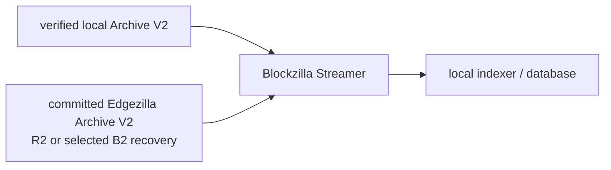

# Blockzilla Streamer

Status: **partially implemented foundation**. `blockzilla-read-sdk` and the
read-only archive gateway can validate and Range-read completed immutable
generations. Current `main` still does not provide `blockzilla sync`,
`blockzilla stream`, a sink trait, or durable consumer checkpoints.

## Purpose

Blockzilla Streamer is the planned indexer-facing side of Blockzilla. It reads
committed Archive V2 blocks from local or edge storage and delivers them to a
local database/indexer adapter.

It is a product responsibility, not necessarily another service. The
`blockzilla` executable can expose the user commands while a focused reader
crate provides reusable storage and sink logic.



Streamer does not connect to Hivezilla. Hivezilla feeds Blockzilla; Blockzilla
repairs, validates, and commits the archive; Streamer reads only that committed
result. The read-only Edgezilla Worker is a point-read RPC surface, not a bulk
backfill source.

## What works today

Blockzilla can already build the local hot-block archive that a future Streamer
will consume:

```sh
cargo run -p blockzilla -- \
  build-archive-v2-hot-blocks INPUT.car.zst OUTPUT_DIRECTORY
```

That command is implemented. It does not stream to an indexer and does not
publish the result to edge storage. Full epochs can be very large; contributors
should use the repository's small fixture workflow for initial testing.

The focused `blockzilla-read-sdk` can also open a completed generation from a
local or HTTP Range source, bind pubkey filters to its registry and generation,
decode independent hot-block frames, and fetch selected signatures. The
`blockzilla-archive-gateway` publishes an authenticated read-only Range surface.
See the [FireWatch handoff](../guides/firewatch-local-archive-indexing.md) for
their exact boundary. They do not yet provide database-specific delivery or a
consumer checkpoint.

## Proposed commands

The following syntax illustrates the target UX; these are not current commands:

```text
blockzilla sync   <committed-edge-source> <local-cache>
blockzilla stream <verified-local-archive> <indexer-sink>
```

- `sync` downloads or range-reads a committed generation, verifies it, then
  reveals it atomically in the local cache.
- `stream` reads a verified local generation and advances a logical checkpoint
  only after the sink acknowledges the delivered block.

## Source selection

The proposed reader order is:

1. a verified local canonical archive or cache;
2. a committed R2 generation;
3. an explicitly selected, independently verified B2 recovery generation.

CAR, raw Yellowstone observations, Hivezilla compact deliveries, and shreds are
not Streamer inputs. Blockzilla must turn them into a validated Archive V2
generation first.

A source transition requires either the same committed generation manifest or
an inclusive overlap whose cluster identity, slot, blockhash, and content
digest agree. An unproven transition pauses rather than silently skipping data.

## Delivery contract

The sink receives deterministic blocks in ascending slot order for the selected
archive view. Each delivery carries enough identity for idempotent application:

- cluster/genesis identity;
- slot, parent slot, blockhash, and previous blockhash;
- archive generation and format version;
- stable content digest or event identity;
- completeness/provenance state required by the selected view.

Initial delivery semantics are at least once:

- identical event identity: the sink may safely ignore a replay;
- same slot/blockhash with different content: quarantine and stop;
- conflicting finalized blockhash: stop as a finality conflict;
- missing slot without authoritative skip evidence: wait for repair.

The initial integration should be a small Rust sink trait plus one example, not
a database-specific runtime hidden inside Blockzilla.

## Checkpoints

Keep three states separate:

1. **storage cursor** — the physical file/object position used to resume a
   reader;
2. **consumer checkpoint** — the last event durably acknowledged by the sink;
3. **sync catalog** — the set of complete verified generations available
   locally.

The consumer checkpoint is source-neutral. It records the consumer identity,
cluster identity, delivery version, filters, commitment, and last acknowledged
event. Checkpoints are written atomically and locked against concurrent writers.
Resume is inclusive, followed by event-identity deduplication.

Changing filters, projection, commitment, or delivery version must not silently
reuse an incompatible checkpoint.

## Committed follow

After local replay works, Streamer can follow new Blockzilla generations:

1. discover a new completion manifest in local or edge storage;
2. pin and verify all referenced objects;
3. make the generation visible in the local sync catalog;
4. deliver blocks and wait for sink ACKs;
5. poll for the next committed generation.

Freshness is bounded by Blockzilla's commit and publication cadence. Lower
latency may use smaller committed generations later, but Streamer still does
not bypass Blockzilla's archive authority.

## Implementation order

1. Replay the deterministic local fixture with per-block ACKs and an atomic
   checkpoint.
2. Add the sink trait and one minimal indexer example.
3. Add committed R2 sync/range reads.
4. Add explicit B2 recovery selection.
5. Add committed-generation follow.
