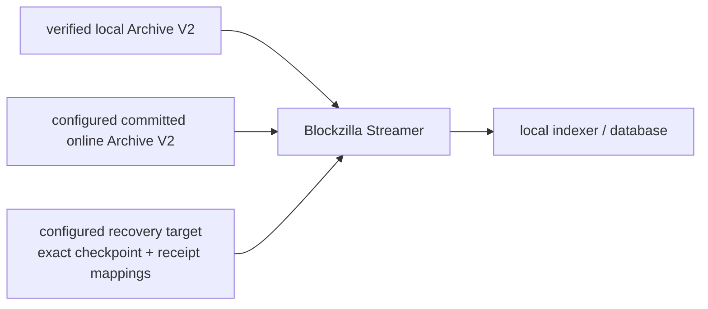

# Blockzilla Streamer

Status: **partially implemented foundation**, reviewed 2026-09-06.
`blockzilla-compact-v2-reader` and the read-only archive gateway can validate
and range-read completed immutable generations. `blockzilla-model` provides
the ordered `BlockSink` interface, and `blockzilla-dump` has a restart-safe
SQLite token-event sink. The general `blockzilla sync` and `blockzilla stream`
commands, including their product-level checkpoint protocol below, remain planned.

## Purpose

Blockzilla Streamer is the planned indexer-facing side of Blockzilla. It reads
committed Archive V2 blocks from local or edge storage and delivers them to a
local database/indexer adapter.

It is a product responsibility, not necessarily another service. The
`blockzilla` executable can expose the user commands while a focused reader
crate provides reusable storage and sink logic.


```mermaid
flowchart LR
    LOCAL["verified local Archive V2"] --> STREAM["Blockzilla Streamer"]
    ONLINE["configured committed online Archive V2"] --> STREAM
    RECOVERY["configured recovery target<br/>exact checkpoint + receipt mappings"] --> STREAM
    STREAM --> DB["local indexer / database"]
```

Streamer does not connect to Hivezilla. A fenced Hivezilla compact worker reads
terminal raw custody, repairs and validates the finite job, and uploads an
immutable candidate object set. Blockzilla alone writes the reader-visible
completion manifest and commits it to the canonical catalog. Streamer reads only
that committed result. The read-only Edgezilla Worker is a point-read RPC
surface, not a bulk backfill source.

## What works today

Blockzilla can already build the local hot-block archive that a future Streamer
will consume:

```sh
cargo run -p blockzilla -- \
  build-archive-v2-hot-blocks INPUT.car.zst OUTPUT_DIRECTORY
```

That command is implemented. It does not stream to an indexer and does not
publish the result to edge storage. Full epochs can be very large; contributors
should use the repository's small fixture workflow for initial testing.

The focused `blockzilla-compact-v2-reader` can also open a completed generation from a
local or HTTP Range source, bind pubkey filters to its registry and generation,
decode independent hot-block frames, and fetch selected signatures. The
`blockzilla-archive-gateway` publishes an authenticated read-only Range surface.
See the [FireWatch handoff](../guides/firewatch-local-archive-indexing.md) for
their exact boundary. The common reader and application-sink APIs are described
in the [query guide](../guides/blockzilla-query-sdk.md). The existing SQLite
sink is one application implementation; it does not implement the general
Streamer source-transition and recovery protocol proposed here.

## Proposed commands

The following syntax illustrates the target UX; these are not current commands:

```text
blockzilla sync   <committed-edge-source> <local-cache>
blockzilla stream <verified-local-archive> <indexer-sink>
```

- `sync` downloads or range-reads a committed generation, verifies it, then
  reveals it atomically in the local cache.
- `stream` reads a verified local generation and advances a logical checkpoint
  only after the sink acknowledges the delivered block.

## Source selection

The proposed reader order is:

1. a verified local canonical archive or cache;
2. the configured committed online archive target; and
3. the configured recovery target, but only through its exact recovery
   checkpoint and predecessor-linked canonical-to-recovery receipt mappings.

R2 online plus B2 recovery is one possible deployment, not a protocol identity.
A recovery reader starts at the configured checkpoint, verifies its target and
catalog head, follows receipt links to the requested generation, and re-verifies
every mapped object's length and SHA-256. Bucket listing, a numerically largest
generation, or an unlinked independently verified object set is never a source
selection rule.

CAR, raw Yellowstone observations, uncommitted Hivezilla candidate objects, and
shreds are not Streamer inputs. They must first become a Blockzilla-committed
Archive V2 generation.

A source transition requires the same Blockzilla-committed completion-manifest
identity and digest. Matching one overlap block is not proof that two otherwise
different generations are interchangeable. An unproven transition pauses
rather than silently skipping data.

## Delivery contract

The sink receives a deterministic canonical Archive V2 block projection. This
contract is independent of Hivezilla's raw-shred and provisional
block-observation wire feeds.

Blocks arrive in ascending slot order for the selected archive view. Each
delivery carries enough identity for idempotent application:

- cluster/genesis identity;
- slot, parent slot, blockhash, and previous blockhash;
- archive generation and format version;
- a stable archive event identity and content digest;
- completeness/provenance state required by the selected view.

Initial delivery semantics are at least once:

- identical event identity: the sink may safely ignore a replay;
- same slot/blockhash with different content: quarantine and stop;
- conflicting finalized blockhash: stop as a finality conflict;
- missing slot without authoritative skip evidence: wait for repair.

Build the Streamer integration on the existing small Rust sink boundary.
Keep database-specific state in the application sink.

## Checkpoints

Keep three states separate:

1. **storage cursor** — the physical file/object position used to resume a
   reader;
2. **consumer checkpoint** — the last event durably acknowledged by the sink;
3. **sync catalog** — the set of complete verified generations available
   locally.

The consumer checkpoint is source-neutral. It records the consumer identity,
cluster identity, delivery version, filters, commitment, and last acknowledged
event. Checkpoints are written atomically and locked against concurrent writers.
Resume is inclusive, followed by event-identity deduplication.

Changing filters, projection, commitment, or delivery version must not silently
reuse an incompatible checkpoint.

## Committed follow

After local replay works, Streamer can follow new Blockzilla generations:

1. discover a new Blockzilla-owned completion manifest through the committed
   catalog;
2. pin and verify all catalog-readable publication objects referenced directly
   by the completion manifest, including its published finality manifest;
3. make the generation visible in the local sync catalog;
4. deliver blocks and wait for sink ACKs;
5. poll for the next committed generation.

Freshness is bounded by Blockzilla's commit and publication cadence. Lower
latency may use smaller committed generations later, but Streamer still does
not bypass Blockzilla's archive authority.

## Implementation order

1. Replay the deterministic local fixture with per-block ACKs and an atomic
   checkpoint.
2. Add the sink trait and one minimal indexer example.
3. Add committed configured-online-target sync/range reads (R2 is the first
   deployment adapter).
4. Add recovery-target reads through the exact checkpoint and receipt mapping
   (B2 is the first deployment adapter).
5. Add committed-generation follow.
