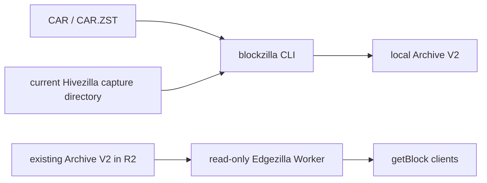

# Blockzilla system architecture

This document separates what exists on current `main` from the proposed
multi-source archive system. For the compact target diagram, see the
[full system schema](full-system-schema.md).

## Current repository and data flow

The complete, usable path today is CAR/CAR.ZST to a local Archive V2 directory.
The repository also has a prototype path that finalizes current Hivezilla
capture directories, plus a read-only Edgezilla Worker for Archive V2 objects
that have already been placed in R2. A restored experimental CAR-backed Worker
provides a separate read-only compatibility/reference path; it is not part of
the canonical Blockzilla Archive V2 flow shown below.



There is no integrated local-archive-to-R2/B2 publisher in the repository yet,
so the two halves of this diagram intentionally have no arrow between them.
There is also no `blockzilla sync` or `blockzilla stream` command yet.

The current top-level layout is:

```text
blockzilla/                         Blockzilla CLI and archive builders
services/
  hivezilla/                        current live prototype and executable
  blockzilla-get-block/             read-only Worker and native reader tools
  old-faithful-get-block/           experimental read-only CAR compatibility
                                    Worker restored from preserved history
crates/
  blockzilla-format/                Archive V2 records, codecs, and indexes
  blockzilla-log-parser/            reusable Solana log parser
  old-faithful/
    car-reader/                     CAR and CAR.ZST reader
    slot-ranges/                    slot-range indexing support
examples/
  token-api/                        optional derived-data example
scripts/                            contributor benchmarks and checks
docs/                               public architecture, guides, and references
```

This is the canonical description of the repository today. Future crates and
runtime modules should not be added to this tree in documentation before they
exist.

## Current capability table

| Boundary | Current status |
| --- | --- |
| Blockzilla CAR preflight/build/repair/inspect | Implemented |
| Hot-block Archive V2 writer, indexes, sidecars, and readers | Implemented |
| Build from a current live-capture directory | Implemented prototype |
| Hivezilla Yellowstone capture and repair tools | Implemented prototype |
| Hivezilla multi-instance gRPC runtime | Planned |
| Hivezilla shred capture/reconstruction | Planned |
| Blockzilla finite archive scheduler and read-only status API | Restored, buildable, and experimental |
| Hivezilla durable receiver | Implemented; Blockzilla-boundary integration and deployment remain planned |
| Blockzilla R2/B2 publication | Planned |
| Edgezilla read-only R2 Worker | Implemented |
| Edgezilla read-only CAR compatibility Worker | Restored, buildable, and experimental |
| Edgezilla B2 recovery integration | Planned |
| Blockzilla Streamer (`sync` and `stream`) | Planned |

## Proposed product model

**Blockzilla remains the main product and the only Archive V2 authority.** The
other names describe supporting failure boundaries:

| Product boundary | Proposed responsibility |
| --- | --- |
| **Hivezilla** | Capture independent gRPC or shred inputs, preserve replay evidence, normalize when possible, and deliver durable observations to Blockzilla |
| **Blockzilla** | Receive, compare, repair, compact, validate, schedule finite jobs, commit local Archive V2, and publish verified edge copies |
| **Edgezilla** | Hold the R2 online copy and B2 recovery copy as one read boundary, and serve committed Archive V2 through a read-only Worker |
| **Blockzilla Streamer** | Sync and read committed compact blocks from local or edge storage to build or follow a local indexer |

Only Blockzilla may declare a generation canonical or write an Edgezilla
generation. Hivezilla never publishes archives, and Edgezilla never repairs or
writes them. Streamer never consumes provisional Hivezilla data.

## Proposed source model

Hivezilla is a family of independently supervised **source instances**, not one
singleton process. An instance is bound to exactly one source identity and owns
its cursor, WAL lineage, replay state, and failure boundary.

- A Yellowstone gRPC instance retains its source observation before attempting
  normalization. If normalization fails, the raw observation remains
  replayable and may be delivered to Blockzilla as an explicit fallback.
- A shred instance retains raw shred evidence separately. It emits a compact
  candidate only after reconstruction and verification; incomplete shreds are
  not disguised as a complete gRPC block.
- Multiple gRPC and shred instances submit independently. Blockzilla performs
  cross-source deduplication, repair, fork/conflict retention, and canonical
  selection.
- CAR/CAR.ZST remains a finite Blockzilla input for historical builds and
  repair. It does not pass through Hivezilla.

Blockzilla should not own a live Yellowstone or shred socket. If capture must
run near storage, it is still a Hivezilla instance with the same source and WAL
contract.

### Proposed delivery boundary

The target Hivezilla-to-Blockzilla protocol is versioned and typed. Its normal
payload is a self-contained registry-free compact block; its Yellowstone
fallback is the retained source observation plus identity, cursor, digest, and
failure reason.

```text
HivezillaDeliveryV1 = CompactBlock(SelfContainedBlockV1)
                    | RawYellowstoneObservation(SourceEnvelopeV1)
```

The names above are design placeholders, not implemented public Rust types.
Both variants require a durable, idempotent Blockzilla acknowledgement. A raw
ACK proves only that replay evidence is stored; it does not prove that the block
is complete, normalized, or canonical.

A compact delivery should remain deterministic, length-delimited, and
independently decodable. It must use raw pubkeys or a block-local dictionary,
not an epoch-global registry. Blockzilla assigns epoch-local dense IDs only
while building the canonical Archive V2 generation.

## Scheduler and runtime placement

The product boundaries determine runtime placement without prescribing a
particular provider or hostname:

- **Hivezilla capture** runs independently from the archive scheduler. Its
  long-lived source sockets and WAL must continue during a Blockzilla restart,
  subject to finite capacity.
- **Blockzilla's scheduler** runs with the archive authority and canonical
  storage. It schedules only finite, idempotent work such as materialization,
  repair, compaction, validation, publication, and reconciliation.
- **Blockzilla publication** owns credentials and write access for R2 and B2,
  even if an execution worker is deployed separately.
- **Edgezilla's Worker** runs in the read plane and has no archive mutation
  route or publication credential.
- **Streamer** runs with the indexer or local cache and reads committed storage
  directly. It does not use the point-read Worker for bulk replay.

## Canonical storage and publication

The proposed publication order is:

1. Blockzilla stages a complete local generation.
2. It validates block/index agreement, sidecar lengths, cluster identity, and
   completeness.
3. It commits the canonical local generation.
4. It uploads immutable payloads and indexes to R2 and B2 independently.
5. It verifies each destination and writes that destination's completion
   manifest last.

R2 is the normal online copy. B2 is an independently verified recovery copy of
the same logical generation. A successful R2 publication does not imply B2 is
complete, and neither remote copy authorizes deletion of the canonical local
archive.

Edgezilla readers accept only a generation whose completion manifest matches
the objects they read. Edgezilla does not own upload, repair, or replication
logic.

## Blockzilla Streamer

The planned Streamer is an indexer-facing responsibility that may live in the
`blockzilla` binary and a reusable reader crate. It has two operations:

- `sync`: acquire and verify committed Archive V2 generations into a local
  cache;
- `stream`: deliver blocks from a verified local generation to an indexer sink
  with durable logical checkpoints.

Its source order is verified local storage, R2, then an explicitly selected and
verified B2 recovery copy. Source transitions must agree on a committed
manifest or an inclusive slot/blockhash/content overlap. See the
[Streamer contract](local-streaming.md).

## Failure rules

| Failure | Required target behavior |
| --- | --- |
| One Hivezilla instance stops | Its own durable backlog grows or intake pauses; unrelated instances continue |
| Normalization fails | Raw Yellowstone evidence remains replayable; shred evidence stays pending or quarantined |
| Blockzilla stops | Hivezilla capture continues within capacity; canonical progress stops |
| Local build is incomplete | No canonical completion manifest is published |
| R2 publication fails | Local canonical production and B2 attempts remain independent |
| B2 publication fails | R2 may remain online, but recovery status stays incomplete |
| Edgezilla Worker stops | Stored archives and direct Streamer reads remain intact |
| Streamer stops after delivery | Resume is inclusive and the sink deduplicates by stable event identity |

No component may turn missing input into an empty-but-successful block. Gaps,
forks, incomplete shreds, normalization errors, and partial publications remain
explicit states.

## Repository evolution rules

- Keep Blockzilla product code in `blockzilla/` and deployable Hivezilla and
  Edgezilla processes in `services/`.
- Extract a crate only after it has a stable responsibility and a real second
  consumer; avoid generic `core`, `common`, or `utils` crates.
- A future Streamer reader crate may live under `crates/` once both CLI and
  example/indexer code consume it.
- Package and executable renames should be reviewed separately from mechanical
  folder moves and protocol changes.
- Provider credentials, machine paths, private incidents, and deployment
  tuning do not belong in the public architecture.

The implementation sequence is tracked in the project
[roadmap](../../ROADMAP.md).
