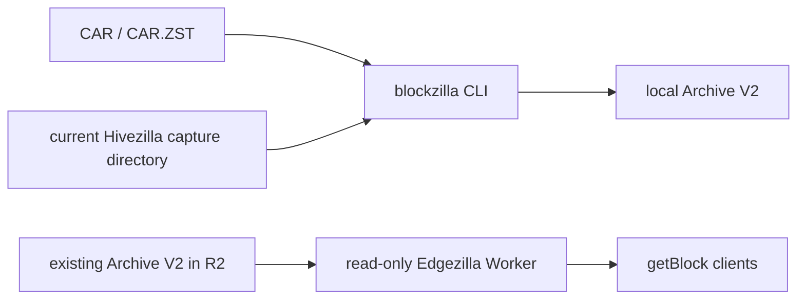

# Blockzilla system architecture

This document separates what exists on current `main` from the proposed
multi-source archive system. For the compact target diagram, see the
[full system schema](full-system-schema.md).
See also [live ingest and storage](live-ingest-and-storage.md) for the source,
spool, spillover, and Archive V2 boundaries.
The normative cross-binary publication boundary is the
[Blockzilla V1 compaction job protocol](../design/blockzilla-compaction-job-v1.md).

## Current repository and data flow

The complete, usable path today is CAR/CAR.ZST to a local Archive V2 directory.
The repository also has a prototype path that finalizes current Hivezilla
capture directories, plus a read-only Edgezilla Worker for Archive V2 objects
that have already been placed in R2. A restored experimental CAR-backed Worker
provides a separate read-only compatibility/reference path; it is not part of
the canonical Blockzilla Archive V2 flow shown below.


```mermaid
flowchart LR
    CAR["CAR / CAR.ZST"] --> BZ["blockzilla CLI"]
    CAPTURE["current Hivezilla capture directory"] --> BZ
    BZ --> LOCAL["local Archive V2"]

    R2["existing Archive V2 in R2"] --> WORKER["read-only Edgezilla Worker"]
    WORKER --> RPC["getBlock clients"]
```

There is no integrated local-archive-to-R2/B2 publisher in the repository yet,
so the two halves of this diagram intentionally have no arrow between them.
There is also no `blockzilla sync` or `blockzilla stream` command yet.

The current top-level layout is:

```text
blockzilla/                         Blockzilla CLI and archive builders
services/
  hivezilla/                        current live prototype and executable
  workers/blockzilla-get-block/        read-only Worker and native reader tools
  workers/old-faithful-get-block/      experimental read-only CAR compatibility
                                    Worker restored from preserved history
crates/
  blockzilla-format/                Archive V2 records, codecs, and indexes
  blockzilla-log-parser/            reusable Solana log parser
  old-faithful/
    car-reader/                     CAR and CAR.ZST reader
    slot-ranges/                    slot-range indexing support
examples/
  token-api/                        optional derived-data example
scripts/                            contributor benchmarks and checks
docs/                               public architecture, guides, and references
```

This is the canonical description of the repository today. Future crates and
runtime modules should not be added to this tree in documentation before they
exist.

## Current capability table

| Boundary | Current status |
| --- | --- |
| Blockzilla CAR preflight/build/repair/inspect | Implemented |
| Hot-block Archive V2 writer, indexes, sidecars, and readers | Implemented |
| Build from a current live-capture directory | Implemented prototype |
| Hivezilla Yellowstone capture and repair tools | Implemented prototype |
| Hivezilla multi-instance gRPC runtime | Planned |
| Hivezilla shred capture/reconstruction | Raw receiver foundations implemented; multi-source reconstruction and network handoff in progress |
| Blockzilla finite archive scheduler and read-only status API | Restored, buildable, and experimental |
| Hivezilla terminal durable receiver | Implemented foundation; live-first cutover, bulk backfill, and deployment remain planned |
| Permanent terminal raw object/index dataset | Planned |
| Central stream registry, lineage, and durable gap ledger | Planned |
| Hivezilla internal Yellowstone relay | Implemented prototype; isolated general public exit remains planned |
| Continuous shred-to-block observation processor | Planned; diagnostic FEC/deshred foundations exist |
| Per-source temporary object-store overflow | Verified upload/receipt prototype implemented; per-node namespaces, unified replay, and ACK-driven cleanup remain planned |
| Canonical Archive V2 cloud publication | Edge read path implemented; Hivezilla compact-worker upload and Blockzilla catalog commit remain planned |
| Edgezilla read-only R2 Worker | Implemented |
| Edgezilla read-only CAR compatibility Worker | Restored, buildable, and experimental |
| Edgezilla B2 recovery integration | Planned |
| Blockzilla Streamer (`sync` and `stream`) | Planned |

## Proposed product model

**Blockzilla remains the main product and the only canonical Archive V2 catalog
authority.** Hivezilla workers may build and upload immutable archive objects,
but those objects are not canonical until Blockzilla commits their manifest to
the catalog. The other names describe supporting failure boundaries:

| Product boundary | Proposed responsibility |
| --- | --- |
| **Hivezilla** | Capture independent gRPC, RPC, or shred inputs; own per-source local and temporary-cloud spools; write the physically policy-compliant permanent exact-raw dataset; process durable records; and execute fenced archive jobs |
| **Hivezilla Exit** | Serve named raw-shred and derived block-observation streams through bounded public replay; hold no custody, processing, or canonical authority |
| **Blockzilla** | Publish the centralized stream registry, schedule finite archive jobs, issue one active fenced compaction attempt, and conditionally commit the canonical Archive V2 completion manifest/catalog |
| **Archive copy/audit** | Copy only catalog-reachable generations to a configured independent failure domain, verify every referenced byte, persist canonical-to-recovery mappings and predecessor-linked receipts, and CAS its exact recovery checkpoint; this may be a Hivezilla operation or provider replication |
| **Edgezilla** | Read the configured online archive and, when selected through its exact checkpoint/receipt chain, the configured recovery target; serve committed Archive V2 through a read-only Worker |
| **Blockzilla Streamer** | Sync and read committed compact blocks from local or edge storage to build or follow a local indexer |

Only Blockzilla may declare a generation canonical or advance the catalog.
Hivezilla compact workers upload immutable candidate objects under a fenced
job; an expired or superseded worker cannot commit them. The copy/audit role has
no catalog authority and cannot turn an uncommitted candidate into a recovery
generation. Edgezilla never repairs or writes archives. Streamer never consumes
provisional Hivezilla data.

## Proposed source model

Hivezilla is a family of independently supervised **source instances**, not one
singleton process. An instance is bound to exactly one source identity and owns
its cursor, WAL lineage, replay state, local spool, private temporary-cloud
namespace, and failure boundary.

A centralized, durable stream registry maps each stable logical source/feed name
to immutable stream generations, manifest digests, status, and explicit
successor IDs. The separately verified immutable manifests carry producer
descriptors, terminal-store/policy binding, lineage, overflow binding, and the
gap-event stream reference. Nodes cache existing snapshots and manifests, so
Blockzilla or registry downtime cannot stop an established source/custody
session. This is static control-plane inventory, not a peer mesh.

- A Yellowstone gRPC instance retains its source observation exactly at the
  declared capture boundary. A leased Hivezilla compact worker replays that
  evidence through the format adapter; normalization failure never removes the
  raw observation.
- A shred instance retains exact ordinary and repair datagrams in separate
  streams. A Hivezilla processor may reconstruct complete provisional block
  observations for a separate live stream. A Hivezilla compact worker
  independently reconstructs complete block candidates for canonical
  publication; incomplete shreds remain raw evidence and are never disguised
  as a complete block.
- Multiple gRPC, RPC, and shred instances transfer raw streams independently to
  terminal custody. The leased compact worker performs normalization,
  cross-source deduplication, repair, fork/conflict retention, and canonical
  selection under the finite Blockzilla job.
- CAR/CAR.ZST remains a finite archive-job input for historical builds and
  repair. It does not pass through live capture or HiveSync.

Blockzilla should not own a live Yellowstone or shred socket. If capture must
run near storage, it is still a Hivezilla instance with the same source and WAL
contract.

Each source spool is one logical retained stream across two physical tiers.
New records become durable on local disk first. Under disk pressure, a source
may seal and verify an immutable object in its own private overflow bucket and
then evict the covered local bytes. This is tier movement, not retirement: the
source remains responsible for serving the range from local disk or cloud until
the configured terminal raw store acknowledges it. Only that store's exact
protected cumulative ACK may make the logical range eligible for retirement
from both tiers. The source records that ACK and its retirement anchor durably
before deleting either copy.

The temporary object prefix and segment contents are self-describing and can be
catalogued again after loss of the original host. A fenced history-only recovery
instance may serve the old stream from overflow; a replacement writer starts a
successor generation unless the predecessor is proven stopped and the exact WAL
lineage is restored.

### Proposed delivery boundary

Hivezilla source-to-terminal-store delivery uses the versioned
[HiveSync custody protocol](../design/hivezilla-record-and-sync-protocol.md).
Each homogeneous source stream transfers exact source-format records under one
chained cursor. In V1 one configured terminal Hivezilla raw store is the sole
deletion-authorizing consumer for a stream. Its ACK proves only that the exact
prefix is stored as verified immutable objects plus rebuildable index and every
physical copy required by the store's immutable durability policy; it does not
prove that any block is complete,
normalized, or canonical. Blockzilla scheduling, a compact result, an Archive
V2 upload, and public delivery cannot ACK raw custody.

On reconnect, the terminal store does not wait for history before resuming the
head. Under the writer lock, the source completes admitted appends, seals and
validates the active segment, advances its checkpoint to the footer cursor `T`,
and starts the live lane at `T`. It serves the consumer's missing fixed range
`[C,T)` through session-fenced, idempotent bounded range fetches from local disk
or temporary cloud. The consumer may
stage both lanes out of order but may ACK only the largest exact contiguous
prefix after the permanent raw objects, independent policy copies, and
rebuildable range/copy index are durable.

A fenced Hivezilla compact worker privately replays permanent raw records
through the [minimal block candidate](../design/blockzilla-block-candidate-v1.md).
That derived candidate has no separate distributed WAL or custody ACK in V1.
The Blockzilla job binds one complete epoch and its deterministic ascending
block order; the worker materializes zero-based epoch-local IDs but cannot
choose a different allocation or make it canonical.

### Public live exit

An isolated Hivezilla Exit process serves the
[public live protocol](../design/hivezilla-public-exit-protocol.md). It reads one
registry-discovered post-durability raw-shred stream or one Hivezilla
processor's durable
block-observation journal and holds a bounded replay cache. Raw and derived
feeds have independent cursors, queues, and recovery semantics. Public
subscribers never connect through HiveSync and never influence raw retention.

Low-latency raw records reach that cache through a bounded post-fsync,
non-custodial fan-out from capture. A failed fan-out can lose only the exit's
cache suffix; it cannot block capture or remove the source-journal record.

The block-observation feed is complete but provisional and may contain losing
forks. Exact historical raw replay comes only from permanent raw custody. A
record not in the exit cache and not yet protected is pending only when trusted
status proves its source range remains recoverable; declared loss is
`HISTORY_LOST`, and unknown or transient state is `UNAVAILABLE`. None causes an
anonymous read against the capture spool. Exact observation replay comes from
retained observation history. Archive V2 is a distinct canonical-by-slot query
and cannot replace a missing raw or provisional event.

## Scheduler and runtime placement

The product boundaries determine runtime placement without prescribing a
particular provider or hostname:

- **Hivezilla capture** runs independently from the archive scheduler. Its
  long-lived source sockets and WAL must continue during a Blockzilla restart,
  subject to finite capacity.
- **Hivezilla terminal raw custody** resumes each source live-first, backfills
  the fixed pre-cutover gap, and writes verified exact objects, rebuildable
  index, and all durability-policy copies before its protected cumulative ACK. One logical
  store ID may be internally sharded by stream for capacity and fairness.
- **Blockzilla's stream registry** publishes logical names, immutable stream
  generations, manifest digests, status, and successors. The referenced
  manifests carry source descriptors, terminal policy binding, and gap-event
  stream IDs. Existing assignments remain valid from cache during an outage.
- **Blockzilla's scheduler and canonical catalog** schedule only finite,
  idempotent work such as materialization, repair, compaction, validation,
  publication, and reconciliation. They hold no live source socket.
- **V1 compaction** has exactly one active fenced attempt. A Hivezilla compact
  worker reads the permanent raw dataset, builds and verifies a candidate, and
  uploads immutable non-canonical candidate objects. Failure pauses canonical progress;
  the configured worker may retry only under a newer persisted fence.
- **Blockzilla's catalog commit** checks the job identity, lease fence, input
  range, and candidate manifest before a conditional commit. Object-store
  credentials granted to a worker do not grant canonical authority.
- **Archive copy/audit** may then read only the catalog-reachable online object
  set, write verified recovery objects and their mapping/receipt chain, and CAS
  its one configured recovery checkpoint. It cannot compact, ACK raw custody,
  mutate the catalog, overwrite immutable objects, or delete.
- **Edgezilla's Worker** runs in the read plane and has no archive mutation
  route or publication credential.
- **Streamer** runs with the indexer or local cache and reads committed storage
  directly. It does not use the point-read Worker for bulk replay.

## Canonical storage and publication

The proposed publication order is:

1. Blockzilla persists a finite job that binds every required stream's exact
   start and end prefix plus any content-addressed finite CAR/CAR.ZST inputs,
   exactly one complete epoch and its pinned schedule,
   coverage/finality/fork policy, algorithm/format versions, fixed zero-based
   epoch-local ID order, output namespace,
   predecessor, and one monotonic fence, which is also the attempt generation.
2. The leased Hivezilla worker reads exact evidence from the permanent raw
   dataset, reconstructs, normalizes, repairs, and selects complete canonical
   blocks.
3. The worker stages and validates a complete Archive V2 candidate, including
   block/index agreement, sidecar lengths, cluster identity, and completeness.
4. The worker uploads immutable payloads, indexes, sidecars, and a non-canonical
   candidate manifest to the permanent archive object store and verifies every
   object.
5. The worker submits the verified result and fence token to Blockzilla.
6. Blockzilla revalidates the job and writes the reader-visible completion
   manifest, then atomically advances the canonical catalog only if the fence,
   candidate digest, inputs, policy, and predecessor still match.
7. Optionally, the copy/audit role copies that exact catalog-reachable set,
   writes the complete provider-specific mapping and predecessor-linked receipt,
   then compare-and-swaps its exact recovery checkpoint. Only this last durable
   transition makes the generation `archive_recovery_protected`.

Worker-local archive files are staging/cache and may be removed after a
successful catalog commit. The permanent Archive V2 bucket is distinct from
both the permanent exact-raw dataset and every source node's temporary overflow
bucket. R2 may be the normal online archive copy and B2 an independently
verified recovery target, but those providers are examples rather than protocol
identity. Recovery-copy lag is
explicit operational state; it does not create another catalog writer or raw
ACK.
Neither archive upload nor catalog commit substitutes for terminal raw custody
or authorizes a source ACK.

Edgezilla readers accept only a catalog-committed generation whose manifest
matches the objects they read. Recovery reads additionally start from the exact
recovery checkpoint and follow its receipt mappings; they never select by
listing. Edgezilla does not own upload, repair, or replication logic.

## Blockzilla Streamer

The planned Streamer is an indexer-facing responsibility that may live in the
`blockzilla` binary and a reusable reader crate. It has two operations:

- `sync`: acquire and verify committed Archive V2 generations into a local
  cache;
- `stream`: deliver blocks from a verified local generation to an indexer sink
  with durable logical checkpoints.

Its source order is verified local storage, the configured online target, then
the configured recovery target reached through its exact checkpoint and receipt
mapping. A source transition must agree on the exact same
Blockzilla-committed completion-manifest identity and digest. See the
[Streamer contract](local-streaming.md).

Streamer renders deterministic canonical blocks from committed Archive V2 and
uses stable archive event identities. It does not consume or claim wire
compatibility with Hivezilla's provisional block-observation feed.

## Failure rules

| Failure | Required target behavior |
| --- | --- |
| One Hivezilla instance stops | Its own durable backlog grows or intake pauses; unrelated instances continue |
| Terminal raw store disconnects | Each source retains its unacknowledged suffix across local disk and its own temporary overflow; reconnect resumes live at sealed `T` while `[C,T)` backfills |
| Terminal raw object/index write fails | No ACK advances; each source retains the uncovered suffix and alerts while the terminal role retries |
| One permanent-raw physical copy is lost | The logical dataset repairs from another policy-required verified copy; no new ACK is emitted while the durability policy is deficient |
| The entire logical permanent raw dataset is lost | Exact ACKed history is a custody-loss incident; compact/history replay stops and source overflow cannot be assumed to retain retired prefixes |
| Source local disk approaches full | Verified overflow objects permit local eviction; unverified or unavailable cloud forces backpressure where possible and an explicit loss alert where it is not |
| Normalization fails | Raw Yellowstone evidence remains replayable; shred evidence stays pending or quarantined |
| Active Hivezilla compact worker stops | Its fenced lease expires; candidate objects remain non-canonical and a later worker retries the finite job |
| Blockzilla scheduler/catalog stops | Hivezilla capture, custody, processing, and live exit continue within capacity; no new archive lease or canonical catalog commit occurs |
| Stream registry stops | Existing cached assignments and sessions continue; new logical streams wait for registry publication and alert rather than inventing membership |
| Public exit overloads or stops | Capture, custody, processing, and compaction continue; clients reconnect and use the selected feed's explicit replay path |
| Candidate build is incomplete | No canonical catalog entry is committed |
| Permanent archive upload fails | The job remains uncommitted; terminal raw custody and source ACK state are unchanged |
| Source overflow deletion fails after ACK | The unnecessary temporary copy remains and alerts; the terminal raw copy remains responsible |
| Recovery-copy publication fails | The configured online copy may remain readable, but recovery status stays incomplete and alerts until exact verification and checkpointing recover |
| Edgezilla Worker stops | Stored archives and direct Streamer reads remain intact |
| Streamer stops after delivery | Resume is inclusive and the sink deduplicates by stable event identity |

No component may turn missing input into an empty-but-successful block. Gaps,
forks, incomplete shreds, normalization errors, and partial publications remain
explicit states.

## Repository evolution rules

- Keep Blockzilla product code in `blockzilla/` and deployable Hivezilla and
  Edgezilla processes in `services/`.
- Extract a crate only after it has a stable responsibility and a real second
  consumer; avoid generic `core`, `common`, or `utils` crates.
- A future Streamer reader crate may live under `crates/` once both CLI and
  example/indexer code consume it.
- Package and executable renames should be reviewed separately from mechanical
  folder moves and protocol changes.
- Provider credentials, machine paths, private incidents, and deployment
  tuning do not belong in the public architecture.

The implementation sequence is tracked in the
[Hivezilla V1 implementation plan](hivezilla-v1-implementation-plan.md).
