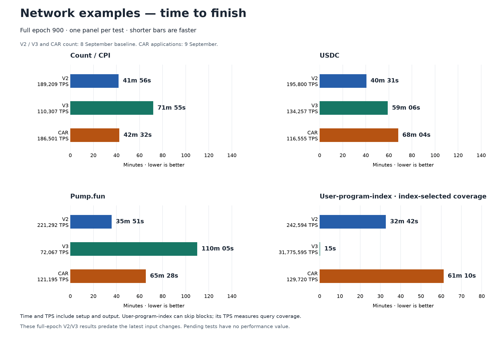
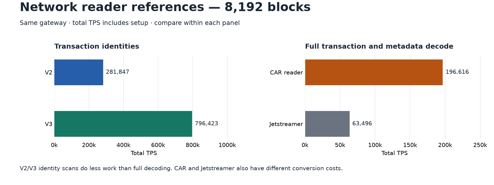

# Reader speeds: Jetstreamer, CAR, V2 and V3

**Epoch 900: 24/24 example measurements available.** All file and network examples are covered.

## Network examples: compare time to finish

**Shorter bars are faster.** Each panel compares the same example over the full epoch. TPS is shown beside each reader. Running or queued tests have no result yet.

The V2/V3 and CAR count results are the 8 September baseline, before the latest input changes. The three CAR application results will come from the current run. Time includes setup and output. User-program-index can skip blocks; its high TPS measures query coverage.

[Separate network read-bandwidth graph](artifacts/reader-speed-summary-20260909/network-mbs.png). MB/s measures bytes read, so a reader that skips data can use less bandwidth and finish sooner.

## Latest short network references

V2/V3 use the latest input schedule. CAR and Jetstreamer use the earlier matched mimalloc test. Each reads 8,192 blocks from our gateway. Compare within each panel: identity scans and full decoding do different work. These are separate tests from the full-epoch examples above.

## File examples

| Example | V2 TPS | V3 TPS | CAR TPS |
|---|---:|---:|---:|
| Count / CPI | 5,882,574 | 7,238,017 | 584,874 |
| USDC | 5,309,423 | 6,242,336 | 273,253 |
| Pump.fun | 1,707,335 | 1,693,006 | 445,707 |
| User-program-index | 1,514,989 | 1,077,992,566 | 468,289 |

File results cover the full epoch and include setup and output. Local CAR uses zstd; network CAR is raw. V3 here is the measured standalone prototype. Network and file cache conditions were not controlled.

[All TPS and read-rate plots](artifacts/reader-speed-summary-20260909/examples.png) · [Detailed results](reader-comparison-details-20260909.md) · [Latest network changes](full-readers-20260909.md) · [Source data](artifacts/reader-speed-summary-20260909/data.json)
