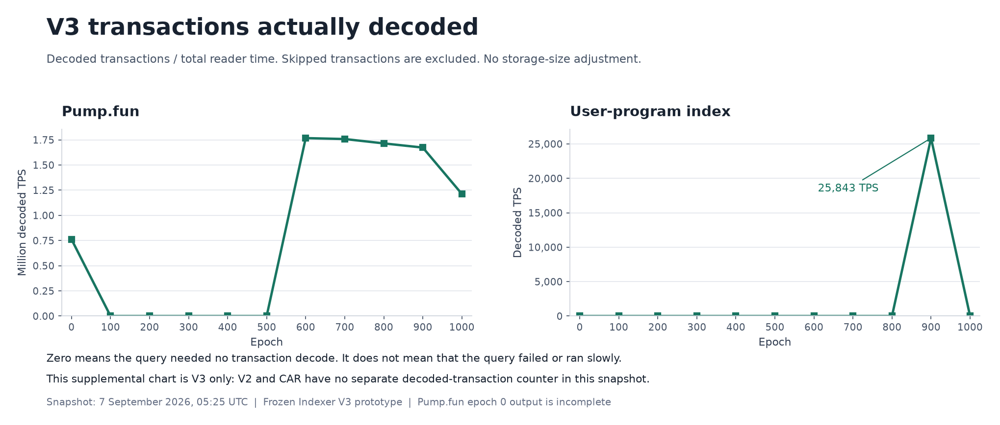
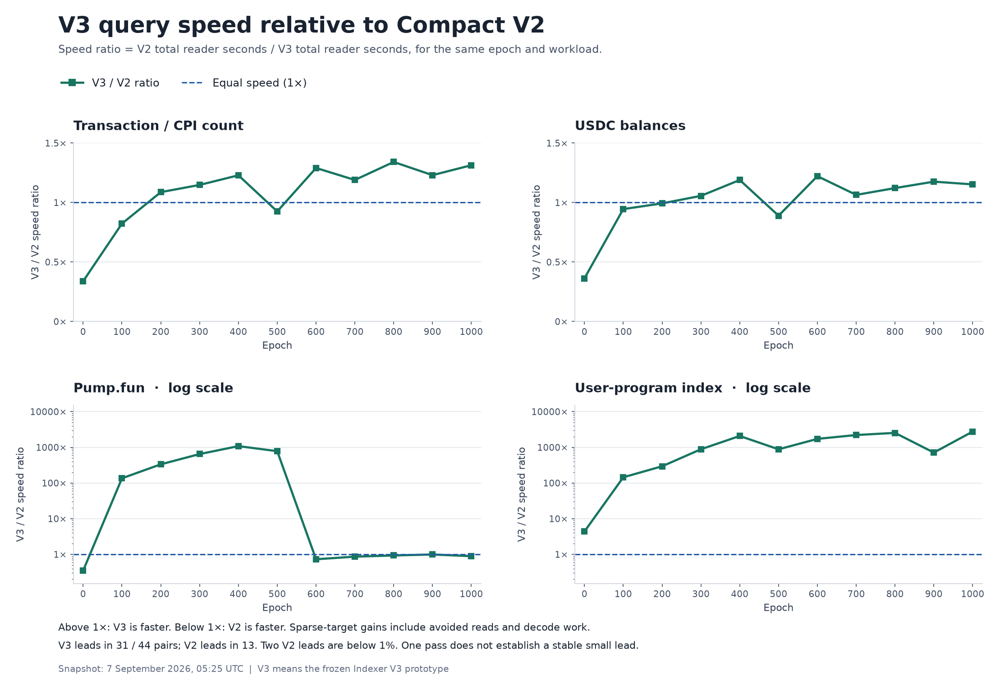

# Early reader benchmark results

Operator note, added 7 September 2026 at 06:54 UTC: a compaction job used NAS CPU during this benchmark. The operator reports that it did not access the benchmark SSD and that some CPU capacity was idle. Its start/end times and affected test cases are not yet known. CPU competition may have changed elapsed time; its effect is not measured. No correction factor is applied.

Naming: `user-program-index` is the current wallet workload name. The saved benchmark package and raw result IDs still use `firewatch`. These reports use the current display name; the source measurements are unchanged.

Snapshot: **2026-09-07 05:25:58 UTC (07:25 Paris)**. These are saved results, not a live view.

**112 of 132 local cases passed:** Compact V2 44/44, Indexer V3 44/44, CAR 24/44. CAR epoch 600 count was running at capture. No new failure occurred in this repaired run. Final local comparison is pending.

[Every selected test, CSV](artifacts/early-reader-results-20260907T0526Z.csv) · [Full metrics and provenance, JSON](artifacts/early-reader-results-20260907T0526Z.json) · [Earlier attempts and proof runs, CSV](artifacts/early-reader-results-20260907T0526Z-history.csv)

[Read the separate blog draft: From CAR to V3](from-car-to-v3-early-results-20260907.md). It explains each design step and the measured gains.

The TPS and MB/s tables below list every local test: 11 epochs × four workloads × three formats. The CSV also lists all 12 pending epoch-900 network tests and the three pending Jetstreamer reference runs.

## Read the rates

- **M TPS** means millions of transactions per second. It uses all requested/covered transactions divided by total reader time, including setup and output work.
- **MB/s** uses logical source bytes divided by scan time. MB is decimal. For V2/V3 this is the SDK logical input rate; it is not the SSD hardware rate. For CAR this is the decoded CAR stream rate. Compressed-file read counts are unavailable for zstd CAR. Separate local file-read and network counters are in the CSV.
- **V3 covered TPS** includes transactions skipped with index evidence. It can be very high for a target with no matches. The separate decoded-TPS table below shows the actual decoded transaction rate for selective queries.
- V3 here is the frozen **Indexer V3 prototype**. This is not a benchmark of canonical Archive V3.
- Local CAR epoch 300 uses the prepared raw baseline file. All other selected local CAR inputs use zstd decoded during their timed scans.

V3 USDC at epochs 700, 800 and 1000 reports 2.4–4.7 GB/s of logical reads. These are not verified SSD bandwidth measurements. Logical read totals need not equal unique file bytes. This snapshot does not establish why those queries report higher logical bytes than V2.

V2/V3 request 12 decode/projection workers. CAR currently overlaps one input producer and one projection consumer; the matrix setting does not make it a 12-worker decoder. Compare format design and reader implementation together.

## TPS for every local test

The main plots show absolute query TPS and logical MB/s separately. Neither metric is divided by stored size. Colors stay the same: blue for V2, green for V3, and orange for CAR. Missing CAR points are pending results. TPS uses total reader time. The two target-query plots use a log scale because index skips produce a wide range of rates. Decoded TPS is shown separately below.

### Transaction and recorded CPI count

| Epoch | V2 M TPS | V3 covered M TPS | CAR M TPS |
| --- | ---: | ---: | ---: |
| 0 | 2.573 | 0.871 | 0.237 |
| 100 | 13.184 | 10.850 | 0.343 |
| 200 | 11.746 | 12.775 | 0.948 |
| 300 | 10.982 | 12.610 | 0.889 |
| 400 | 9.266 | 11.389 | 0.892 |
| 500 | 10.605 | 9.815 | 0.933 |
| 600 | 6.118 | 7.897 | Running |
| 700 | 6.700 | 7.973 | Pending |
| 800 | 5.617 | 7.533 | Pending |
| 900 | 5.883 | 7.238 | Pending |
| 1000 | 4.805 | 6.313 | Pending |

### USDC recorded balances

| Epoch | V2 M TPS | V3 covered M TPS | CAR M TPS |
| --- | ---: | ---: | ---: |
| 0† | 2.385 | 0.866 | 0.251 |
| 100 | 10.510 | 9.934 | 0.348 |
| 200 | 9.901 | 9.832 | 0.794 |
| 300 | 9.346 | 9.872 | 0.717 |
| 400 | 8.205 | 9.761 | 0.576 |
| 500 | 9.489 | 8.441 | 0.824 |
| 600 | 5.693 | 6.957 | Pending |
| 700 | 5.982 | 6.368 | Pending |
| 800 | 5.072 | 5.690 | Pending |
| 900 | 5.309 | 6.242 | Pending |
| 1000 | 4.298 | 4.955 | Pending |

### Pump.fun transactions

| Epoch | V2 M TPS | V3 covered M TPS | CAR M TPS |
| --- | ---: | ---: | ---: |
| 0† | 2.174 | 0.762 | 0.258 |
| 100 | 4.784 | 648.086 | 0.351 |
| 200 | 6.887 | 2,297.148 | 0.883 |
| 300 | 6.140 | 3,970.577 | 0.786 |
| 400 | 5.746 | 6,195.841 | 0.721 |
| 500 | 6.152 | 4,797.162 | 0.791 |
| 600 | 3.555 | 2.591 | Pending |
| 700 | 2.079 | 1.794 | Pending |
| 800 | 1.844 | 1.716 | Pending |
| 900 | 1.707 | 1.693 | Pending |
| 1000 | 1.368 | 1.217 | Pending |

### User-program index wallet programs

| Epoch | V2 M TPS | V3 covered M TPS | CAR M TPS |
| --- | ---: | ---: | ---: |
| 0 | 2.454 | 10.741 | 0.257 |
| 100 | 4.731 | 683.601 | 0.347 |
| 200 | 8.481 | 2,492.147 | 0.915 |
| 300 | 6.165 | 5,435.511 | 0.834 |
| 400 | 3.918 | 8,139.661 | 0.760 |
| 500 | 7.147 | 6,280.767 | 0.875 |
| 600 | 1.500 | 2,584.887 | Pending |
| 700 | 1.566 | 3,461.966 | Pending |
| 800 | 1.289 | 3,269.590 | Pending |
| 900 | 1.515 | 1,077.993 | Pending |
| 1000 | 0.890 | 2,455.005 | Pending |

† Epoch 0 USDC and Pump.fun completed with incomplete outputs: 1,724,876 transactions have indeterminate coverage in each format. Known failed transactions are excluded from these application outputs.

Count includes all transactions, votes, failures, and recorded inner instructions in 9,000-slot buckets. User-program index uses wallet `5LikTUsx695BHRipWoRrn6YmTQEcPrvbR8YaHxdSRQo8`. It retains failed/unknown signer counters and lists programs from successful matching transactions.

## Logical MB/s for every local test

MB/s uses scan time. A lower rate can mean that the query needed less data. Use TPS or total time to rank query speed. The USDC chart has a larger vertical scale so its reported logical-byte values remain visible.

### Transaction and recorded CPI count

| Epoch | V2 logical MB/s | V3 logical MB/s | CAR decoded MB/s |
| --- | ---: | ---: | ---: |
| 0 | 116.9 | 41.9 | 590.7 |
| 100 | 520.7 | 169.9 | 251.3 |
| 200 | 544.5 | 188.3 | 670.6 |
| 300 | 662.2 | 246.8 | 623.5 |
| 400 | 617.6 | 284.1 | 688.6 |
| 500 | 479.0 | 156.4 | 558.4 |
| 600 | 688.8 | 447.9 | Running |
| 700 | 682.6 | 367.1 | Pending |
| 800 | 686.0 | 437.0 | Pending |
| 900 | 740.5 | 442.7 | Pending |
| 1000 | 749.5 | 511.9 | Pending |

### USDC recorded balances

| Epoch | V2 logical MB/s | V3 logical MB/s | CAR decoded MB/s |
| --- | ---: | ---: | ---: |
| 0† | 105.9 | 41.1 | 625.5 |
| 100 | 414.8 | 144.6 | 254.6 |
| 200 | 460.9 | 159.2 | 561.7 |
| 300 | 569.1 | 201.0 | 502.6 |
| 400 | 550.2 | 229.3 | 444.3 |
| 500 | 431.3 | 120.2 | 493.0 |
| 600 | 648.3 | 297.6 | Pending |
| 700 | 627.2 | 2,419.2 | Pending |
| 800 | 628.4 | 2,651.8 | Pending |
| 900 | 678.3 | 274.9 | Pending |
| 1000 | 679.6 | 4,681.7 | Pending |

### Pump.fun transactions

| Epoch | V2 logical MB/s | V3 logical MB/s | CAR decoded MB/s |
| --- | ---: | ---: | ---: |
| 0† | 240.3 | 87.8 | 641.1 |
| 100 | 188.4 | 0.0 | 257.0 |
| 200 | 319.1 | 0.0 | 624.7 |
| 300 | 370.2 | 0.0 | 551.6 |
| 400 | 383.0 | 0.0 | 556.3 |
| 500 | 277.8 | 0.0 | 473.6 |
| 600 | 637.7 | 224.7 | Pending |
| 700 | 348.9 | 197.3 | Pending |
| 800 | 347.8 | 213.3 | Pending |
| 900 | 331.0 | 216.1 | Pending |
| 1000 | 305.8 | 180.2 | Pending |

### User-program index wallet programs

| Epoch | V2 logical MB/s | V3 logical MB/s | CAR decoded MB/s |
| --- | ---: | ---: | ---: |
| 0 | 108.7 | 0.0 | 640.4 |
| 100 | 186.3 | 0.0 | 253.9 |
| 200 | 393.0 | 0.0 | 647.1 |
| 300 | 371.7 | 0.0 | 585.0 |
| 400 | 261.1 | 0.0 | 586.2 |
| 500 | 322.8 | 0.0 | 523.5 |
| 600 | 168.9 | 0.0 | Pending |
| 700 | 159.6 | 0.0 | Pending |
| 800 | 157.5 | 0.0 | Pending |
| 900 | 190.7 | 3.4 | Pending |
| 1000 | 138.8 | 0.0 | Pending |

† The epoch 0 source-coverage limits also apply to these rows. CAR epoch 300 is the prepared raw baseline; other CAR epochs stream zstd during the scan. These values do not measure compressed SSD reads.

## What V3 actually decoded for target queries

This supplemental chart excludes transactions skipped through indexes. It shows V3 only because V2 and CAR do not report a separate decoded counter in this snapshot. A zero means no decode was needed; it does not rank query speed. [SVG copy](artifacts/early-reader-visuals-20260907T0526Z/v3-decoded-tps.svg).

TPS below uses **decoded transactions / total reader time**. The same setup time remains included. Zero means no transaction decode was needed, not a missing result.

| Epoch | Pump decoded M TPS | Pump decoded transactions | Pump output rows | User-program index decoded TPS | User-program index decoded transactions | User-program index output programs |
| --- | ---: | ---: | ---: | ---: | ---: | ---: |
| 0 | 0.762 | 1,724,876 | 0 | 0 | 0 | 0 |
| 100 | 0.000 | 0 | 0 | 0 | 0 | 0 |
| 200 | 0.000 | 0 | 0 | 0 | 0 | 0 |
| 300 | 0.000 | 0 | 0 | 0 | 0 | 0 |
| 400 | 0.000 | 0 | 0 | 0 | 0 | 0 |
| 500 | 0.000 | 0 | 0 | 0 | 0 | 0 |
| 600 | 1.767 | 388,399,841 | 732,238 | 0 | 0 | 0 |
| 700 | 1.758 | 721,026,702 | 8,663,935 | 0 | 0 | 0 |
| 800 | 1.715 | 681,175,132 | 5,067,483 | 0 | 0 | 0 |
| 900 | 1.673 | 470,452,521 | 3,357,974 | 25,843 | 11,412 | 4 |
| 1000 | 1.213 | 546,273,400 | 4,085,619 | 0 | 0 | 0 |

For epoch 900 User-program index, V3 covered 476,026,811 transactions but decoded 11,412. It found 11 signer transactions and four program rows. The 1.078 billion covered TPS is an indexed query rate; actual decoded throughput is about 25,843 TPS. Pump.fun epoch 900 is much less selective: V3 decoded 470,452,521 transactions and wrote 3,357,974 matching rows.

## Comparison using the same completed epochs

These aggregates use epochs **0, 100, 200, 300, 400 and 500**, the shared completed set across all three formats. Each rate is a ratio of sums: total covered transactions / total reader seconds, and total logical source bytes / scan seconds. Different workloads are not pooled into one throughput figure.

### TPS

| Workload | V2 M TPS | V3 covered M TPS | CAR M TPS |
| --- | ---: | ---: | ---: |
| Transaction / CPI count | 10.355 | 11.111 | 0.862 |
| USDC balances | 9.051 | 9.286 | 0.674 |
| Pump.fun | 6.006 | 916.814 | 0.743 |
| User-program index | 5.480 | 3,663.717 | 0.791 |

### Logical MB/s

| Workload | V2 logical MB/s | V3 logical MB/s | CAR decoded MB/s |
| --- | ---: | ---: | ---: |
| Transaction / CPI count | 577.8 | 218.2 | 598.4 |
| USDC balances | 508.5 | 175.8 | 467.9 |
| Pump.fun | 335.3 | 84.7 | 515.7 |
| User-program index | 305.7 | 0.0 | 548.7 |

Pump.fun has no recorded matching output rows through epoch 500. The selected User-program index wallet also has no output rows in those samples. These target-query aggregates include absence queries and must not be read as general transaction-decode benchmarks. Epoch 0 USDC/Pump coverage remains incomplete, as marked above.

## Measured speed gain from V2 to V3

The ratio below uses V2 total reader time divided by V3 total reader time. Above 1× means V3 completed the same query faster. The two target-query panels use a log scale. All 44 V2/V3 pairs have results in this snapshot.

## Network and Jetstreamer

Scope update, 7 September 2026 at 08:03 UTC: the first network pilot now has **nine SDK cases at epoch 900**: four workloads each for V2 and V3, plus one CAR count. The three CAR application scans in the original snapshot plan are deferred. Jetstreamer keeps two 512-block proofs and one full epoch900 decoded count. Review and optimize the network reader before a full network sample run. The table and raw snapshot retain the original planned case list as history.

The user selected **epoch 900 only** for the next network phases. None has started. Pending rates are not zero.

| Epoch | Reader / format | Test | State | TPS | Network MB/s |
| --- | --- | --- | --- | ---: | ---: |
| 900 | Compact V2 | Transaction and recorded CPI count | Pending | Pending | Pending |
| 900 | Indexer V3 prototype | Transaction and recorded CPI count | Pending | Pending | Pending |
| 900 | Old Faithful CAR | Transaction and recorded CPI count | Pending | Pending | Pending |
| 900 | Compact V2 | USDC recorded balances | Pending | Pending | Pending |
| 900 | Indexer V3 prototype | USDC recorded balances | Pending | Pending | Pending |
| 900 | Old Faithful CAR | USDC recorded balances | Pending | Pending | Pending |
| 900 | Compact V2 | Pump.fun transactions | Pending | Pending | Pending |
| 900 | Indexer V3 prototype | Pump.fun transactions | Pending | Pending | Pending |
| 900 | Old Faithful CAR | Pump.fun transactions | Pending | Pending | Pending |
| 900 | Compact V2 | User-program index wallet programs | Pending | Pending | Pending |
| 900 | Indexer V3 prototype | User-program index wallet programs | Pending | Pending | Pending |
| 900 | Old Faithful CAR | User-program index wallet programs | Pending | Pending | Pending |
| 900 | Jetstreamer 0.7.0 | 512-block-proof-1-worker | Pending | Pending | Pending |
| 900 | Jetstreamer 0.7.0 | 512-block-proof-12-workers | Pending | Pending | Pending |
| 900 | Jetstreamer 0.7.0 | full-decoded-tx-count | Pending | Pending | Pending |

Jetstreamer uses unchanged upstream 0.7.0 with a count adapter. First run the first 512 canonical blocks with one and 12 processing workers, then a full epoch with 12 workers. Require exact block/count-plan equality. Its full transaction/metadata decoding, hashing and vote classification differ from the SDK count that includes recorded CPI. Public CAR is raw HTTP data; local epoch 900 is outer-zstd CAR.

## Current validation and source limits

- All 44 completed V2/V3 pairs agree on saved count buckets or saved application metrics and output hashes. All 24 completed CAR cases agree with both formats on the same saved evidence.
- This report compares recorded hashes and summaries. It does not claim a new byte-by-byte output comparison while timed readers are active. Final output and source inventory checks remain pending.
- Epoch-0 USDC and Pump.fun outputs are incomplete in all formats. Equal incomplete outputs show agreement, not complete source history.
- Tests use one NAS, one selected pass per case, and uncontrolled OS caches. Output comparison is outside timing. The two software cohorts ran at different times.
- Compact V2 uses the retained `38e1dcaa` binaries. Fresh CAR/V3 use the tested signer fix associated with `f46db7b7`; source and binary hashes are in the JSON.

The earlier full attempt stopped at CAR epoch 100 User-program index because stored CPI coordinates contradicted a recorded failed instruction. Its 95 passed cases and failed attempt remain saved. The selected table retains its 44 V2 measurements and replaces its old V3/CAR measurements with the fresh run. Two extra repaired epoch-100 proof cases passed. The history CSV lists all 52 superseded V3/CAR results and those two extra proof cases; they are not double-counted in the 132 selected local tests.

## Format choices behind the results

CAR reads the source node stream and decodes transaction metadata during each pass. Compact V2 replaces repeated public keys with IDs and scans compressed block records. The V3 prototype separates data into planes, which can reduce query input. Its reverse indexes can skip blocks for a program or signer query. Those skips explain the very large covered-TPS results when a target is absent or rare. The effect depends on the query; the USDC logical-read exceptions are noted above.

For epoch 900 Pump.fun, both V2 and V3 are near 1.7 million covered TPS. V3 still decodes nearly all requested transactions in that test. The same V3 index is much more selective for the chosen wallet. Lower logical MB/s can mean less data was needed, not slower storage.

Sources: [format and SDK map](../reference/archive-formats-and-read-sdk.md), [sample benchmark method](sample-reader-matrix.md), [workload contract](../../examples/workloads/README.md), and the captured records identified by hash in the technical JSON. The final blog will add the remaining local tests, epoch-900 network results and Jetstreamer comparison.

<!-- storage-ratio:start -->
Optional: [TPS per stored GB, with its own tables and charts](early-reader-storage-efficiency-20260907T0526Z.md). The main plots keep TPS and read speed separate. The winner matrix ranks query completion time.
<!-- storage-ratio:end -->

## Fastest measured format by epoch and test

Each cell selects the completed format with the shortest total reader time. Counts agree within each compared group. This is a measurement from one pass, not a claim that the format always wins. V3 leads in **31 of 44** V2/V3 pairs, and V2 leads in **13**. In the 24 groups with all three formats complete, V3 leads in 16 and V2 in eight. CAR leads in none of those 24 groups.

**Cell units: million covered TPS.** `*` means CAR is still pending, so the winner is provisional. `†` marks incomplete epoch 0 application output. `‡` marks a lead below 1%; more measurements are needed to assess that lead. V3 rates include index skips.

| Epoch | Transaction / CPI count | USDC balances | Pump.fun | User-program index |
| --- | ---: | ---: | ---: | ---: |
| 0 | V2 2.573 | V2 2.385 † | V2 2.174 † | V3 10.741 |
| 100 | V2 13.184 | V2 10.510 | V3 648.086 | V3 683.601 |
| 200 | V3 12.775 | V2 9.901 ‡ | V3 2,297.148 | V3 2,492.147 |
| 300 | V3 12.610 | V3 9.872 | V3 3,970.577 | V3 5,435.511 |
| 400 | V3 11.389 | V3 9.761 | V3 6,195.841 | V3 8,139.661 |
| 500 | V2 10.605 | V2 9.489 | V3 4,797.162 | V3 6,280.767 |
| 600 | V3 7.897 * | V3 6.957 * | V2 3.555 * | V3 2,584.887 * |
| 700 | V3 7.973 * | V3 6.368 * | V2 2.079 * | V3 3,461.966 * |
| 800 | V3 7.533 * | V3 5.690 * | V2 1.844 * | V3 3,269.590 * |
| 900 | V3 7.238 * | V3 6.242 * | V2 1.707 * ‡ | V3 1,077.993 * |
| 1000 | V3 6.313 * | V3 4.955 * | V2 1.368 * | V3 2,455.005 * |

V2 leads in count at epochs 0, 100 and 500; USDC at epochs 0, 100, 200 and 500; and Pump.fun at epochs 0 and 600–1000. Its USDC epoch 200 lead is 0.70%, and its Pump.fun epoch 900 lead is 0.85%. The tests do not yet establish whether these small leads persist. V3 leads in every selected User-program index query, including ten epochs with no matching output.

[Winner data and margins, CSV](artifacts/early-reader-visuals-20260907T0526Z/fastest-format.csv). Each chart also has an SVG copy for export: [TPS](artifacts/early-reader-visuals-20260907T0526Z/tps-by-epoch.svg), [logical MB/s](artifacts/early-reader-visuals-20260907T0526Z/logical-read-by-epoch.svg), [V3/V2 speed ratio](artifacts/early-reader-visuals-20260907T0526Z/speedup-vs-v2.svg), and [winner matrix](artifacts/early-reader-visuals-20260907T0526Z/fastest-format.svg).
