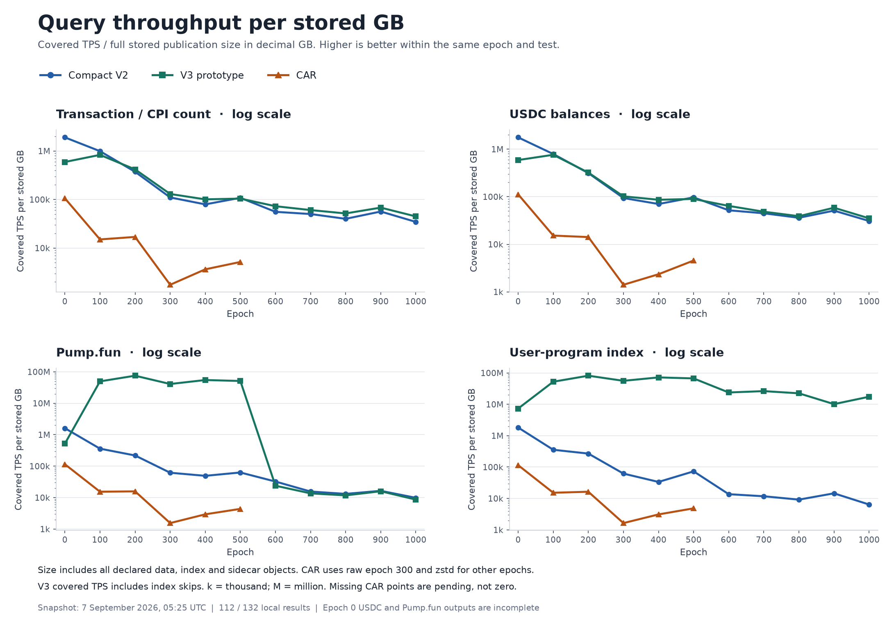
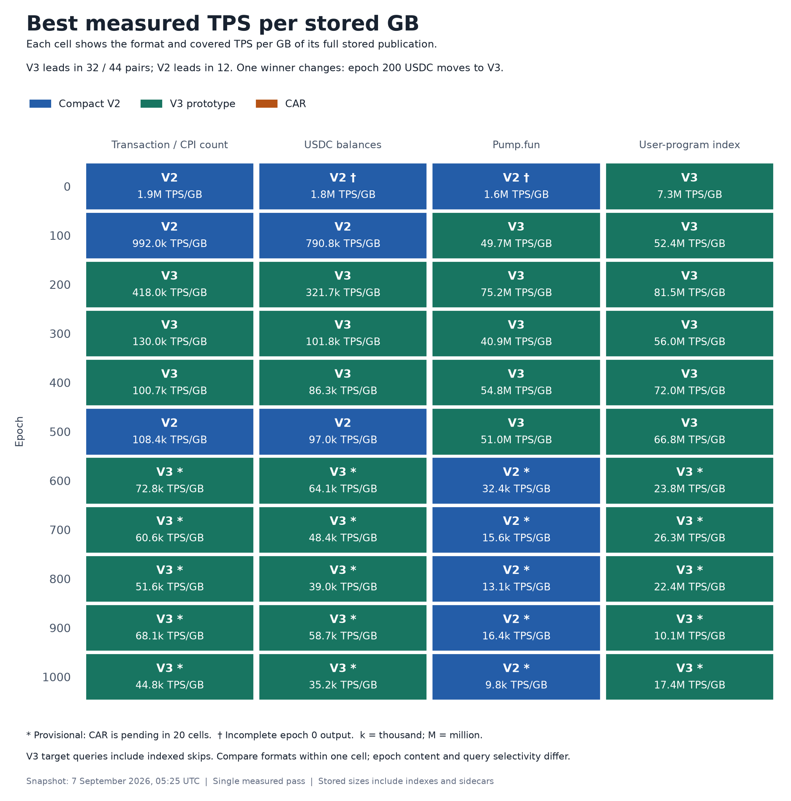

# Reader throughput per stored GB

Operator note, added 7 September 2026 at 06:54 UTC: a compaction job used NAS CPU during this benchmark. The operator reports that it did not access the benchmark SSD and that some CPU capacity was idle. Its start/end times and affected test cases are not yet known. CPU competition may have changed elapsed time; its effect is not measured. No correction factor is applied.

Naming: `user-program-index` is the current wallet workload name. The saved benchmark package and raw result IDs still use `firewatch`. These reports use the current display name; the source measurements are unchanged.

Snapshot: **2026-09-07 05:25:58 UTC (07:25 Paris)**. This uses the same fixed measurements as the [early report](early-reader-results-20260907T0526Z.md).

**TPS per stored GB = covered transactions per second ÷ stored archive GB.** One GB is 1,000,000,000 bytes. Higher values combine more query throughput with a smaller stored format. TPS includes reader setup and output work.

Compare formats for the **same epoch and workload**. Do not rank different epochs by this score: their transaction count, metadata, storage density and target selectivity differ. This ratio weights throughput and storage equally in proportional terms. Twice the throughput or half the size doubles the score.

## Storage used in the denominator

Size is the sum of the full declared publication object lengths for one format and epoch, including indexes, registries and sidecars, even when a query does not read every object. This is not the query's logical read byte count. It excludes application outputs, caches, temporary files and the unused alternate CAR copy.

These are independent format footprints, not filesystem-allocated blocks. Some V2/V3 sidecars share files on this NAS. Adding the format sizes together would not measure actual NAS disk use. CAR epoch 300 uses raw CAR plus its index; other CAR epochs use zstd CAR plus their indexes. Raw epoch-300 TPS is never divided by its unused compressed size. [Metric definition](sample-reader-matrix.md), [stored layout](../reference/archive-sample-layout-and-design.md).

All 33 sizes come from the saved preflight inventories, including the pending CAR epochs. Their throughput and ratios remain unavailable until their tests finish.

| Epoch | V2 stored GB | V3 stored GB | CAR stored GB | CAR encoding |
| --- | ---: | ---: | ---: | --- |
| 0 | 1.349 | 1.467 | 2.240 | zstd |
| 100 | 13.290 | 13.044 | 22.817 | zstd |
| 200 | 31.515 | 30.564 | 55.945 | zstd |
| 300 | 99.504 | 97.004 | 508.343 | Raw |
| 400 | 116.692 | 113.079 | 245.124 | zstd |
| 500 | 97.868 | 93.977 | 180.697 | zstd |
| 600 | 109.749 | 108.505 | 237.004 | zstd |
| 700 | 133.420 | 131.601 | 298.251 | zstd |
| 800 | 140.496 | 145.922 | 331.059 | zstd |
| 900 | 104.049 | 106.322 | 226.074 | zstd |
| 1000 | 139.038 | 140.889 | 299.445 | zstd |

## TPS per stored GB for every local test

Tables use **thousand covered TPS per stored GB**. V3 means the frozen Indexer V3 prototype. Its covered TPS includes transactions skipped through indexes. Separate decoded-TPS/GB values are included in the [CSV](artifacts/early-reader-visuals-20260907T0526Z/tps-per-stored-gb.csv) where the source reports them.

### Transaction / CPI count

| Epoch | V2 thousand TPS/GB | V3 thousand TPS/GB | CAR thousand TPS/GB |
| --- | ---: | ---: | ---: |
| 0 | 1,906.887 | 593.637 | 105.908 |
| 100 | 992.014 | 831.796 | 15.049 |
| 200 | 372.717 | 417.965 | 16.940 |
| 300 | 110.371 | 129.995 | 1.749 |
| 400 | 79.403 | 100.720 | 3.641 |
| 500 | 108.359 | 104.439 | 5.164 |
| 600 | 55.743 | 72.777 | Running |
| 700 | 50.220 | 60.583 | Pending |
| 800 | 39.980 | 51.625 | Pending |
| 900 | 56.537 | 68.076 | Pending |
| 1000 | 34.561 | 44.807 | Pending |

### USDC balances

| Epoch | V2 thousand TPS/GB | V3 thousand TPS/GB | CAR thousand TPS/GB |
| --- | ---: | ---: | ---: |
| 0† | 1,767.426 | 590.153 | 112.154 |
| 100 | 790.843 | 761.536 | 15.244 |
| 200 | 314.184 | 321.698 | 14.190 |
| 300 | 93.931 | 101.774 | 1.410 |
| 400 | 70.312 | 86.324 | 2.349 |
| 500 | 96.958 | 89.822 | 4.559 |
| 600 | 51.875 | 64.114 | Pending |
| 700 | 44.837 | 48.385 | Pending |
| 800 | 36.101 | 38.991 | Pending |
| 900 | 51.028 | 58.712 | Pending |
| 1000 | 30.911 | 35.171 | Pending |

### Pump.fun

| Epoch | V2 thousand TPS/GB | V3 thousand TPS/GB | CAR thousand TPS/GB |
| --- | ---: | ---: | ---: |
| 0† | 1,611.325 | 519.257 | 115.017 |
| 100 | 359.991 | 49,683.270 | 15.391 |
| 200 | 218.546 | 75,158.088 | 15.781 |
| 300 | 61.709 | 40,932.301 | 1.547 |
| 400 | 49.236 | 54,792.128 | 2.941 |
| 500 | 62.855 | 51,046.089 | 4.380 |
| 600 | 32.392 | 23.880 | Pending |
| 700 | 15.582 | 13.632 | Pending |
| 800 | 13.128 | 11.761 | Pending |
| 900 | 16.409 | 15.923 | Pending |
| 1000 | 9.840 | 8.635 | Pending |

### User-program index

| Epoch | V2 thousand TPS/GB | V3 thousand TPS/GB | CAR thousand TPS/GB |
| --- | ---: | ---: | ---: |
| 0 | 1,818.822 | 7,322.227 | 114.924 |
| 100 | 355.971 | 52,405.865 | 15.200 |
| 200 | 269.103 | 81,538.052 | 16.347 |
| 300 | 61.958 | 56,034.160 | 1.641 |
| 400 | 33.575 | 71,982.050 | 3.099 |
| 500 | 73.028 | 66,832.971 | 4.841 |
| 600 | 13.670 | 23,822.838 | Pending |
| 700 | 11.738 | 26,306.506 | Pending |
| 800 | 9.177 | 22,406.494 | Pending |
| 900 | 14.560 | 10,138.923 | Pending |
| 1000 | 6.400 | 17,425.093 | Pending |

† Epoch 0 USDC and Pump.fun completed with incomplete output. All three formats have 1,724,876 transactions with indeterminate coverage.

## What changes when size is included

V3 leads in **32 of 44** V2/V3 pairs, and V2 leads in **12**. Raw TPS alone gave V3 31 and V2 13. The only change is **epoch 200 USDC**: V2 is 0.70% faster, but V3 has a smaller stored footprint and leads by **2.39% in TPS/GB**. This remains one measured pass.

For epoch 300 count, V3 gives **129,995 TPS/GB**, V2 **110,371 TPS/GB**, and raw CAR **1,749 TPS/GB**. V3 is **1.178× V2** on this metric. Its raw query speed gain is 1.148×; the smaller V3 archive supplies the remaining factor.

At epoch 900, V3 occupies **106.322 GB** versus V2's **104.049 GB**. Its count score is **68,076 versus 56,537 TPS/GB**, a **1.204×** gain. V2 still leads Pump.fun on this metric: **16,409 versus 15,923 TPS/GB**. The storage term does not make V3 win every query.

For a dimensionless comparison, the CSV also includes **score / V2 score**. Equivalently: `(format TPS / V2 TPS) × (V2 stored GB / format stored GB)`. Above 1 means a better score than V2. Do not sum scores across epochs or average these ratios as if all queries had the same cost.

## Best measured format for each epoch and test

Each cell shows the format and **thousand covered TPS/GB**. `*` marks a provisional comparison with CAR still pending. `†` marks incomplete epoch 0 output. In the 24 groups with all three formats complete, V3 leads in 17 and V2 in seven. CAR leads in none.

| Epoch | Transaction / CPI count | USDC balances | Pump.fun | User-program index |
| --- | ---: | ---: | ---: | ---: |
| 0 | V2 1,906.887 | V2 1,767.426 † | V2 1,611.325 † | V3 7,322.227 |
| 100 | V2 992.014 | V2 790.843 | V3 49,683.270 | V3 52,405.865 |
| 200 | V3 417.965 | V3 321.698 | V3 75,158.088 | V3 81,538.052 |
| 300 | V3 129.995 | V3 101.774 | V3 40,932.301 | V3 56,034.160 |
| 400 | V3 100.720 | V3 86.324 | V3 54,792.128 | V3 71,982.050 |
| 500 | V2 108.359 | V2 96.958 | V3 51,046.089 | V3 66,832.971 |
| 600 | V3 72.777 * | V3 64.114 * | V2 32.392 * | V3 23,822.838 * |
| 700 | V3 60.583 * | V3 48.385 * | V2 15.582 * | V3 26,306.506 * |
| 800 | V3 51.625 * | V3 38.991 * | V2 13.128 * | V3 22,406.494 * |
| 900 | V3 68.076 * | V3 58.712 * | V2 16.409 * | V3 10,138.923 * |
| 1000 | V3 44.807 * | V3 35.171 * | V2 9.840 * | V3 17,425.093 * |

Saved count buckets, application metrics and output hashes agree within the compared groups. Final source and output-byte checks are still pending. This score measures query throughput per GB, including index-assisted skips. It does not isolate decoder performance.

[All local ratio values, CSV](artifacts/early-reader-visuals-20260907T0526Z/tps-per-stored-gb.csv) · [Stored sizes, CSV](artifacts/early-reader-visuals-20260907T0526Z/stored-publication-sizes.csv) · [Winner values, CSV](artifacts/early-reader-visuals-20260907T0526Z/best-tps-per-stored-gb.csv) · [Exact data and source hashes, JSON](artifacts/early-reader-visuals-20260907T0526Z/storage-ratio-data.json)

Charts also have SVG copies: [TPS/GB](artifacts/early-reader-visuals-20260907T0526Z/tps-per-stored-gb.svg) and [winner matrix](artifacts/early-reader-visuals-20260907T0526Z/best-tps-per-stored-gb.svg).
