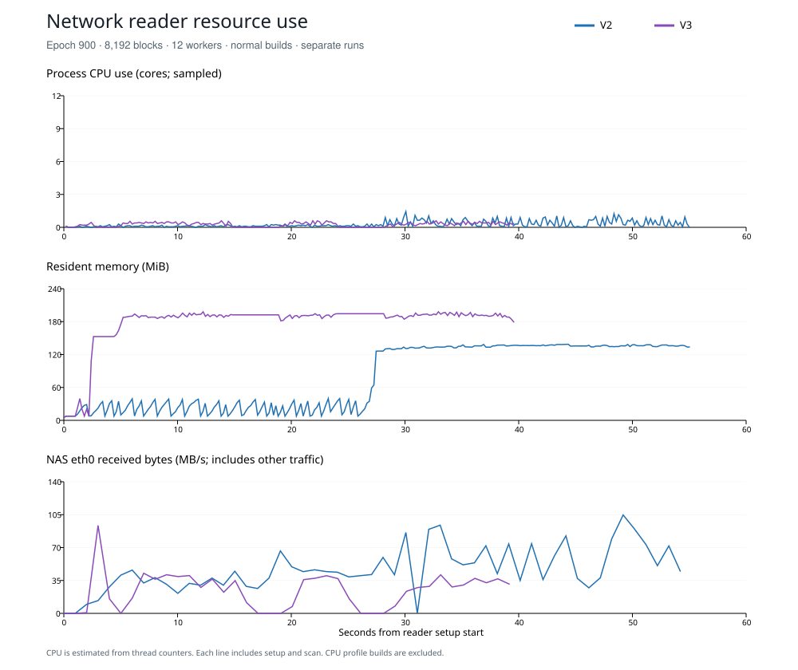

# Epoch 900 reader CPU and input profile — 8 September 2026

**All eight runs passed. The network reader is still much slower than the local
SSD path.** Both network readers used less than one CPU core on average out of
12. The next useful change is to reduce signature-read waits and improve input
scheduling. These measurements do not show that a smaller memory limit would
improve speed.

## Normal release results

These four runs use the same hash-and-discard sink. MB means 1,000,000 bytes.
Each cell is one short run, not an average or a full-epoch result.

| Reader | Setup (s) | Scan (s) | Total (s) | Scan transactions/s | Total transactions/s |
| --- | ---: | ---: | ---: | ---: | ---: |
| V2 local | 0.031 | 1.274 | 1.305 | 7,004,987 | 6,839,484 |
| V2 network | 26.642 | 28.448 | 55.090 | 313,762 | 162,022 |
| V3 local | 0.172 | 1.105 | 1.277 | 8,078,962 | 6,988,457 |
| V3 network | 4.473 | 35.162 | 39.635 | 253,850 | 225,203 |

| Reader | Scan logical input (MB/s) | Scan HTTP body (MB/s) | Setup HTTP (MB) | Scan GETs |
| --- | ---: | ---: | ---: | ---: |
| V2 local | 1,344.85 | — | — | — |
| V2 network | 60.24 | 60.24 | 912.01 | 156 |
| V3 local | 774.87 | — | — | — |
| V3 network | 24.35 | 24.35 | 107.10 | 2,176 |

V3 finishes sooner overall because it downloads much less during setup. V2 has
the faster network scan in this run. V3 uses half the scan bytes, but makes
nearly 14 times as many requests. Mean response body size is 10.98 MB for V2
and 0.393 MB for V3. All runs recorded zero server-error and incomplete-body
retries. The live gateway log tail recorded no slow or failed R2 operation;
this does not measure response body transfer time.

## CPU, memory and storage

| Reader | Mean process CPU cores, setup + scan | NAS busy CPU, sampled | Peak RSS at exit (MiB) | Process storage reads (MB) |
| --- | ---: | ---: | ---: | ---: |
| V2 local | 6.58 / 12 | 59.5% | 140.2 | 1,751.2 |
| V2 network | 0.28 / 12 | 3.4% | 138.2 | 0 |
| V3 local | 7.38 / 12 | 60.7% | 180.5 | 964.1 |
| V3 network | 0.26 / 12 | 3.2% | 198.6 | 0 |

CPU cores use process user + system CPU time divided by reader elapsed time.
Peak RSS comes from Linux process exit resource counters. The 0.2-second RSS
samples can differ slightly from that counter. Storage reads use Linux
`ru_inblock × 512`; they cover the whole process, including setup and executable
reads. They are not a direct-I/O disk benchmark. The local runs did cause
substantial storage reads, so the measured local rate was not entirely a
page-cache result. The archive volume is SSD, not a rotating hard drive.

Both readers reached 12 active worker jobs, but most network worker samples
were sleeping: 98.0% for V2 and 98.3% for V3. These are thread-state sample
fractions, not exact blocked-time fractions. Most waits were on a condition
variable, with the HTTP runtime also waiting for socket events. The NAS was
mostly idle. Its eth0 link reports 10 Gbit/s and carried almost all measured
traffic; this does not establish the speed of the public Internet path.



There is no before/after memory claim in this test. The diagnostic has a
smaller output sink than the earlier durable exporter. Profile builds also add
roughly 40–45 MiB during the reader phase and must not be used as the normal
reader memory baseline.

## CPU flame graphs

Open an SVG in a browser to zoom into stacks and search function names.
Width shows CPU samples. Height shows stack depth. Neither shows elapsed
network wait. Setup is included, so the V2 network graph includes its large
registry sidecar download.

| Reader | Local CPU profile | Network CPU profile | CPU samples, local / network |
| --- | --- | --- | ---: |
| V2 | [Flame graph](artifacts/network-profile-20260908/v2-local.svg) · [leaf counts](artifacts/network-profile-20260908/v2-local.top.tsv) | [Flame graph](artifacts/network-profile-20260908/v2-network.svg) · [leaf counts](artifacts/network-profile-20260908/v2-network.top.tsv) | 324 / 1,616 |
| V3 | [Flame graph](artifacts/network-profile-20260908/v3-local.svg) · [leaf counts](artifacts/network-profile-20260908/v3-local.top.tsv) | [Flame graph](artifacts/network-profile-20260908/v3-network.svg) · [leaf counts](artifacts/network-profile-20260908/v3-network.top.tsv) | 319 / 1,753 |

The local profiles show decoding, message validation, ordered publication and
SHA-256 output hashing. Hashing is 17.9% of sampled leaf frames for V2 and 21.3%
for V3; this is deliberate correctness work in the diagnostic. The V2 network
profile has a large HTTP/TLS CPU stack. The V3 network profile includes message
validation, integer decoding and HTTP/TLS work. CPU cost exists, but the process
counters show that available CPU capacity is not the current speed limit.

The local profiles are short and contain only about 320 samples. Unresolved
leaf frames account for 8.6% / 24.3% in V2 local/network and 1.6% / 11.8% in V3
local/network. Treat small function differences as sampling noise. The valid
profiles contain named stacks; they are not complete stack coverage.

For transparency, profiled scan times were V2 local 1.259 s, V2 network 21.668 s,
V3 local 1.170 s, V3 network 22.692 s. They are excluded from the throughput
comparison. Faster network times in later profile runs show that network/cache
variance is material; they do not show a benefit from CPU profiling.

## What to change next

1. **V2: overlap signature input with block input and decoding.** The normal
   scan spent 14.030 seconds in signature reads, out of 28.448 seconds elapsed.
   The coordinator's consume stage included those reads. The compressed input
   path already has three buffers and concurrent reads, but signature input can
   still stop ordered consumption. These stage times overlap; do not add them
   together or treat 14 seconds as guaranteed savings.
2. **V3: combine signature reads across adjacent decode jobs.** The scan has
   2,048 four-block jobs. Code inspection accounts for its 2,176 requests as
   2,048 signature windows plus 128 grouped directory/message reads. This is
   a code-derived breakdown, not a per-object HTTP trace. Read larger adjacent
   signature windows ahead of decoding, share them between jobs, and include
   their retained bytes in the existing memory budget. Keep sparse-range and
   source-identity checks.
3. **Then overlap independent V3 plane reads.** The current producer loads
   selected planes in sequence. A bounded request pool can hide latency, but
   it must keep ordered output, cancellation and the shared byte limit.

The storage-speed target is not reached. Do not increase worker count or reduce
memory limits blindly: the measured network problem is mainly waiting for
input. A new scheduling change needs its own ordinary-build comparison and
exact record checks. No SDK scheduling change was made during these measurements.

## Scope and measurement rules

- V2 and prototype Indexer V3, first 8,192 blocks of epoch 900, 12 workers.
- Transaction identities: slot, transaction position and primary signature. All
  8,925,832 records must match the earlier independently hashed output SHA-256
  `54531e48c946cb66c0c148d7339fdbb11511cffaaec9bc9c5a33f650a10d3685`.
- The diagnostic sink serializes and hashes every record, then discards the bytes.
  It does not write or sync a 714 MB output file. Its speed cannot be compared
  directly with the earlier durable-output exporter.
- Local and HTTPS runs use the same source code, projection, sink and block range.
  Each network process has a new private application cache. OS and CDN cache
  states are uncontrolled. Archive object metadata and HTTP ETags are checked
  before and after the run. One reader runs at a time.
- Ordinary release runs supply throughput numbers. Separate builds with CPU
  symbols, frame pointers and the internal `pprof` profiler supply flame graphs.
  CPU profiles include setup and scan. They show CPU samples, not elapsed I/O wait.
  Profile generation takes place after the timed reader completes.
- Process RSS, I/O and thread CPU/wait state are sampled every 0.2 seconds; host
  CPU, memory, disk, network and pressure counters every second. Process resource
  counters are also collected at exit. Host counters include other processes.
- NAS archive storage is a Btrfs SSD volume. Logical reader MB/s can include
  page-cache hits. Actual process disk I/O must be shown before making a claim
  about disk throughput. No cache flush or direct-I/O baseline is part of this run.
- External Linux `perf` cannot run under the NAS account (`perf_event_paranoid=3`).
  The existing internal CPU profiler avoids a system permission change.

Control: `target/nas-validation/network-profile-20260908T104622Z`.
Build source snapshot and logs stay on the development host. The NAS receives
only runtime executables, the control script and hash metadata.

## Reproduce a normal run

```sh
cargo build --release --locked --target x86_64-unknown-linux-musl \
  -p blockzilla-reader-profile
blockzilla-reader-profile --archive-root /path/to/archive \
  --epoch 900 --format v3 --workload transactions --blocks 8192 \
  --workers 12 --warmups 0 --iterations 1
```

For HTTPS, replace `--archive-root` with `--origin <sample-origin>` and
`--cache-root <new-private-cache>`. Use `--format v2` for V2.
For comparable builds, use the exact flags in the control's `build.json`.

## Reproduce a CPU profile

```sh
CARGO_PROFILE_RELEASE_DEBUG=1 CARGO_PROFILE_RELEASE_STRIP=none \
RUSTFLAGS='-C target-feature=+aes,+sse2 -C force-frame-pointers=yes -C force-unwind-tables=yes' \
cargo build --release --locked --target x86_64-unknown-linux-musl \
  -p blockzilla-reader-profile --features frame-profiler
```

Add `--flamegraph cpu.svg --profile-setup` to the run. Keep `--warmups 0`.
The tool rejects empty or fully unresolved CPU profiles and also writes
`cpu.top.tsv`. Save the normal executable before the profile build replaces it.

## Evidence and validation

[Acceptance and full counters](artifacts/network-profile-20260908/acceptance.json).
All eight hashes match the prior independently checked file. Archive stat
identities and HTTP lengths/strong ETags were unchanged. The normal and profile
builds passed, the diagnostic compiled locally, and all 639 recorded source
hashes remained unchanged through the run. Four SVGs were parsed and rendered
for inspection. The supervisor, eight readers and gateway tail have exited.

The diagnostic harness now accepts a network source, records setup/scan HTTP
counters and CPU phase times, and has a transaction-identity hash sink. It uses
the existing SDKs; there was no new reader scheduling change in this run.

Raw process, thread, disk, network and pressure samples, per-run logs, executable
hashes, control scripts and source/build provenance are retained under
`target/nas-validation/network-profile-20260908T104622Z`. The runtime archive
SHA-256 is `713d9d6a6f3856d24fcde20121b7b23da5a054fe08919cc6303608e94c50819d`.
The source snapshot and build logs remain local. No commit, push or Worker
deployment was made for this test.
