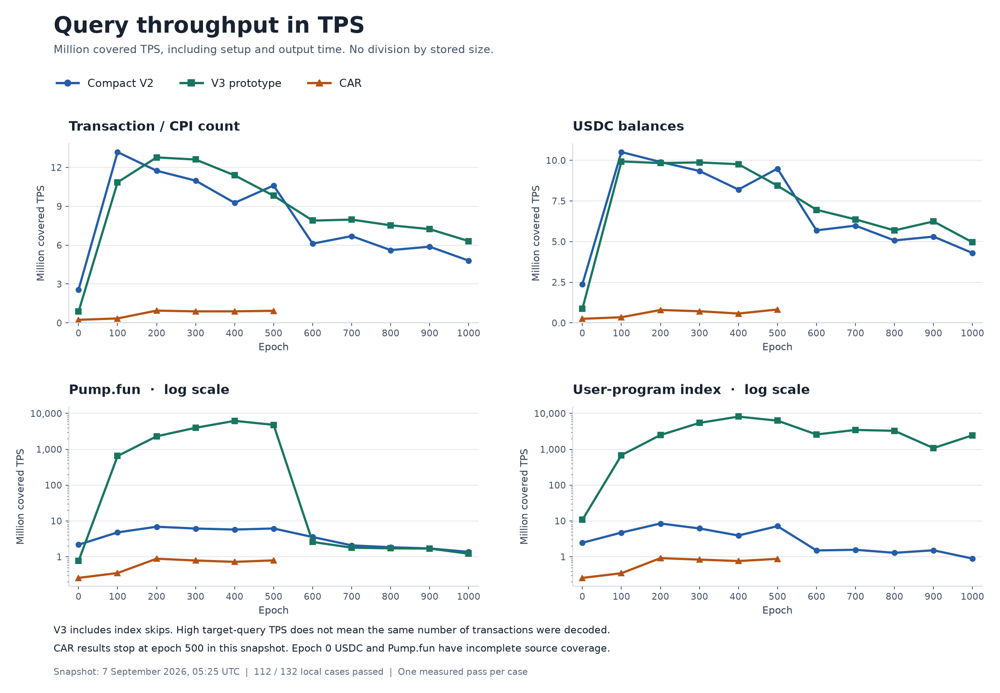
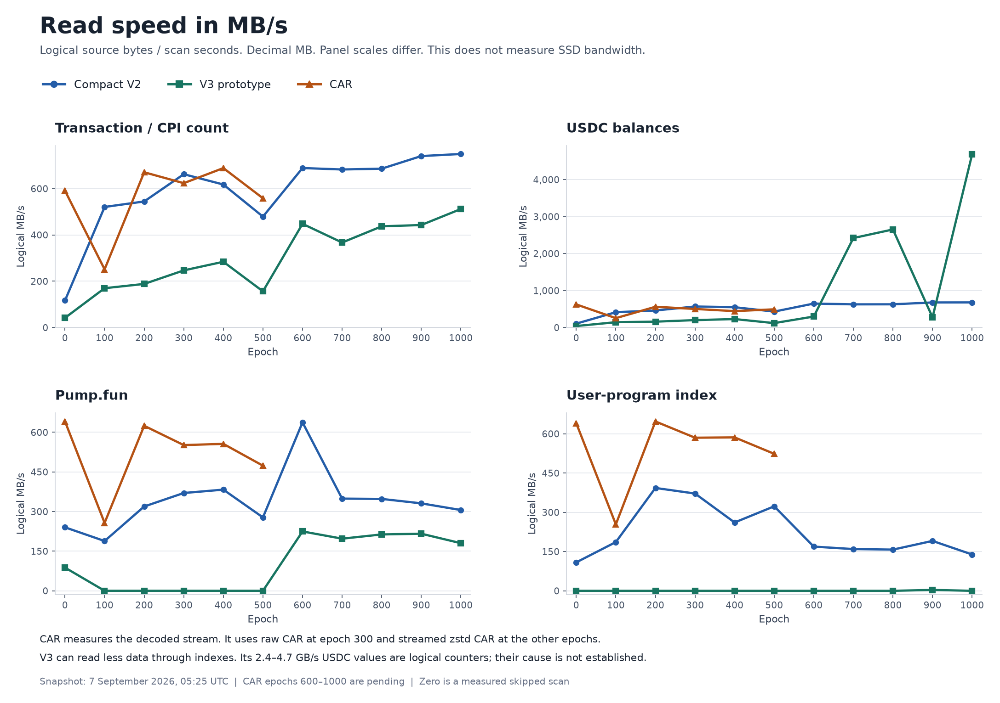
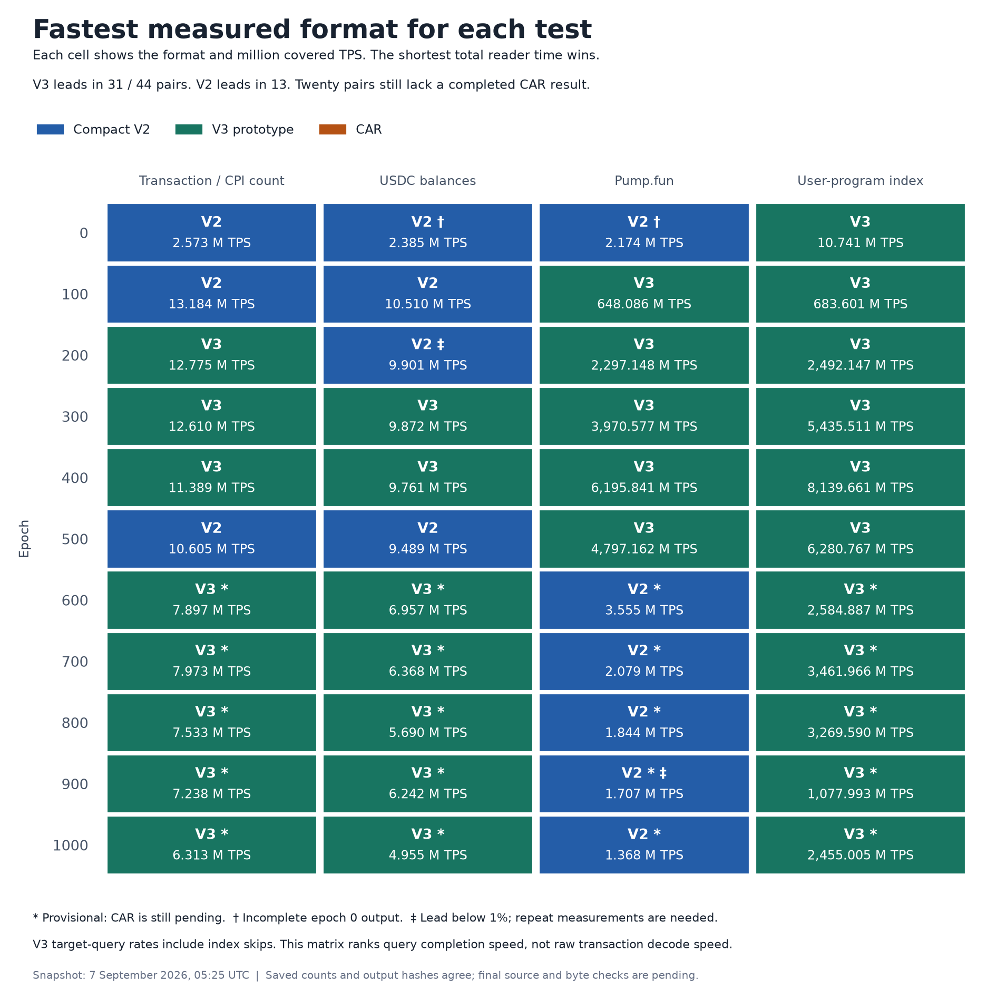

# From CAR to V3: read less data, finish the query sooner

Operator note, added 7 September 2026 at 06:54 UTC: a compaction job used NAS CPU during this benchmark. The operator reports that it did not access the benchmark SSD and that some CPU capacity was idle. Its start/end times and affected test cases are not yet known. CPU competition may have changed elapsed time; its effect is not measured. No correction factor is applied.

Naming: `user-program-index` is the current wallet workload name. The saved benchmark package and raw result IDs still use `firewatch`. These reports use the current display name; the source measurements are unchanged.

Blockzilla's archive work started with CAR, added compression, then changed the stored layout to reduce the work needed for each query. The early results show two distinct gains: Compact V2 makes full scans much faster, while the V3 prototype can avoid most transaction decoding for a narrow query.

V3 does not win every test. In the completed V2–V3 comparison, **V3 is faster in 31 of 44 cases; V2 is faster in 13**. These are single measurements, not proof that small differences will repeat.

This article uses the fixed **7 September 2026, 07:25 Paris** snapshot: 112 of 132 local cases had passed. It covers 11 epochs, from 0 to 1000, and four workloads: transaction/CPI count, recorded USDC balances, Pump.fun transactions, and programs used by one signer wallet. “V3” below means the **frozen standalone Indexer V3 prototype**. Canonical Archive V3, the intended replacement for V2, has a different layout and is not measured here. [Full results](early-reader-results-20260907T0526Z.md), [measurement data](artifacts/early-reader-results-20260907T0526Z.json), [format map](../reference/archive-formats-and-read-sdk.md).

## Start with CAR: retain the source representation

Old Faithful CAR stores content-addressed source nodes. A slot index gives the byte offset and length for each recorded block. The reader reads the nodes, reconstructs transaction and metadata frames, and extracts the fields that the application needs. CAR provides the independent source against which the compact formats can be checked. [CAR layout](../reference/archive-sample-layout-and-design.md#car), [reader implementation](../../crates/old-faithful/of-car-reader/src/query_sdk.rs).

This representation has a cost on each full scan. At epoch 300, the raw CAR stream is **508.338 GB**. The current count run took **815.35 seconds**, or **0.889 million TPS**, for 724,730,034 transactions. All four CAR workloads read that stream. A query for one wallet still has to inspect the selected history.

The current CAR reader overlaps input with projection. Two reusable raw-block buffers move between one input producer and one projection consumer. This limits queued work and avoids a payload copy between those stages. It is not a 12-worker transaction decoder. The benchmark measures this implementation together with the format.

## Add outer zstd: store fewer bytes

Outer zstd compression reduces the CAR file size while keeping the decoded CAR stream. The local reader decompresses `.car.zst` during the scan. It does not first create a raw file. The slot index still addresses decoded offsets, so a compressed scan that starts later must decode the preceding stream. Compression saves storage; it does not remove CAR parsing or add a program or signer index. [Compressed CAR behavior](../reference/archive-sample-layout-and-design.md#car).

A separate **5 September epoch-300 comparison** measured this step. The same reader binary counted the same blocks, transactions and recorded inner instructions from raw CAR and zstd level 3. Compression reduced the file from **508.338 GB to 206.321 GB**, a **59.41% reduction**. Total reader time changed from **817.01 to 753.09 seconds**: **1.085× throughput**, or 7.82% less time. Both files used the NAS SSD volume, but the raw run was earlier and OS caches were not cleared. This is one historical result, not a general compression speed guarantee. It is separate from the current matrix. [Raw/zstd comparison and evidence](epoch-300-car-zstd-level3-2026-09-05-report.md).

In the current matrix, epoch 300 uses its prepared raw CAR baseline. All other local CAR cases use streamed zstd. There is no current raw-versus-zstd pair for every epoch.

## Compact V2: change the data that the reader must process

V2 stores ordered block records in independent zstd frames. A shared registry replaces repeated 32-byte public keys with numeric IDs. Signatures and other data are kept in separate files. The reader can compare IDs, use borrowed block views, and read selected signature data when needed. It still reads each selected block for a general program or signer query. [V2 layout](../reference/archive-v2-hot-block-format.md), [reader API](../../crates/compact-v2/blockzilla-compact-v2-reader/README.md).

At epoch 300, the V2 count scan reports **43.683 GB of logical input**, compared with the **508.338 GB decoded CAR stream**. Its count time falls from 815.35 to **65.99 seconds**. The table uses total reader time, including setup and output work.

| Epoch-300 workload | CAR, million TPS | V2, million TPS | V2 throughput / CAR |
| --- | ---: | ---: | ---: |
| Transaction and recorded CPI count | 0.889 | 10.982 | 12.36× |
| Recorded USDC balances | 0.717 | 9.346 | 13.04× |
| Pump.fun | 0.786 | 6.140 | 7.81× |
| user-program-index wallet programs | 0.834 | 6.165 | 7.39× |

The two target queries have no matching output at epoch 300. Their V2 and CAR times measure scanning, validation and filtering. Across the common completed epochs 0–500, aggregate V2 throughput is **12.01× CAR for count** and **13.42× for USDC**. These aggregates divide total transactions by total seconds; they do not average the individual TPS figures. [Saved measurements](artifacts/early-reader-results-20260907T0526Z.json).

The reader also matters. V2 uses one sequential input producer, 12 reusable decode/projection workers and one ordered output stage. A bounded rolling window lets a free worker start later work without waiting for a whole group of blocks. In a separate 6 September comparison, this scheduling change reduced full epoch-300 scan time by **10.30% for USDC** and **9.58% for Pump.fun**, with identical outputs. Sampled process CPU use rose from about 8.94 to 10.71 cores for USDC. Memory use did not show a general reduction. [Pipeline measurements](epoch-300-rolling-pipeline-2026-09-06.md).

Buffer reuse and borrowed views reduce temporary allocation. The common application model still owns selected vectors, so this is not a fully zero-copy API. V2's normal 12-worker window allows up to 96 outstanding blocks, with additional transaction and declared-byte limits. These limits do not cap all process memory. [Pipeline contract](../design/reader-pipeline-rolling-window.md).

## V3: separate fields and reject blocks before decoding

The V3 prototype separates messages, outcomes, token balances, logs and other fields into data planes. A transaction directory locates each transaction's data. A query can read the planes it needs. Reverse indexes then map a program or signer to candidate blocks. The application checks the candidates for exact matches; coverage records retain blocks that cannot safely be skipped. [V3 layout](../reference/archive-sample-layout-and-design.md#indexer-v3), [selective reader](../../crates/archive-v3/blockzilla-archive-v3-reader/README.md#selective-target-scan).

For epoch-300 count, V3 reports **14.149 GB of logical input** and finishes in **57.47 seconds**. That is **1.15× V2 throughput** and **14.19× CAR throughput**. Its logical rate is only **246.8 MB/s**, below V2's **662.2 MB/s**, because the query reads much less logical input. A lower MB/s value can accompany a shorter query.

V3 also reuses decompression state, plane buffers and projection scratch across workers. Its ordered merge moves the owned result instead of copying every transaction again. It has bounded work and buffer-retention policies, but selected application vectors still allocate. Neither “V3” nor “12 workers” means zero allocation or a fixed process memory size. [Parallel reader and memory bounds](../../crates/archive-v3/blockzilla-archive-v3-reader/README.md#parallel-scan).

The largest gain depends on how much the index can exclude. Epoch 900 provides two useful examples with real matching output:

| Epoch-900 workload | V2 total seconds | V3 total seconds | V3 throughput / V2 |
| --- | ---: | ---: | ---: |
| Transaction and recorded CPI count | 80.922 | 65.768 | 1.23× |
| Recorded USDC balances | 89.657 | 76.258 | 1.18× |
| Pump.fun | 278.813 | 281.173 | 0.992× |
| user-program-index wallet programs | 314.211 | 0.442 | 711.55× |

For Pump.fun, V3 decodes **470,452,521 of 476,026,811 transactions: 98.83%**. It produces 3,357,974 output rows. The index excludes little transaction work, and V2 is about **0.85% faster** in this pass. V2 also wins Pump.fun at epochs 600, 700, 800 and 1000.

For the selected user-program-index wallet, V3 decodes only **11,412 transactions**, finds **11 signer transactions**, and writes **four program rows**. It completes the query in 0.442 seconds. Its **1.078 billion covered TPS** describes how quickly it answers a query over the complete epoch. Its actual decoded rate is about **25,843 TPS**. The 711.55× gain is an indexed-query gain, not a claim of that much faster transaction decoding. [Per-case metrics and decoded rates](early-reader-results-20260907T0526Z.md).

## Compare throughput, logical reads and winners separately

The two main plots show absolute query TPS and read speed in MB/s separately. Neither uses TPS per stored GB. The TPS plot includes setup and output time. Large selective-query values include transactions skipped through index evidence; the full report has a separate chart for actual V3 decoded TPS.

The read chart shows logical input per scan second. CAR reports decoded stream bytes. V2/V3 report SDK logical source bytes. These are not physical SSD bandwidth measurements, and the byte meanings differ. In particular, the reported V3 USDC rates of 2.4–4.7 GB/s at epochs 700, 800 and 1000 remain logical counters; this snapshot does not establish why their logical byte totals exceed V2.

Each winner cell uses the highest completed covered TPS for that epoch and workload. The 20 cells at epochs 600–1000 are provisional because CAR results were still missing in this snapshot. A winner for an absence query does not establish the fastest decoder for a dense query.

## What remains to be measured

At this snapshot, all 44 V2/V3 pairs agree on saved counts or application metrics and output hashes. The 24 completed CAR cases agree with both. Final byte-by-byte output comparisons and source inventory checks remain pending. Epoch-0 USDC and Pump.fun outputs are incomplete in every format: 1,724,876 transactions have indeterminate coverage. Equal outputs do not restore missing source metadata.

The selected runs use one NAS and one pass per case. OS caches are uncontrolled, and the V2 and repaired V3/CAR binaries ran at different times. Setup is included in TPS; scan time is used for logical MB/s. The remaining local CAR tests, **nine SDK network pilot tests at epoch 900**, and the **epoch-900 Jetstreamer decoded transaction-count reference** will extend the comparison. V2 and V3 each run all four workloads; CAR runs count only. The next step is a network-reader review and targeted optimization before a wider network sample run. Jetstreamer performs different decode and validation work, so its result must keep that distinction visible. [Test method](sample-reader-matrix.md), [complete early test list](early-reader-results-20260907T0526Z.md).
