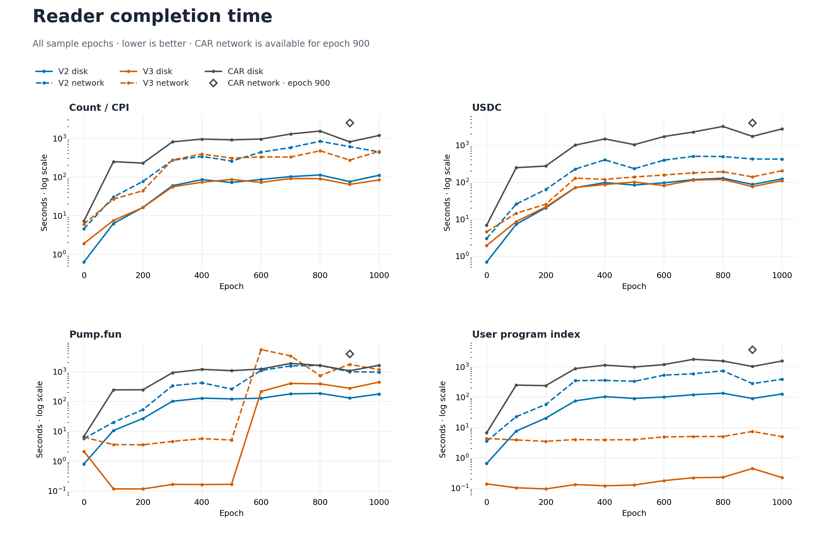
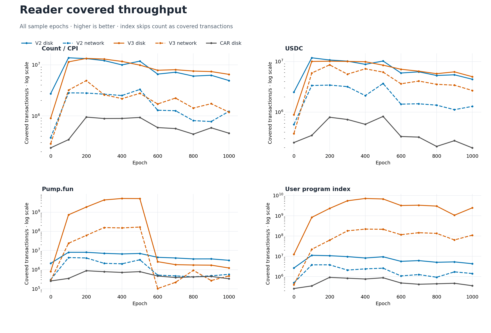
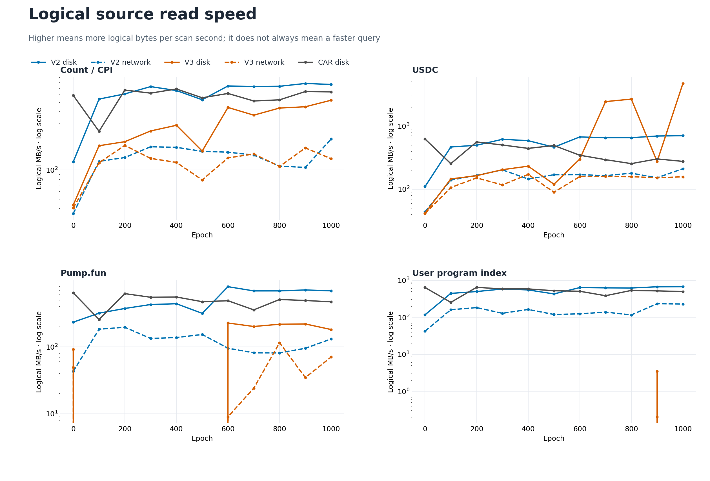
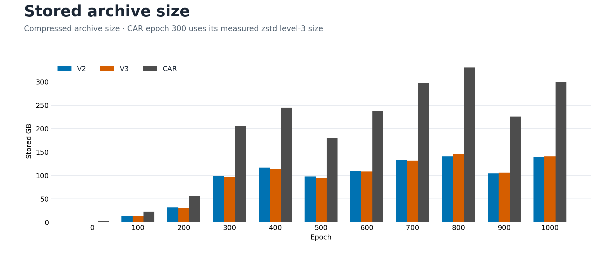

# Archive reader performance

Updated **11 September 2026**. The main test covers all 11 sample epochs, four examples, disk and network input, and both V2 and V3. All 176 cases passed after the stale public epoch 300 index was replaced. The graphs also include 44 accepted CAR disk cases and four accepted CAR network cases for epoch 900.

## Whole test at a glance

The time column is the sum for all four examples over all 11 epochs. TPS is total covered transactions divided by that time. Stored size is the sum of the 11 compressed archives. CAR network has only epoch 900 data, so its results are in a separate table.

| Reader | Input | Total time | Covered TPS | Logical MB/s | Stored size |
|---|---|---:|---:|---:|---:|
| V2 | Disk | 1.01 h | 6.34M | 631.3 | 987.0 GB |
| V2 | Network | 5.01 h | 1.28M | 132.5 | 987.0 GB |
| V3 | Disk | 52.9 min | 7.25M | 568.4 | 982.4 GB |
| V3 | Network | 4.67 h | 1.37M | 49.8 | 982.4 GB |
| CAR | Disk | 12.90 h | 495.6k | 455.8 | 2,105.0 GB |

Across the complete matrix, V3 used 12.6% less time than V2 from disk and 6.8% less time over the network. V3 finished first in 30 of 44 disk cases and 32 of 44 network cases. The gain depends strongly on the example because V3 can skip most data for some indexed queries.

The CAR disk line uses outer zstd for ten epochs. Epoch 300 uses raw CAR. These CAR measurements are two to three days older than the V2/V3 measurements, so small differences can include host and cache variation.

The storage graph uses zstd CAR for all epochs. For epoch 300, it uses the measured 206.3 GB zstd level-3 CAR plus its 5.2 MB slot index. The timed CAR disk test used the 508.3 GB raw input, so this adjustment changes only the storage comparison.

## Workload totals

Each row combines the 11 epochs. Completion time is the clearest speed comparison. Logical MB/s shows how much source data the reader moves during the scan.

| Example | Reader | Input | Time | Covered TPS | Logical MB/s |
|---|---|---|---:|---:|---:|
| Count / CPI | V2 | Disk | 12.2 min | 7.85M | 710.7 |
| Count / CPI | V2 | Network | 1.09 h | 1.47M | 144.3 |
| Count / CPI | V3 | Disk | 10.8 min | 8.90M | 360.8 |
| Count / CPI | V3 | Network | 49.0 min | 1.96M | 126.9 |
| Count / CPI | CAR | Disk | 2.50 h | 639.1k | 587.7 |
| USDC | V2 | Disk | 13.9 min | 6.90M | 633.3 |
| USDC | V2 | Network | 53.3 min | 1.80M | 172.7 |
| USDC | V3 | Disk | 13.2 min | 7.27M | 1,532.1 |
| USDC | V3 | Network | 21.7 min | 4.41M | 147.0 |
| USDC | CAR | Disk | 4.40 h | 363.5k | 334.3 |
| Pump.fun | V2 | Disk | 19.9 min | 4.81M | 604.1 |
| Pump.fun | V2 | Network | 2.03 h | 788.6k | 101.2 |
| Pump.fun | V3 | Disk | 28.9 min | 3.32M | 206.1 |
| Pump.fun | V3 | Network | 3.47 h | 459.9k | 28.6 |
| Pump.fun | CAR | Disk | 3.08 h | 518.2k | 476.5 |
| User program index | V2 | Disk | 14.5 min | 6.63M | 599.8 |
| User program index | V2 | Network | 1.01 h | 1.59M | 149.1 |
| User program index | V3 | Disk | 2.0 s | 2.86B | 1.9 |
| User program index | V3 | Network | 50.8 s | 113.18M | 0.0 |
| User program index | CAR | Disk | 2.92 h | 547.8k | 503.8 |

## CAR disk and network at epoch 900

These four network tests read the complete raw CAR object. The disk tests read the outer-zstd CAR object. The output and counters match, but the input size is different. The result therefore includes both network transfer and source encoding effects.

| Example | Disk time | Network time | Disk TPS | Network TPS | Network / disk time |
|---|---:|---:|---:|---:|---:|
| Count / CPI | 13.6 min | 42.5 min | 584.9k | 186.5k | 3.14× |
| USDC | 29.0 min | 1.13 h | 273.3k | 116.6k | 2.34× |
| Pump.fun | 17.8 min | 1.09 h | 445.7k | 121.2k | 3.68× |
| User program index | 16.9 min | 1.02 h | 468.3k | 129.7k | 3.61× |

The disk source is 226.1 GB. The network source is 527.1 GB.

## CAR reader and Jetstreamer

This separate epoch 900 network reference gives both readers the same 8,192 blocks. They produce the same 2.300 GB output file, with the same SHA-256 hash.

| Reader | Mean time | TPS | Peak memory |
|---|---:|---:|---:|
| CAR reader | 79.6 s | 112.2k | 436–458 MiB |
| Jetstreamer | 144.7 s | 61.7k | 243–284 MiB |

This CAR comparison is a full decode adapter test. The V2/V3 examples have different output work and can use indexes, so their TPS values are not directly equal to this CAR test.

## Design notes

CAR keeps the original data model and needs broad decoding. Outer zstd reduces storage and can be decompressed as the reader scans. V2 uses compressed block frames, compact account IDs, shared registries, and borrowed decoding. V3 separates fields into files and adds reverse indexes. It can skip unrelated blocks and avoid downloading unused data.

The network reader downloads sealed signature data once, keeps large registries in a local cache, merges adjacent HTTP ranges, and processes downloads while worker threads decode earlier data. These changes reduce HTTP calls and allocation work. Disk can still win when a query reads much of an epoch because the network path has request latency and transfer limits.

The NAS ran another CPU compaction job during part of this test. SSD traffic was not shared, but some CPU speed can be lower than an idle-machine result. No correction was applied.

## Acceptance method

The final data set contains only passing case records. V2 disk and network results come from two completed groups. V3 disk and 40 network results come from the full V3 batch. Its final batch check detected the epoch 300 repair because the repair occurred while the last epoch 1000 case ran. A comparison of all 526 before and after inventory entries found one change: the ETag of the epoch 300 block index. The size and all other entries stayed equal. The four original epoch 300 failures were removed, and a clean four-case run against the repaired inventory passed. Output hashes and counters match across V2, V3, disk, and network for every epoch and example. The separate CAR disk records have passing parity for all 44 cases. The three CAR network example receipts passed and match their disk output. The CAR count case is in the accepted network set, and its block, transaction, instruction, and CPI counters match disk.

[Source data](artifacts/full-v2-v3-reader-20260911/results.json) · SHA-256 `cbdd8742c9842bcf1e1dc39232d1f13c24ce8e9c3e5cb8adb7881424c8ec85dd`
