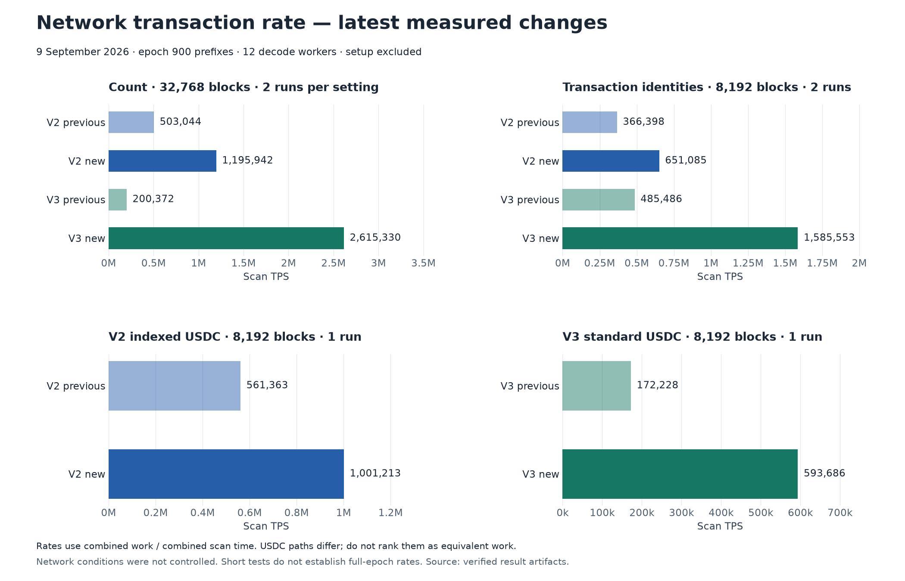
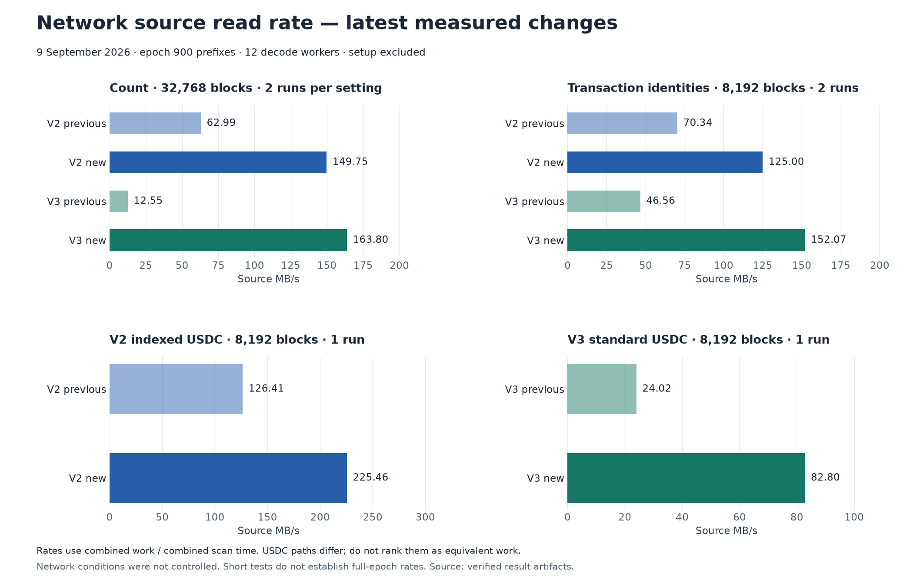
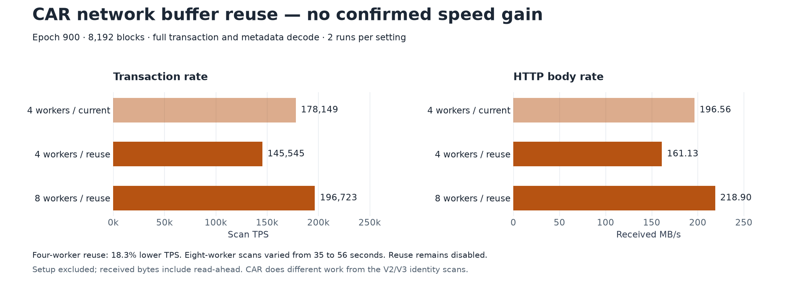
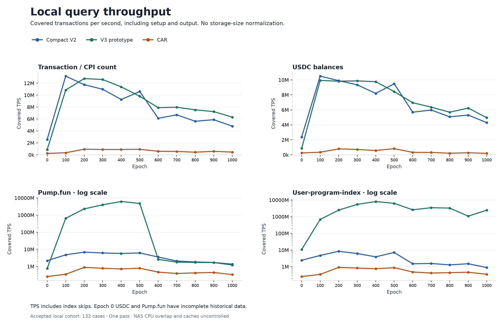
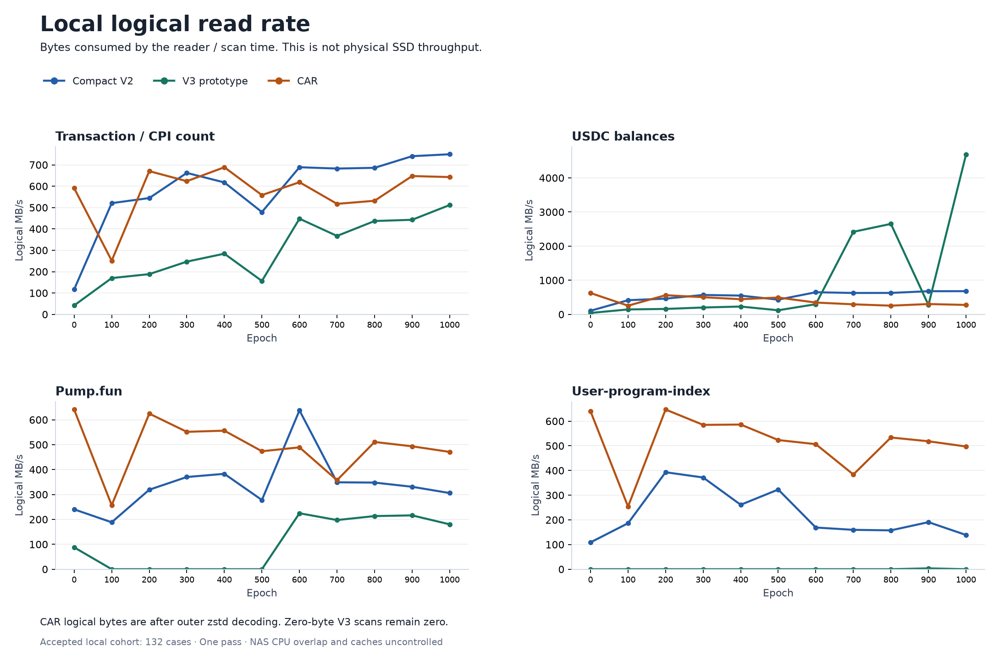
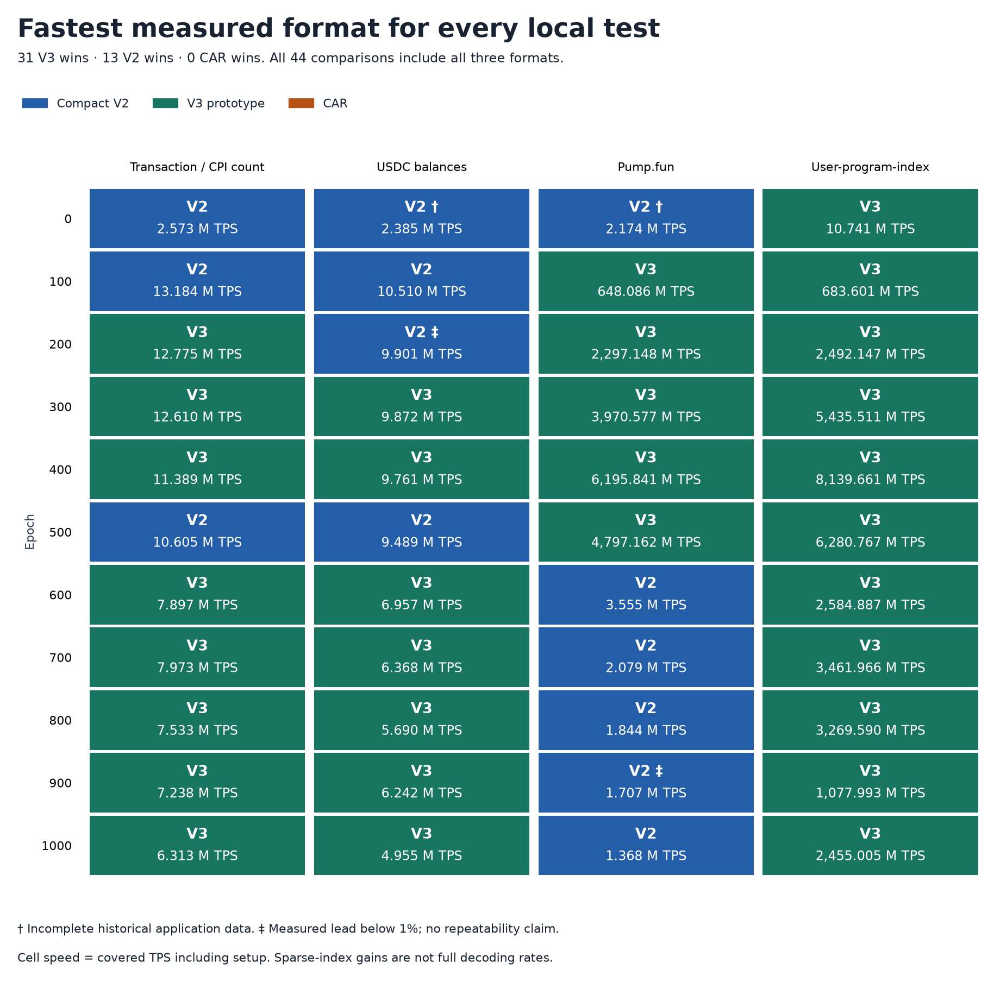
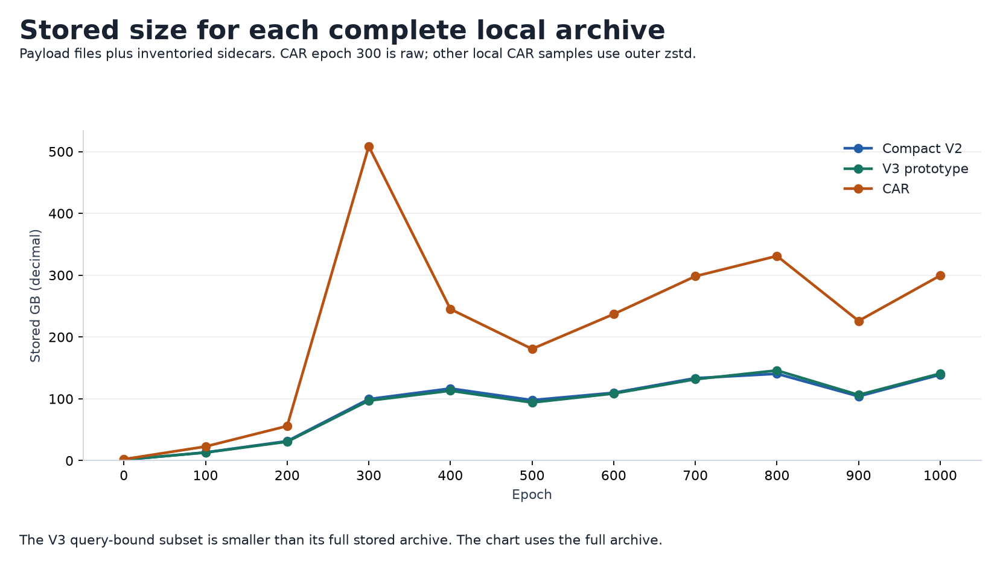
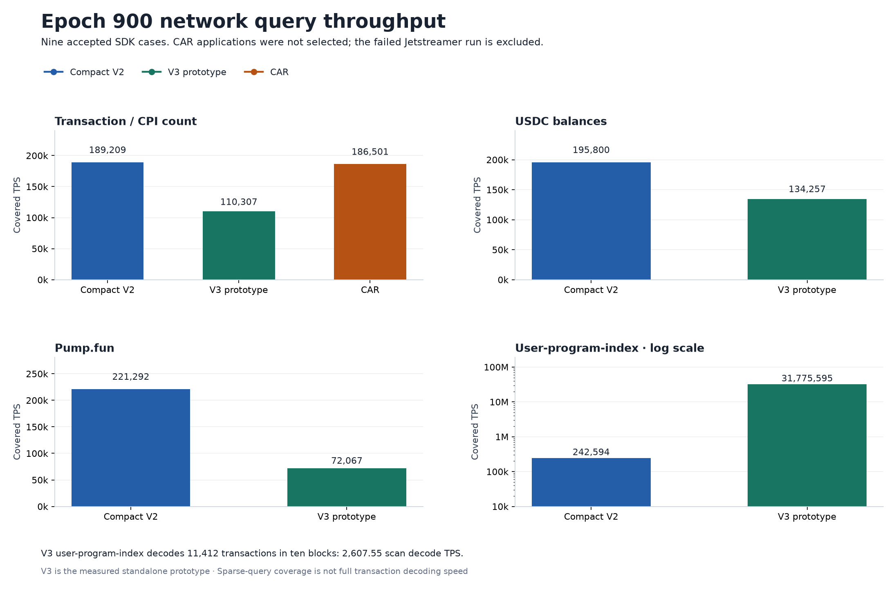
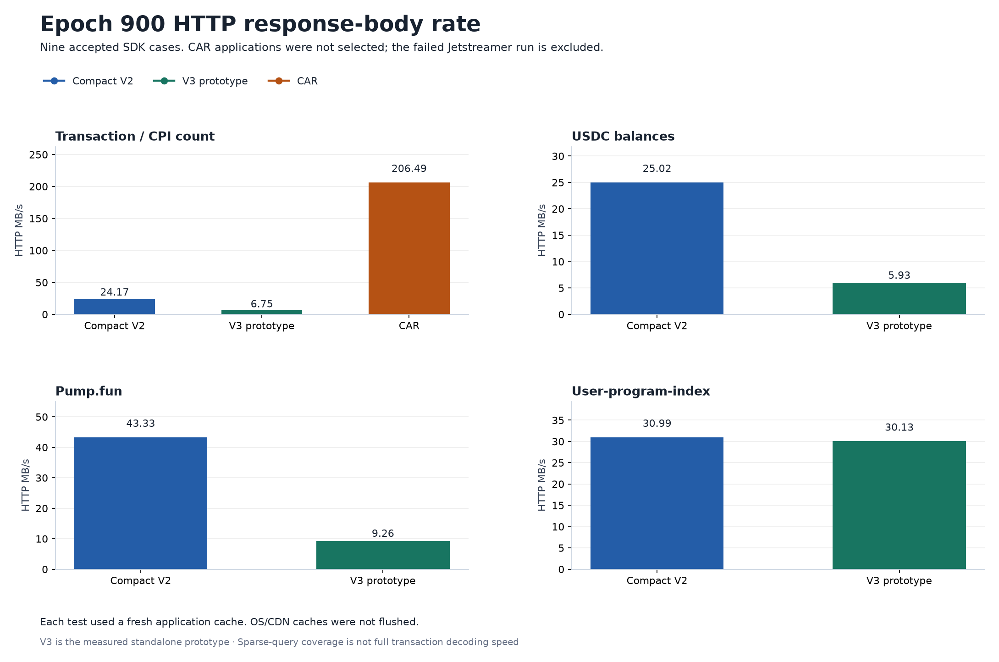

# Archive readers: full comparison with graphs

Updated **9 September 2026**. The latest network schedule improves V2 and V3;
CAR buffer reuse remains disabled because it did not establish a speed gain.
The report retains all local tests, full-epoch network results, storage sizes,
and the local winner matrix. New prefix measurements have their own graphs.

| Test group | Coverage | Result |
|---|---|---|
| Full local suite | 11 epochs × 4 workloads × 3 formats | 132 passed; V3 fastest in 31/44 comparisons, V2 in 13 |
| Original network suite | Full epoch 900; 4 V2, 4 V3, 1 CAR count | 9 passed |
| Latest input comparisons | Epoch 900 prefixes; V2, V3, CAR | 34 local/network cases passed |
| Full-suite rerun | Epochs 300 and 900 | Stopped; no complete replacement suite |

“V3” here is the measured standalone Indexer V3 prototype. These results do
not measure the separate canonical Archive V3 implementation.

## Latest network TPS

Count uses 32,768 blocks; transaction identities and USDC use 8,192. Each
setting has two network runs, except USDC with one. Rates use total transactions
divided by combined scan time; **setup and sidecar downloads are excluded**.
USDC TPS counts scanned transactions. V2 indexed USDC and V3 standard USDC
are different workloads and must not be ranked directly.

| Format / test | Previous TPS | New TPS | Gain |
|---|---:|---:|---:|
| V2 / Count | 503,044 | 1,195,942 | 2.38× |
| V3 / Count | 200,372 | 2,615,330 | 13.05× |
| V2 / Transaction identities | 366,398 | 651,085 | 1.78× |
| V3 / Transaction identities | 485,486 | 1,585,553 | 3.27× |
| V2 / Indexed USDC | 561,363 | 1,001,213 | 1.78× |
| V3 / Standard USDC | 172,228 | 593,686 | 3.45× |

## Latest network read speed

Source MB/s uses decimal megabytes divided by scan time; registry reads can
be included. It is not physical disk throughput. The new count rates are
**149.75 MB/s for V2** and **163.80 MB/s for V3**.

Larger adjacent requests and concurrent input keep decode workers supplied.
V2 and V3 reuse input buffers within a 256 MiB budget. Count peak process
memory rose from about 85 to 307 MiB for V2, and 176 to 400 MiB for V3.
The input budget is not a whole-process memory limit. Including setup, count
throughput improved by 1.91× for V2 and 10.00× for V3.

Pump.fun and user-program-index were not rerun with these settings. Their
full-epoch results remain in the original tables below. Network conditions
were not controlled; these short tests do not establish full-epoch rates.

## Latest CAR test

CAR already downloaded concurrent 32 MiB ranges. Reusing the large bodies
reduced their allocation count from 292–295 to eight, but four-worker TPS
fell from **178,149 to 145,545**. A shorter confirmation was also slower.
Peak memory did not fall. Eight-worker runs varied widely, so the existing
four-worker schedule and per-range allocation remain the default.

These CAR tests use 8,192 blocks, 12 decode workers, and full transaction and
metadata decoding. Their TPS is not equivalent to V2/V3 identity-only scans.
CAR MB/s counts received HTTP bodies, including read-ahead.

All measurements, memory figures, and verification records:
[V2](v2-reader-window-20260909.md), [V3](v3-reader-window-20260909.md),
[CAR](car-reader-window-20260909.md).

## Full local suite: transaction rate

Covered TPS is the requested transaction count divided by total reader time,
including setup, scan and output. Index skips count as query coverage. This
metric measures how fast the query covers the epoch; it is not always a full
transaction decoding rate. Tables and plots use absolute TPS, not TPS per GB.

| Epoch | Workload | V2 TPS | V3 TPS | CAR TPS |
| ---: | --- | ---: | ---: | ---: |
| 0 | Transaction / CPI count | 2,572,956 | 870,839 | 237,235 |
| 0 | USDC balances | 2,384,782 | 865,729 | 251,226 |
| 0 | Pump.fun | 2,174,155 | 761,727 | 257,639 |
| 0 | User-program-index | 2,454,131 | 10,741,387 | 257,431 |
| 100 | Transaction / CPI count | 13,184,083 | 10,850,241 | 343,360 |
| 100 | USDC balances | 10,510,485 | 9,933,748 | 347,810 |
| 100 | Pump.fun | 4,784,366 | 648,086,133 | 351,165 |
| 100 | User-program-index | 4,730,932 | 683,600,631 | 346,812 |
| 200 | Transaction / CPI count | 11,746,177 | 12,774,758 | 947,691 |
| 200 | USDC balances | 9,901,493 | 9,832,434 | 793,852 |
| 200 | Pump.fun | 6,887,468 | 2,297,147,949 | 882,886 |
| 200 | User-program-index | 8,480,759 | 2,492,146,551 | 914,516 |
| 300 | Transaction / CPI count | 10,982,375 | 12,610,012 | 888,859 |
| 300 | USDC balances | 9,346,479 | 9,872,425 | 716,580 |
| 300 | Pump.fun | 6,140,325 | 3,970,577,449 | 786,409 |
| 300 | User-program-index | 6,165,077 | 5,435,510,980 | 833,975 |
| 400 | Transaction / CPI count | 9,265,700 | 11,389,346 | 892,375 |
| 400 | USDC balances | 8,204,885 | 9,761,403 | 575,687 |
| 400 | Pump.fun | 5,745,522 | 6,195,841,465 | 720,836 |
| 400 | User-program-index | 3,917,896 | 8,139,661,389 | 759,652 |
| 500 | Transaction / CPI count | 10,604,948 | 9,814,835 | 933,038 |
| 500 | USDC balances | 9,489,179 | 8,441,201 | 823,805 |
| 500 | Pump.fun | 6,151,555 | 4,797,162,178 | 791,448 |
| 500 | User-program-index | 7,147,100 | 6,280,767,211 | 874,717 |
| 600 | Transaction / CPI count | 6,117,701 | 7,896,630 | 591,475 |
| 600 | USDC balances | 5,693,271 | 6,956,700 | 330,967 |
| 600 | Pump.fun | 3,555,016 | 2,591,133 | 467,767 |
| 600 | User-program-index | 1,500,256 | 2,584,886,990 | 484,422 |
| 700 | Transaction / CPI count | 6,700,355 | 7,972,840 | 565,272 |
| 700 | USDC balances | 5,982,115 | 6,367,503 | 321,616 |
| 700 | Pump.fun | 2,078,918 | 1,794,004 | 390,390 |
| 700 | User-program-index | 1,566,153 | 3,461,965,533 | 419,287 |
| 800 | Transaction / CPI count | 5,617,071 | 7,533,265 | 439,786 |
| 800 | USDC balances | 5,071,994 | 5,689,647 | 210,799 |
| 800 | Pump.fun | 1,844,366 | 1,716,191 | 422,513 |
| 800 | User-program-index | 1,289,368 | 3,269,589,989 | 441,455 |
| 900 | Transaction / CPI count | 5,882,574 | 7,238,017 | 584,874 |
| 900 | USDC balances | 5,309,423 | 6,242,336 | 273,253 |
| 900 | Pump.fun | 1,707,335 | 1,693,006 | 445,707 |
| 900 | User-program-index | 1,514,989 | 1,077,992,566 | 468,289 |
| 1000 | Transaction / CPI count | 4,805,294 | 6,312,823 | 458,881 |
| 1000 | USDC balances | 4,297,824 | 4,955,152 | 197,410 |
| 1000 | Pump.fun | 1,368,149 | 1,216,509 | 336,247 |
| 1000 | User-program-index | 889,910 | 2,455,005,285 | 355,069 |

Epoch 0 USDC and Pump.fun outputs agree but remain incomplete: each reports
1,724,876 indeterminate transactions. Agreement does not recover missing
historical data. The full technical evidence retains coverage and zero values.

## Local read rate

Logical MB/s is bytes supplied by the source to the reader divided by scan
time. For local CAR with outer zstd, it uses the CAR stream after decompression.
It is not SSD throughput. V2 and V3 read compressed format ranges and selected
sidecars. A smaller read rate can accompany a faster query because fewer bytes
are needed. Physical disk traffic, cache bytes and decoded stream bytes must
not be combined.

| Epoch | Workload | V2 logical MB/s | V3 logical MB/s | CAR logical MB/s |
| ---: | --- | ---: | ---: | ---: |
| 0 | Transaction / CPI count | 116.86 | 41.87 | 590.72 |
| 0 | USDC balances | 105.91 | 41.10 | 625.49 |
| 0 | Pump.fun | 240.26 | 87.76 | 641.14 |
| 0 | User-program-index | 108.73 | 0.00 | 640.39 |
| 100 | Transaction / CPI count | 520.75 | 169.91 | 251.34 |
| 100 | USDC balances | 414.84 | 144.56 | 254.59 |
| 100 | Pump.fun | 188.43 | 0.00 | 257.05 |
| 100 | User-program-index | 186.26 | 0.00 | 253.86 |
| 200 | Transaction / CPI count | 544.47 | 188.34 | 670.58 |
| 200 | USDC balances | 460.92 | 159.16 | 561.72 |
| 200 | Pump.fun | 319.13 | 0.00 | 624.73 |
| 200 | User-program-index | 393.00 | 0.00 | 647.11 |
| 300 | Transaction / CPI count | 662.22 | 246.81 | 623.47 |
| 300 | USDC balances | 569.14 | 200.96 | 502.63 |
| 300 | Pump.fun | 370.23 | 0.00 | 551.61 |
| 300 | User-program-index | 371.71 | 0.00 | 584.98 |
| 400 | Transaction / CPI count | 617.64 | 284.08 | 688.64 |
| 400 | USDC balances | 550.17 | 229.32 | 444.25 |
| 400 | Pump.fun | 382.96 | 0.00 | 556.26 |
| 400 | User-program-index | 261.12 | 0.00 | 586.22 |
| 500 | Transaction / CPI count | 479.03 | 156.37 | 558.37 |
| 500 | USDC balances | 431.32 | 120.19 | 492.99 |
| 500 | Pump.fun | 277.83 | 0.00 | 473.63 |
| 500 | User-program-index | 322.82 | 0.00 | 523.46 |
| 600 | Transaction / CPI count | 688.83 | 447.87 | 618.73 |
| 600 | USDC balances | 648.29 | 297.63 | 346.22 |
| 600 | Pump.fun | 637.67 | 224.67 | 489.32 |
| 600 | User-program-index | 168.90 | 0.00 | 506.74 |
| 700 | Transaction / CPI count | 682.59 | 367.14 | 517.42 |
| 700 | USDC balances | 627.20 | 2,419.17 | 294.39 |
| 700 | Pump.fun | 348.95 | 197.34 | 357.34 |
| 700 | User-program-index | 159.55 | 0.00 | 383.79 |
| 800 | Transaction / CPI count | 686.05 | 437.04 | 531.76 |
| 800 | USDC balances | 628.41 | 2,651.80 | 254.88 |
| 800 | Pump.fun | 347.80 | 213.33 | 510.87 |
| 800 | User-program-index | 157.48 | 0.00 | 533.77 |
| 900 | Transaction / CPI count | 740.51 | 442.73 | 647.57 |
| 900 | USDC balances | 678.30 | 274.89 | 302.54 |
| 900 | Pump.fun | 331.03 | 216.15 | 493.48 |
| 900 | User-program-index | 190.68 | 3.43 | 518.48 |
| 1000 | Transaction / CPI count | 749.53 | 511.87 | 642.72 |
| 1000 | USDC balances | 679.61 | 4,681.75 | 276.49 |
| 1000 | Pump.fun | 305.76 | 180.20 | 470.95 |
| 1000 | User-program-index | 138.80 | 0.00 | 497.31 |

## Measured winners

This matrix belongs to the accepted 132-case local suite from 8 September.
The new network prefixes do not replace its values. Each cell selects the
shortest total reader time among all three formats.
The displayed rate is covered TPS. Epoch 200 USDC and epoch 900 Pump.fun have
V2 leads below 1%. These are measured winners for this pass, not stable rankings.

## Stored size

This is the sum of the inventoried archive files, including sidecars. V3 has
a smaller query-bound subset; using only that subset would understate its
complete storage cost. CAR epoch 300 is raw. Other local CAR samples use
outer zstd, so the epoch-300 size increase includes a representation change.

| Epoch | V2 stored GB | V3 stored GB | CAR stored GB |
| ---: | ---: | ---: | ---: |
| 0 | 1.349 | 1.467 | 2.240 |
| 100 | 13.290 | 13.044 | 22.817 |
| 200 | 31.515 | 30.564 | 55.945 |
| 300 | 99.504 | 97.004 | 508.343 |
| 400 | 116.692 | 113.079 | 245.124 |
| 500 | 97.868 | 93.977 | 180.697 |
| 600 | 109.749 | 108.505 | 237.004 |
| 700 | 133.420 | 131.601 | 298.251 |
| 800 | 140.496 | 145.922 | 331.059 |
| 900 | 104.049 | 106.322 | 226.074 |
| 1000 | 139.038 | 140.889 | 299.445 |

The optional [TPS per stored GB appendix](artifacts/all-samples-reader-20260908/optional-tps-per-stored-gb.tsv)
divides covered TPS by the complete stored archive size. It is a secondary
capacity-efficiency view. It inherits index-skip gains and is not decoder speed.

## Earlier full-epoch network tests

These are the original full-epoch measurements from 8 September, before the
latest input changes. All nine network outputs matched their accepted local
counterparts. They remain separate from the new prefix tests above. The
network inputs used fresh private application caches. Total HTTP MB/s counts
response bodies consumed during setup and scan, including counted partial
retry bodies. It excludes headers and is not sampled host network traffic.

| Reader | Workload | Total seconds | Covered TPS |
| --- | --- | ---: | ---: |
| Compact V2 | Transaction / CPI count | 2,515.88 | 189,209 |
| Compact V2 | USDC balances | 2,431.19 | 195,800 |
| Compact V2 | Pump.fun | 2,151.12 | 221,292 |
| Compact V2 | User-program-index | 1,962.24 | 242,594 |
| V3 prototype | Transaction / CPI count | 4,315.46 | 110,307 |
| V3 prototype | USDC balances | 3,545.64 | 134,257 |
| V3 prototype | Pump.fun | 6,605.37 | 72,067 |
| V3 prototype | User-program-index | 14.98 | 31,775,595 |
| CAR | Transaction / CPI count | 2,552.40 | 186,501 |

| Reader | Workload | HTTP body GB | Total HTTP MB/s |
| --- | --- | ---: | ---: |
| Compact V2 | Transaction / CPI count | 60.811 | 24.17 |
| Compact V2 | USDC balances | 60.819 | 25.02 |
| Compact V2 | Pump.fun | 93.198 | 43.33 |
| Compact V2 | User-program-index | 60.819 | 30.99 |
| V3 prototype | Transaction / CPI count | 29.143 | 6.75 |
| V3 prototype | USDC balances | 21.019 | 5.93 |
| V3 prototype | Pump.fun | 61.197 | 9.26 |
| V3 prototype | User-program-index | 0.451 | 30.13 |
| CAR | Transaction / CPI count | 527.051 | 206.49 |

The V3 user-program-index network query covers 476,026,811 transactions but
decodes only 11,412 in ten selected blocks. Its scan decode rate is 2,607.55
TPS; its total coverage rate is 31,775,595 TPS. Its setup dominates total time.
V3 Pump.fun selects 426,475 of 431,858 blocks and decodes 470,452,521
transactions. Its scan decode rate is 71,460.88 TPS. These rates have different
numerators and time intervals, so the evidence records each separately.

Network CAR reads raw CAR; local epoch-900 CAR reads outer zstd. Their stored
and transferred sizes differ. The HTTP count needed 527.05 GB including its
index, compared with 226.07 GB stored for the local zstd archive and index.

## Format design and measured benefit

**CAR** preserves source nodes. Broad queries traverse and decode those records.
**CAR with outer zstd** uses less storage; the reader decompresses while reading.
The local suite uses zstd CAR except at epoch 300. It has no paired raw/zstd
test for the same epoch, so it cannot isolate a zstd speed gain.

**Compact V2** uses compressed block frames, compact account IDs, shared
registries, and borrowed decoding. **V3** separates fields into files and uses
reverse indexes for selected program and signer queries. It can read fewer
fields and skip unrelated blocks. At epoch 900, the original local count was
**10.06× faster with V2** and **12.38× faster with V3**, relative to CAR.
Very high sparse-query TPS measures index coverage, not full decoding.

The latest network work lets larger reads cross small decode-job boundaries.
V2 count requests fell from 550 to 148; V3 count requests fell from 1,280 to
335 for unchanged input bytes in each format. This improved the supply of
input. Buffer reuse alone did not produce the same gain for CAR.

## Jetstreamer reference

Jetstreamer was not rerun for the latest buffer tests. The earlier accepted
8,192-block comparison used 12 workers and mimalloc in both adapters:

| Source | Our CAR total TPS | Jetstreamer total TPS |
|---|---:|---:|
| Triton | 204,136 | 63,353 |
| Our gateway | 196,616 | 63,496 |

Both decode transactions and metadata, but output conversion, hashing, and
callback costs differ. This is an end-to-end adapter comparison, not an
isolated parser test. Our adapter used more memory. The older System-allocator
results must not represent Jetstreamer's best measured speed. The failed
full-epoch attempt contributes no accepted full-epoch TPS.
[Complete reference and limits](network-reader-comparison-20260909.md).

## Method and evidence

- The original local suite has one pass per format, epoch, and workload. Small leads need repeated tests. Twelve processing workers were requested where supported; the CAR examples and full-decode probe use different execution paths.
- OS/CDN caches were not reset. The NAS also ran CPU compaction work; its effect is unknown. No time correction is applied.
- Epoch-0 USDC and Pump.fun outputs agree but contain incomplete historical data. Matching incomplete outputs do not restore missing data.
- Accepted records retain output checks, source identities, build hashes, and failed attempts. Frozen historical IDs can still use `firewatch`; the displayed workload is user-program-index.

[All original selected metrics](artifacts/all-samples-reader-20260908/results.json) ·
[Original tables](artifacts/all-samples-reader-20260908/results.tsv) ·
[Winner table](artifacts/all-samples-reader-20260908/winners.tsv) ·
[Latest chart data and source hashes](artifacts/reader-network-update-20260909/chart-data.json) ·
[Short format story](from-car-to-v3-accepted-results-20260908.md)

Graphs are available as PNG and SVG beside their data. The latest chart
builder is [plot-reader-network-comparison.py](../../scripts/plot-reader-network-comparison.py).
