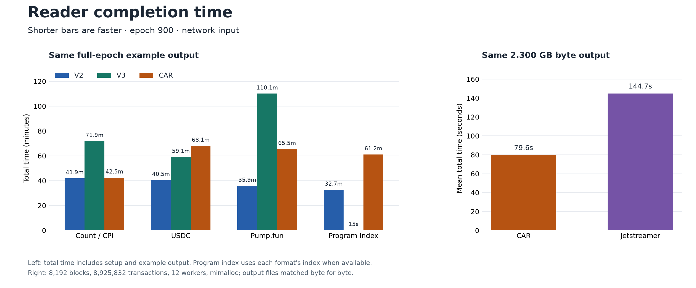

# Blockzilla archive reader performance

We tested Compact V2, Index V3, and CAR on Solana epoch 900. The main test
contains 24 cases: four examples, three formats, and disk or network input. Each
case used 12 reader workers on the same NAS. Total time includes setup and
output. All sizes use decimal units.

## Source size

| Format | Disk source | Network source |
| --- | ---: | ---: |
| Compact V2 | 104.05 GB | 104.05 GB |
| Index V3 | 106.32 GB | 106.32 GB |
| CAR | 226.07 GB zstd | 527.05 GB raw |

The disk CAR reader decompresses zstd while it reads. The network CAR reader
streams the raw CAR object. This difference explains the two CAR source sizes.

## Full epoch from disk

Each cell shows **total time · TPS**. V3 uses its program index for the program
query, so its 0.44-second result does not scan all transaction data.

| Example | Compact V2 | Index V3 | CAR + zstd |
| --- | ---: | ---: | ---: |
| Count / CPI | 1m 21s · 5.88M | **1m 06s · 7.24M** | 13m 34s · 585K |
| USDC | 1m 30s · 5.31M | **1m 16s · 6.24M** | 29m 02s · 273K |
| Pump.fun | **4m 39s · 1.71M** | 4m 41s · 1.69M | 17m 48s · 446K |
| User-program index | 5m 14s · 1.51M | **0.44s · 1.08B** | 16m 57s · 468K |

V3 is fastest for three queries. V2 is 0.8% faster for Pump.fun. CAR has more
data to decode and has no query index.

## Full epoch over the network

| Example | Compact V2 | Index V3 | Raw CAR |
| --- | ---: | ---: | ---: |
| Count / CPI | **41m 56s · 189K** | 71m 55s · 110K | 42m 32s · 187K |
| USDC | **40m 31s · 196K** | 59m 06s · 134K | 68m 04s · 117K |
| Pump.fun | **35m 51s · 221K** | 110m 05s · 72K | 65m 28s · 121K |
| User-program index | 32m 42s · 243K | **15s · 31.78M** | 61m 10s · 130K |

V2 is the fastest network reader for the three scan queries. V3 is much faster
when its index can answer the query. These full-epoch network runs were made
before the new V3 signature cache.

## CAR reader and Jetstreamer

This separate network test gives both readers the same work. Each reader
decoded 8,192 blocks and 8,925,832 transactions, then wrote the same ordered
2.300 GB output. All output bytes and SHA-256 hashes matched. Time includes the
write and final file sync.

| Reader | Mean time | TPS | Peak memory |
| --- | ---: | ---: | ---: |
| **Blockzilla CAR** | **79.58s** | **112,159** | 436–458 MiB |
| Jetstreamer 0.7.0 | 144.70s | 61,685 | **243–284 MiB** |

The Blockzilla CAR reader is **1.82 times faster**. Jetstreamer uses about 40%
less peak memory.

## Latest V3 network change

V3 can now download the 32.38 GB signature file once and reuse it from disk.
The first download took 73.93 seconds at 438 MB/s. On a 32,768-block
transaction scan, reuse reduced time from 31.43 to 11.40 seconds and increased
speed from 1.13M to 3.13M TPS. Pump.fun improved by 12.4%. This cache helps
repeated scans of a sealed epoch.

A NAS compaction job used some CPU during part of the benchmark. It did not use
the SSD. Small CPU differences can therefore be test noise.

[Full 24-case data](artifacts/reader-speed-summary-20260909/data.json) ·
[CAR and Jetstreamer verification](artifacts/car-jetstreamer-common-output-20260909.json) ·
[V3 signature-cache test](v3-signature-cache-20260909.md)
