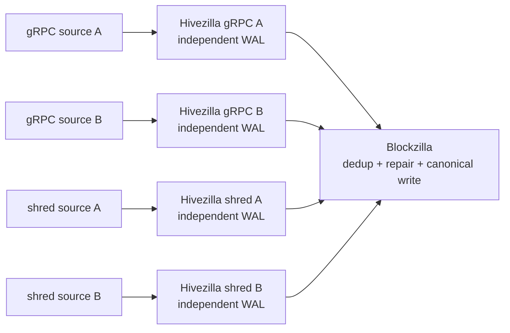

# Redundant live ingest foundations

Date: 2026-07-13

Status: **historical design note with implemented foundations**.

The original proposal put several sources behind one merged live-producer
spool and a primary/replica protocol. That topology is superseded by the
current [system architecture](../architecture/system-overview.md): independent
Yellowstone gRPC and shred Hivezilla instances converge only at Blockzilla.

The durability, identity, deduplication, and receipt rules developed here remain
useful and are preserved below. Deployment-specific configuration and cutover
instructions are intentionally outside this public design note.

## What remains valid

1. A source cursor advances only after its observation is durable.
2. Transport is at least once; canonical archive effects must be idempotent.
3. A slot alone is never a deduplication identity. Conflicting payloads and fork
   candidates remain observable.
4. Queues are bounded by bytes as well as record count. Capacity exhaustion
   pauses or fails explicitly; it never silently evicts unpreserved evidence.
5. Exactly one authority assigns canonical ordering and dense Archive V2 block
   IDs: Blockzilla.
6. A source instance deletes evidence only after it has durable proof that the
   configured retention requirements are satisfied for that exact content.
7. EOF, timeout, or one source crossing an epoch boundary does not prove epoch
   completeness.

## Identity model

Three identities answer different questions:

```text
ObservationId = (source identity, journal identity, sequence)
ContentDigest = hash(domain, cluster identity, event kind, canonical bytes)
LogicalKey    = block(slot, blockhash)
              | entry(slot, entry index, entry hash)
              | shred(slot, kind, shred index, FEC-set index)
```

- `ObservationId` detects replay and illegal sequence reuse within one source.
- `ContentDigest` recognizes identical content observed through different
  transports.
- `LogicalKey` groups competing candidates without overwriting them.

Expected classifications are:

| Condition | Decision |
| --- | --- |
| Same observation and digest | transport replay |
| Different observation, same logical key and digest | exact duplicate; merge provenance |
| Same logical key, different digest | conflicting payload; retain both |
| Same slot, different blockhash | fork candidate; retain both |
| Same observation, different digest | identity violation; quarantine |
| Same digest, different logical key | corruption or digest-domain error; quarantine |

Source priority may break a tie only after commitment and completeness checks.
It must not silently overwrite a conflicting finalized candidate.

## WAL model

Each Hivezilla source instance owns an append-only segmented WAL. A record
contains bounded lengths, its identities, payload, checksum, and an end marker.
Recovery may truncate an incomplete final frame; interior corruption is a
quarantine condition.

Payload bytes remain in WAL segments. An exact index stores observation,
content, and logical-key metadata. An in-memory cache may accelerate recent
lookups but is never authoritative.

Every in-memory channel and replication window has an explicit byte budget.
When durable capacity cannot satisfy the configured redundancy target, the
instance stops claiming continuity instead of discarding evidence.

## Reconnect and epoch closure

Reconnect resumes inclusively with overlap; durable deduplication absorbs the
replay. A cursor is derived from the committed WAL, never from an in-memory
"seen" set.

An epoch closes only when required source coverage, commitment, and gap policy
agree. Late observations enter repair instead of being appended to the next
epoch.

PoH entries and raw shreds remain distinct evidence. A shred candidate may
enrich a gRPC block only after their final PoH/blockhash evidence agrees. A
mismatch remains a fork or conflict for Blockzilla to resolve.

## Durable replication receipt

The historical primary/replica work established a useful deletion rule:

```text
source WAL durable
  -> offer identity + digest + length
  -> receiver stores and verifies the exact record
  -> receiver returns an authenticated durable receipt
  -> source verifies and persists that receipt
  -> only then may retention policy consider the record eligible for cleanup
```

A deletion-capable disposition is allow-listed and bound to exact content.
Rejected, malformed, unsigned, wrong-cluster, wrong-receiver, or wrong-digest
responses never authorize cleanup. Lost replies are harmless because resend is
idempotent and returns the same durable disposition.

The target Hivezilla-to-Blockzilla protocol should reuse these semantics, but
the receiver is the Blockzilla archive boundary rather than another process
sharing canonical-writer responsibility.

## How the target topology differs

The superseded design merged all sources into one live-producer spool. The
target keeps source failures isolated:



Yellowstone and shred inputs also have different fallback behavior:

- a Yellowstone instance can preserve and deliver its complete known-schema
  observation when compact normalization fails;
- a shred instance retains incomplete/conflicting shred evidence and emits no
  complete block candidate until reconstruction and verification succeed.

## Implemented foundation

The current `hivezilla/src/ingest/` code contains:

- validated, redacted ingest configuration types;
- domain-separated content identities and explicit deduplication decisions;
- a segmented checksummed spool with committed records and tail recovery;
- canonical durable-receipt bytes and a checksummed receipt WAL;
- deletion eligibility bound to a verified receipt and exact local spool token.

These are foundations, not a complete redundant live service. Current `main`
still lacks the full multi-instance network runtime, production disk-backed
dedup index, complete transport, sealed-segment garbage collection, and shred
adapter. Those gaps are tracked in the project [roadmap](../../ROADMAP.md).
