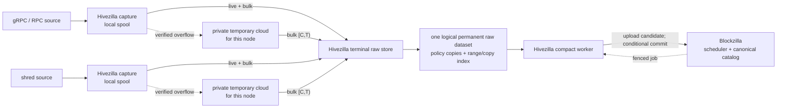

# Redundant live ingest foundations

Date: 2026-07-13

Status: **historical design note with implemented foundations**.

The original proposal put several sources behind one merged live-producer
spool and a primary/replica protocol. That topology is superseded by the
current [system architecture](../architecture/system-overview.md): independent
Yellowstone gRPC and shred Hivezilla instances converge canonically only at
Blockzilla. A separate Hivezilla processor may derive a source-labelled live
block observation without gaining canonical or retention authority.

The durability, identity, candidate-level deduplication, and receipt rules
developed here remain useful and are preserved below. Capture and terminal
custody never deduplicate producer records: every `RecordV1`, including raw
duplicates and conflicts, remains addressable by its original stream cursor.
Deployment-specific configuration and cutover instructions are intentionally
outside this public design note.

## What remains valid

1. A source cursor advances only after its observation is durable.
2. Transport is at least once; canonical archive effects must be idempotent.
3. A slot alone is never a deduplication identity. Conflicting payloads and fork
   candidates remain observable.
4. Queues are bounded by bytes as well as record count. Capacity exhaustion
   pauses or fails explicitly; it never silently evicts unpreserved evidence.
5. Exactly one authority defines canonical epoch order and committed catalog
   state: Blockzilla. A Hivezilla worker may execute the deterministic
   zero-based Archive V2 ID assignment and physical compact/upload job only
   under a fenced Blockzilla lease.
6. A source instance makes logical evidence eligible for deletion only after
   the one configured terminal raw consumer durably stores and cumulatively
   ACKs that exact contiguous prefix; deletion additionally requires the source
   to fsync the accepted-ACK receipt and receipt-bound retirement checkpoint.
7. EOF, timeout, or one source crossing an epoch boundary does not prove epoch
   completeness.

## Identity model

Three identities answer different questions:

```text
ObservationId = (source identity, journal identity, sequence)
ContentDigest = hash(domain, cluster identity, event kind, canonical bytes)
LogicalKey    = block(slot, blockhash)
              | entry(slot, entry index, entry hash)
              | shred(slot, kind, shred index, FEC-set index)
```

- `ObservationId` detects replay and illegal sequence reuse within one source.
- `ContentDigest` recognizes identical content observed through different
  transports.
- `LogicalKey` groups competing candidates without overwriting them.

Expected classifications below apply only after exact producer records are
durable, when processors or compact workers compare candidate content. They do
not merge or remove capture/custody records:

| Condition | Decision |
| --- | --- |
| Same observation and digest | transport replay |
| Different observation, same logical key and digest | equivalent candidate; merge provenance while retaining both source records |
| Same logical key, different digest | conflicting payload; retain both |
| Same slot, different blockhash | fork candidate; retain both |
| Same observation, different digest | identity violation; quarantine |
| Same digest, different logical key | corruption or digest-domain error; quarantine |

Source priority may break a tie only after commitment and completeness checks.
It must not silently overwrite a conflicting finalized candidate.

## WAL model

Each Hivezilla source instance owns an append-only segmented WAL. A record
contains bounded lengths, its identities, payload, checksum, and an end marker.
Recovery may truncate an incomplete final frame; interior corruption is a
quarantine condition.

Source-process reconnect is deliberately bounded. The writer validates the
final handoff row, its exact checksummed WAL frame, and at most the active
segment; it does not reread every sealed segment before reconnecting. Complete
sealed-history and journal-sequence validation belongs to an offline
maintenance job, which runs against a stopped source or immutable snapshot
before materialization or source retention cleanup. This split keeps recovery
latency independent of capture age without weakening the publish/delete gate.

Payload bytes remain in WAL segments. An exact index stores observation,
content, and logical-key metadata. An in-memory cache may accelerate recent
lookups but is never authoritative.

Every in-memory channel and replication window has an explicit byte budget.
When durable capacity cannot satisfy the configured redundancy target, the
instance stops claiming continuity instead of discarding evidence.

## Reconnect and epoch closure

An upstream source reconnect resumes inclusively with overlap; durable
deduplication absorbs the replay. A cursor is derived from the committed WAL,
never from an in-memory "seen" set.

The target terminal-consumer reconnect is a different operation. If its last
durable cumulative cursor is `C`, the source atomically seals its current tail
and snapshots cutover cursor `T`. The consumer immediately starts the live lane
at `T`, while a separately budgeted background job downloads the fixed missing
range `[C, T)` through session-fenced idempotent bounded record-range fetches
from that source node's local spool or private cloud overflow. Ranges and later live records may
be staged out of order, but only the largest exact contiguous prefix can be
ACKed after its permanent raw objects, required independent physical copies,
and rebuildable range/copy index are verified. Closing
the bulk gap can therefore advance through already durable live records
without ever skipping data or delaying reconnection to the head.

An epoch closes only when required source coverage, commitment, and gap policy
agree. Late observations enter repair instead of being appended to the next
epoch.

PoH entries, raw shreds, and provider runtime metadata remain distinct evidence.
Capture never deduplicates them or transfers an ACK between them. After
durability, `(cluster, slot, final_poh_hash)` groups comparable ledger cores;
where the protocol defines a separate consensus/shred block ID, shred variants
remain partitioned by that ID and an ID-less gRPC observation cannot select one.
Effective parent, ordered entries/components, transaction order, and exact
signed content must also agree before a separately immutable gRPC runtime
attachment can bind to the selected signed-ledger candidate. Replay/runtime
parity then uses the outer-transaction-signature-free `execution_core_digest`; it never pretends
that this proves outer-signature equality. Missing runtime data is not
verified-empty data, and any mismatch remains a fork or conflict for Blockzilla
to resolve.

Today both source families remain required: shreds are the permanent ledger/FEC
evidence, while gRPC supplies execution results and a replay-parity oracle.
Future Replay V1 derives an outer-transaction-signature-stripped execution projection from verified
shreds and regenerates runtime attachments; gRPC can be retired only after the
explicit finality, deterministic-replay, parity, capacity, and cutover gates.
Only verified shreds/markers plus pinned genesis, protocol, feature, and
checkpoint state qualify as shred-only continuing inputs; any required RPC,
gRPC, Tower/status, or provider finality feed makes the result shred-primary.

## Durable replication receipt

The historical primary/replica work established a useful deletion rule:

```text
source WAL durable
  -> offer identity + digest + length
  -> receiver stores and verifies the exact record
  -> receiver returns an authenticated durable receipt
  -> source verifies and persists that receipt
  -> only then may retention policy consider the record eligible for cleanup
```

A deletion-capable disposition is allow-listed and bound to exact content.
Rejected, malformed, unsigned, wrong-cluster, wrong-receiver, or wrong-digest
responses never authorize cleanup. Lost replies are harmless because resend is
idempotent and returns the same durable disposition.

The target HiveSync protocol reuses these semantics with one configured
terminal Hivezilla raw dataset. It is one logical permanent exact-raw archive
with an immutable multi-target durability policy and rebuildable range/copy
index. Its one ACK identity is the deletion-authorizing consumer; physical
copies do not ACK independently. A processor, compact worker, public subscriber,
Blockzilla scheduler, or Archive V2 commit is not a consumer. The source's own
cloud overflow also does not count: verified upload may evict the local copy.
The terminal cumulative ACK makes covered local and cloud copies eligible for
retirement, and the source deletes them only after fsyncing the accepted-ACK
receipt and receipt-bound retirement checkpoint.

## How the target topology differs

The superseded design merged all sources into one live-producer spool. The
target keeps source failures isolated:


```mermaid
flowchart LR
    G["gRPC / RPC source"] --> HG["Hivezilla capture<br/>local spool"]
    S["shred source"] --> HS["Hivezilla capture<br/>local spool"]
    HG -. verified overflow .-> OG["private temporary cloud<br/>for this node"]
    HS -. verified overflow .-> OS["private temporary cloud<br/>for this node"]
    HG -->|"live + bulk"| R["Hivezilla terminal raw store"]
    OG -->|"bulk [C,T)"| R
    HS -->|"live + bulk"| R
    OS -->|"bulk [C,T)"| R
    R --> RAW["one logical permanent raw dataset<br/>policy copies + range/copy index"]
    RAW --> W["Hivezilla compact worker"]
    B["Blockzilla<br/>scheduler + canonical catalog"] -. fenced job .-> W
    W -->|"upload candidate; conditional commit"| B
```

Yellowstone and shred inputs also have different fallback behavior:

- a Yellowstone instance can preserve and deliver its complete known-schema
  observation when compact normalization fails;
- a shred instance retains incomplete/conflicting evidence; an optional
  Hivezilla processor emits a separate provisional block observation only after
  reconstruction and verification succeed, while the leased Hivezilla compact
  worker independently validates raw evidence before asking Blockzilla to
  commit canonical catalog state.

## Implemented foundation

The current `services/hivezilla/src/ingest/` code contains:

- validated, redacted ingest configuration types;
- domain-separated content identities and explicit deduplication decisions;
- a segmented checksummed spool with committed records and tail recovery;
- canonical durable-receipt bytes and a checksummed receipt WAL;
- deletion eligibility bound to a verified receipt and exact local spool token;
- bounded mTLS push and pull transports with signed cumulative acknowledgements;
  and
- ACK-gated retirement of whole sealed generations.

That implemented ACK proves a current local receiver prefix, not the V1
terminal object/copy/index boundary. It is reusable staging evidence but must
not be granted V1 deletion authority without the terminal custody layer.

These hardened primitives are not yet the complete target topology. Hivezilla
still lacks per-node temporary-cloud tiering, the live-first/two-lane terminal
sync, and production shred-processing and compact-worker paths; raw shred
capture, replication, FEC recovery, and diagnostic deshredding foundations now
exist. Blockzilla still lacks the production scheduler/catalog boundary and
disk-backed candidate index that choose and commit one canonical block stream.
Those gaps are tracked in the project
[hivezilla-v1 implementation plan](../architecture/hivezilla-v1-implementation-plan.md).
