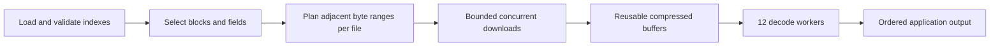

# Network read windows for Compact V2 and Archive V3

## Current input windows — 9 September 2026

The new [V2 input window](v2-concurrent-input.md) and
[V3 input window](v3-concurrent-input.md) replace the small download groups
listed below. Both use reusable input buffers with a 256 MiB capacity budget.
The sections below record the earlier designs and measurements.

## Measured next step — 8 September 2026

The monitored prefix run passed all eight local/network output checks. CPU use
was low during network reads. V2 spent 14.03 of 28.45 scan seconds reading
signatures; V3 made 2,176 requests for 8,192 blocks. Next work should overlap
V2 signature reads with compressed input and combine V3 signature windows
across adjacent jobs within the shared byte budget. The existing V3 plane
producer still reads each plane in sequence. These changes are not implemented
by the profiling harness. See the [CPU and resource report](../benchmarks/epoch900-network-profile-20260908.md).

## Streaming update — 8 September 2026

The default V3 cache now retains only the block index and streams the selected
transaction-directory ranges with semantic input. Explicit `Sequential` keeps
the previous whole-directory cache policy. The prefetched input budget is now
64 MiB, with 16 MiB/128-block groups. Retained semantic workspace is capped at
16 MiB per worker between jobs. The following first-implementation limits are
historical.

A controlled 8,192-block epoch 900 transaction export passed old/new/new/old
checks. Mean total time fell from 63.88 to 31.71 seconds, mainly through smaller
startup downloads. Peak process memory stayed near 200 MiB; no RSS reduction
was established. See the [streaming test report](../benchmarks/epoch900-network-streaming-20260908.md)
for exact parity, run variance, a measured R2 signature-read delay, and limits.
Full-epoch and application-workload comparisons remain separate work.

Review date: 7 September 2026. Failure review updated on 8 September 2026.

Status: first implementation built and tested on 8 September 2026. The nine
SDK baseline cases have passed final acceptance. The new candidate is separate
from that baseline and still needs NAS measurements. The full Jetstreamer
attempt failed; both small correctness checks passed. No candidate speed
increase is claimed yet.

## First implementation — 8 September 2026

The first candidate addresses input scheduling without changing archive formats
or output semantics. It is a smaller step than the shared scheduler proposed
below. Build: `network-window-20260908T064833Z`, Linux x86-64 musl. The saved
package binds all 639 source files, dependencies, compiler, eight binaries,
runner, and test results.

- **V2:** remote sources can opt into concurrent input. The input worker count
  is capped by the existing compressed-buffer count and eight workers. The
  current examples have three buffers, so they use at most three input reads.
  Publication stays ordered. Local sources retain the serial producer. The
  `pipeline_read_s` counter is now the sum of request durations for concurrent
  reads; it can exceed elapsed scan time and must not be added to wait time.
- **V3:** one separate input producer combines up to 128 adjacent selected
  blocks, with at most 32 MiB of selected stored planes per group. Small
  four-block decode jobs share those bytes without a per-job copy. A 128 MiB
  global budget includes queued, active, and consumer-held compressed buffers.
  The input producer can overlap decoding. Plane reads within a group are
  still sequential; a general pool of concurrent plane requests is future work.
- **Selection:** only adjacent byte ranges are combined. Sparse and oversized
  groups use the existing read path. Reverse-index filtering remains in place.
- **Cache:** exact reads into caller storage now avoid a temporary allocation
  and copy in `CachedHttpRangeSource`.
- **Limits:** cancellation releases queued buffers and joins input workers.
  Existing strict range, length and object-identity checks remain in use.

All 374 affected library tests pass: V3 142, V2 220, source 1, cache 11.
The new V3 fixture test proves identical dense and sparse outputs and identical
payload byte counts. Dense input needs fewer than one quarter of the old read
calls. This is a fixture result, not a measured NAS speed increase. Tests also
cover input errors, sink errors, ordered publication, cancellation and buffer
limits. The example check and separate Linux release build passed.

The first NAS candidate stopped in V2 count after the origin returned HTTP
500 for a block range. V3 and later workloads did not start. This is a failed
attempt, not a speed measurement. Its files remain in
`network-window-20260908T064833Z`; `failure-receipt.json` records the failure.

A follow-up candidate, `network-window-retry-20260908T070846Z`, adds at most
two retries for HTTP 500/502/503/504, with 250/500 ms backoff. A numeric
Retry-After of up to five seconds is respected; longer or unsupported values
fail rather than retry early. Incomplete-body retries keep their separate
budget of two. Thus a read has at most nine GET attempts in the combined
worst case. Each accepted response must still pass exact range, length and
pinned identity validation. Error bodies are dropped without an allocation.
A separate server-error retry counter is included in the example metrics.
394 affected library tests and 44 benchmark-script tests pass. The new Linux
build passed. The retry candidate was then stopped during V2 count after
repeated origin errors and long input pauses; V3 did not start. A captured
Worker log reports HTTP 500, 19,400 ms wall time and 1 ms CPU time for one
range. This indicates waiting in the serving path, but does not identify
the failing operation or establish a concurrency cause. The failed and
stopped attempts remain separate from accepted baseline timings. No speed
gain is claimed.

A small independent HTTP diagnostic then read the exact failed range
(7,634,257 bytes) six times, after the SDK process stopped. All reads passed
exact range, length and pinned ETag checks and produced the same body hash.
Three serial reads took 0.234, 0.299 and 35.290 seconds. The last took
35.220 seconds before response headers. Three concurrent reads took 0.327,
0.402 and 0.329 seconds. Three separate HEAD requests took 0.106–0.127 seconds.
Thus the long delay also occurs without the SDK, and this small test does not
support a general failure at three concurrent requests. It does not isolate
the slow R2 operation, measure cold-cache performance, or establish an SDK
speed gain. Repeated exact ranges can warm remote caches. The complete
receipt is `origin-range-diagnostic.json` in the retry candidate directory.
Full timing is paused for source-latency diagnosis; no reader remains active.

The NAS comparison is limited to epoch 900 and the four V2/V3 workloads.
Each workload gets a fresh cache and result directory. Counts and application
bytes must match the accepted baseline before the next workload starts. CAR
and Jetstreamer are not part of this candidate run. OS and CDN caches remain
uncontrolled. Workload order differs from the baseline and is recorded.

## Decision

Separate network requests from decode jobs. Use a bounded shared download
window, with several requests in progress and reusable compressed buffers.
Let each archive reader plan exact ranges from its own index and query.

The existing CAR HTTP reader already has a bounded concurrent range window.
Use it as the local basis for common scheduling code. Keep format geometry,
query selection, and decode logic in the format readers. Keep Jetstreamer as
an independent benchmark reference, without adding it as an SDK dependency.

## Jetstreamer source reviewed

The review used `jetstreamer-firehose 0.7.0`, commit
`cffaf3d891b3cbe45a46dd963d6d3571b2aa1a24`, with `rseek 0.4.0` and
`ripget 0.3.0`. This is the version in the prepared NAS reference package.
The saved upstream verification receipt records that all 23 package files
matched the published crate. The review also checked the pinned upstream
source links below.

| Mode | Source behavior | Lesson for our readers |
| --- | --- | --- |
| Parallel forward replay | Divide the slot interval among workers. Use the slot index to seek to the start. Read through a long CAR HTTP response with an 8 MiB read buffer. Each worker keeps its own ordered stream. | Avoid a new request after each small decode job. Several input streams can supply the decoder pool. |
| Sequential replay from the epoch start | Use one firehose processor and several `ripget` download tasks. Fill one buffer while the consumer reads the other. Each buffer is split into parallel byte ranges. | Download concurrency and decode concurrency must be separate settings. |
| Work distribution | Finished parallel workers can receive part of another worker's remaining slot interval. | A slow input stream must not leave the rest of the download pool idle. |

The prepared count adapter passes `sequential=false`. Thus, its planned
12-worker benchmark uses the first path. It does not measure the `ripget`
window. Also, a sequential request that starts partway through an epoch can
use the seekable path instead. Do not describe all Jetstreamer reads as
`ripget` downloads.

`rseek` retains the response until a seek. A seek opens another request from
the new offset toward the object end. The 8 MiB parser buffer is not an
8 MiB HTTP request limit. `ripget` instead has two bounded buffers, fills
each with parallel ranges, and waits for a free buffer before it advances.
Jetstreamer's default sequential window is the smaller of 4 GiB and 15% of
available memory. That is not a suitable default for every SDK caller.

Jetstreamer forces HTTP/1.1 in its main client. The source explains this as
a response to its large number of long streams. It also has rate-based
connection recycling. These are upstream choices for its workload, not
proof of HTTP/2 or server throttling in our run. Check our compiled client
features, negotiated protocol, and measured request timings before making
a protocol change. Reuse connections for normal requests.

Parallel Jetstreamer callbacks have no global slot order. Our application
outputs require that order. Adopt input scheduling without removing ordered
publication or its memory limits.

Sources:

- [Jetstreamer epoch streams](https://github.com/anza-xyz/jetstreamer/blob/cffaf3d891b3cbe45a46dd963d6d3571b2aa1a24/jetstreamer-firehose/src/epochs.rs)
- [Jetstreamer scheduling](https://github.com/anza-xyz/jetstreamer/blob/cffaf3d891b3cbe45a46dd963d6d3571b2aa1a24/jetstreamer-firehose/src/firehose.rs)
- [Jetstreamer HTTP client](https://github.com/anza-xyz/jetstreamer/blob/cffaf3d891b3cbe45a46dd963d6d3571b2aa1a24/jetstreamer-firehose/src/network.rs)
- [rseek 0.4.0 source](https://docs.rs/crate/rseek/0.4.0/source/src/lib.rs)
- [ripget 0.3.0 source](https://docs.rs/crate/ripget/0.3.0/source/src/lib.rs)

## Jetstreamer reference outcome

Both 512-block checks passed exact block and transaction comparisons, with
545,576 transactions each. The full epoch-900 reference exited with code 1
after 1,549.322 seconds. It stopped with 24,415 blocks and 27,111,371 transaction
callbacks. The report records 12 `read_until_block` timeouts and `valid=false`.
These partial counts are failure evidence, not an accepted full-epoch speed.

In parallel mode, upstream places a 15-second timeout around one
`read_until_block` operation. This is not the full-run duration or a measured
HTTP body stall duration. The adapter stops the reference on any reported
upstream error. Normal Jetstreamer can restart its stream after that error.
The timeout does not establish whether the cause was the origin, connection,
parser, CPU scheduling, or another part of the read path. No cause is yet
confirmed, and no timeout setting or acceptance rule has been relaxed.

Keep this result separate from the SDK baseline. Jetstreamer decodes full
transaction and status objects and performs work that the SDK count projection
can omit. Its failed reference does not invalidate the useful download design.
A later diagnostic should record per-stream request and block-read progress,
upstream restart events, and process CPU use before another full attempt.

Evidence: `jetstreamer-status-latest.json`, `jetstreamer-full-failed-report.json`
and `jetstreamer-failure-receipt.json` in the local control directory below.

## Measured baseline limits

Compact V2 loads its block index, metadata, and registry into the local
application cache. Its parallel scan has one compressed-batch producer.
The producer waits for each exact read before starting the next. Decoding
overlaps input, but the block download itself is serial. In the completed
epoch-900 count measurement, input wait was 2,490.031 seconds and scan time
was 2,490.509 seconds. These overlapping counters show input starvation;
they do not isolate request latency from body transfer or copying.

The measured V3 prototype has four-block parallel jobs. A job groups adjacent
blocks, then reads the selected semantic planes one after another. Different
workers can read concurrently, but the input batch ends at the job boundary.
This creates many small range requests. Increasing the number of projected
blocks per job would also increase transaction-result memory. It would not
provide an independent network window.

V3 count and USDC scan every block but omit unused planes. Pump.fun and
user-program-index use reverse indexes before payload reads. Pump.fun selects
426,475 of 431,858 epoch-900 blocks in the accepted local result; its index
can skip only about 1.2% of blocks there. User-program-index selects ten.
The transport must work well for both dense and sparse selections.

The completed V3 count used 29.14 GB of HTTP bodies at 6.75 MB/s overall;
V2 used 60.81 GB at 24.17 MB/s. V3 request overhead is a strong suspect,
but the frozen examples do not print GET counts or request latency.
All nine SDK network cases passed final local/network acceptance on
7 September at 22:10 UTC. The CAR count read 527.05 GB including its index at
206.49 MB/s overall, with 186,501 TPS. This higher rate on the same host and
origin is further evidence against a fixed 24 MB/s network limit. It does not
by itself measure the V2/V3 request-latency cost.

Our CAR HTTP stream already fetches closed ranges concurrently, retains a
bounded ordered window, cancels queued work, and joins workers on drop.
Its defaults are four download workers and eight 32 MiB chunks, or 256 MiB
of body buffers. These are implementation defaults, not the claimed settings
of a completed CAR benchmark. They demonstrate that the needed mechanism
already exists locally.

## Proposed data path

The format planner knows which bytes are needed. The scheduler knows how to
fetch them. A generic read-ahead cache cannot safely infer the query from
arbitrary calls alone: it can fetch skipped blocks, repeat overlapping
ranges, or retain bytes that no worker needs.

1. Build ranges from validated block locators and the requested planes. Keep
   object identity, byte offset, byte length, and dependent decode jobs in
   the plan. Merge adjacent ranges in the same file across decode-job
   boundaries. Split large ranges at the admitted endpoint limit.
2. Start with exact adjacency only. Do not silently fill gaps in a sparse
   query. Any later gap-merging policy must have an explicit excess-byte
   budget and counters for bytes fetched without a selected consumer.
3. Use one download pool and one byte budget across all V3 planes. Avoid
   twelve download threads per decode worker or a full window per plane.
   Give ranges needed by the earliest unpublished blocks priority. Reserve
   enough capacity for their complete input so later work cannot block them.
4. Bound scheduled, active, completed, and consumer-held buffers together.
   Keep compressed-input credit until the last dependent decoder releases
   its slice. Keep the current separate limits on decoded data and ordered
   transaction results. Reuse buffer allocations after all borrowers finish.
5. Give decoders borrowed slices of completed immutable buffers. Do not
   expand decode jobs to the full network window. Avoid one copied `Vec` per
   block or transaction. Decompression still requires output storage; this
   is not a claim of zero allocation throughout the reader.
6. Preserve exact Content-Range, length, object validator, and body checks
   in the existing HTTP source. Do not publish a partially downloaded buffer.
   Keep retries bounded and count retry bytes. A later partial-range resume
   must validate the same object identity on every response.
7. Stop scheduling on cancellation, release held credits, wake all waiters,
   and join workers. A sink error must not leave background downloads active.
   Retain deterministic ordered error behavior.

A first experimental setting is eight concurrent downloads, a 256 MiB total
compressed-body budget, and an 8 MiB target range. Permit up to 32 MiB when
the endpoint admits it. Small selected extents remain small. These values
are trial settings, not measured optimal settings. Keep 12 decode workers
for comparison with the baseline.

## Code placement and implementation order

Keep the common scheduler in the existing `crates/source` layer. Begin with
an internal module in `blockzilla-source`; keep its `RangeSource` contract
compatible and use standard-library scheduling where sufficient. It must
not depend on a format crate. Move the reusable scheduling mechanism from
the CAR transport only when its lifecycle and ordering checks also transfer.
Do not add Jetstreamer, ripget, or rseek dependencies for this work.

The integration points are:

- V2 `reader.rs`: feed the existing borrowed decode pipeline from a window
  of prepared compressed ranges instead of one blocking producer.
- V3 `indexer_v3_query.rs` and `engine/standalone_v2.rs`: plan input across
  multiple small jobs and pass shared range slices to plane decoding.
- CAR `query_sdk_http.rs`: retain its public stream behavior and validator
  policy while using the common scheduling core, after V2/V3 validation.
- `blockzilla-source-http`: expose request measurements and retain protocol
  validation. `blockzilla-source-cache` continues to own persistent sidecars.

First expose the existing GET/HEAD/retry counters and add bounded aggregate
measurements by object: requested and consumed bytes, request-size buckets,
response-header wait, body-read time, and peak active GETs. Measure download
queue wait, decoder input wait, peak retained input bytes, and cache reads
separately. A header wait is not an exact first-body-byte measurement.

Then integrate the window in V2, followed by V3. This separates a simpler
single-file input case from V3's multi-file scheduling and sparse queries.

## Validation and benchmark gate

Use deterministic fixture tests for out-of-order request completion, a slow
earliest range, shared slices across job boundaries, a full input budget,
sparse gaps, short bodies, changed validators, and cancellation after sink
failure. Require exact bytes and ordered outputs. Verify that the byte limit
includes buffers still held by consumers and that all worker threads finish.
Use controlled local HTTP fixtures for protocol tests, not as NAS speed results.

The baseline acceptance is complete. Retain those original results. Build a separate candidate and use fresh result/cache
directories. Start with epoch-900 count, then USDC and Pump.fun. Include
user-program-index to check that a large window does not damage sparse-query
latency or fetch unnecessary data. Keep the prepared Jetstreamer reference
mode unchanged. Run one material NAS read at a time.

Accept an improvement only with equal output and coverage, fewer requests or
less input wait, higher measured throughput, and an acceptable memory peak.
Keep HTTP MB/s and TPS separate. Do not predict a speed multiplier from the
window size alone.

## Local source map

- [V2 input producer](../../crates/compact-v2/blockzilla-compact-v2-reader/src/reader.rs)
- [V3 job scheduling](../../crates/archive-v3/blockzilla-archive-v3-reader/src/indexer_v3_query.rs)
- [V3 plane reads](../../crates/archive-v3/blockzilla-archive-v3-reader/src/engine/standalone_v2.rs)
- [CAR concurrent stream](../../crates/old-faithful/of-car-reader/src/query_sdk_http.rs)
- [HTTP source](../../crates/source/blockzilla-source-http/src/lib.rs)
- [Shared range contract](../../crates/source/blockzilla-source/src/lib.rs)

Evidence files are under
`target/nas-validation/all-samples-signer-fix-20260907T001310Z/`:
`network-status-latest.json`, `combined-local-acceptance.json`, and
`network-diagnostics-plan.md`. Jetstreamer source and adapter receipts are
under `target/nas-validation/jetstreamer-review-20260906/`.
