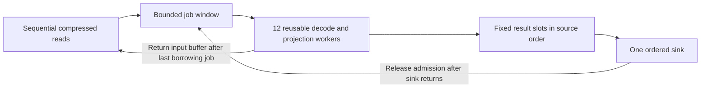

# Ordered Compact V2 block pipeline

Status: implemented and tested, 2026-09-06. The NAS comparison
is complete: full USDC scan time fell 10.30% and Pump scan time fell 9.58% against
the immediately preceding build. Exact outputs pass. See
[the epoch 300 report](../benchmarks/epoch-300-rolling-pipeline-2026-09-06.md).

## Reason for the change

The earlier reader already overlaps input reads with decompression and projection.
One producer reads monotonic, frame-aligned ranges into three recycled compressed
buffers. Twelve workers can process the current range while the producer reads
the next one. The ordered sink can consume one completed group while workers
process the following group.

However, each group contains up to four blocks per worker. All blocks in a group
must finish before any result in that group is delivered or the next group starts.
With twelve workers, this creates a barrier after up to 48 blocks. A slow block
can delay completed output and prevent free workers from starting later blocks.

The last epoch 300 canonical USDC pair averaged 88.608 seconds of scan time.
Input-ready waits totaled only 0.022 seconds, while the producer waited 62.831
seconds for free input buffers. The input producer was usually ahead. These
measurements do not isolate time lost at group boundaries; more prefetch alone
is not supported as the main improvement.

## Execution

The producer still reads each planned range once, in increasing offset order.
A compressed buffer remains alive until the last job that borrows it finishes.
Workers reuse their decompressor, decompressed storage and caller state. Borrowed
block data cannot leave the projection callback; published results own their data.

The group barrier is replaced by a fixed window of admitted blocks. Admission
counts queued jobs, active jobs and completed results, including a result still
being consumed. A free worker takes the next admitted row. The sink receives the
next result in source order as soon as it is ready. After the sink returns, that
row releases its share of the window and another row can enter.

The worker threads remain private to the scan and are joined before it returns.
The implementation uses fixed job/result storage rather than a separate heap
task for every block. A reference-counted owner per compressed input batch keeps
borrowed frame slices valid while jobs run. This changes scheduling, not message
or metadata validation, signatures, compact-ID assignment, or output schemas.

## Resource limits

For `W` workers, `B` configured blocks per input batch, and `U` configured declared
uncompressed bytes per input batch, the outstanding window permits at most:

- `2 * min(B, 4 * W)` blocks;
- 131,072 declared transactions;
- `2 * U` declared uncompressed bytes.

A single admitted block larger than the byte target runs alone through sink
completion. Existing per-block/frame and transaction limits still apply. The
ordinary twelve-worker SDK configuration therefore permits up to 96 outstanding
blocks and 64 MiB of declared source bytes, subject to the transaction limit.

These are admission limits, not a total process memory cap. Compressed buffers,
retained worker buffers, registry caches, signature buffers, and the application
sink use additional memory. Projection-byte counters are measured after allocation
and are not an OOM guard.

New receipt and profile fields expose maximum outstanding blocks, transactions,
and declared uncompressed bytes. A row remains charged until ordered consumption
finishes. Maximum counters describe observed peaks; they do not estimate CPU idle
time or physical memory.

The decode/project wall metric now measures the span from first admission to last
projection completion, including input and sink-capacity gaps. It is no longer a
sum of complete-group execution times. The result-send wait is zero because each
worker already owns its result slot. The former output-buffer wait now measures
admission waits. Compare scan times and worker sums across versions; these three
queue/span fields have changed meaning.

## Ordering and shutdown

Only the sink advances signature cursors, publishes canonical blocks, assigns
first-observed compact IDs, or commits application checkpoints. Workers can finish
in any order. The first projection error is selected by source row, even if a
later error finishes first. No row after the selected error is published.

Sink failure, source failure and panic paths must release blocked participants
and join started threads. A full result window must not prevent shutdown. Reader
and worker setup failures must occur before archive payload reads start.

## Validation

The regression cases cover simultaneous reads and processing; publication before
a later block finishes; admission beyond the former group boundary; reversed error
completion; output lifetimes through sink return; block, transaction and declared
byte limits; oversized blocks; and source, worker and sink shutdown paths.

The dated benchmark report records the workspace and pipeline checks for the
measured build. A repeat comparison should use saved baseline binaries, separate
timing and allocation runs, and exact output comparisons after timed scans.
Record other NAS work and use an agreed quiet period. Do not treat a run with
concurrent copying or decompression as equivalent to the measured quiet run.
