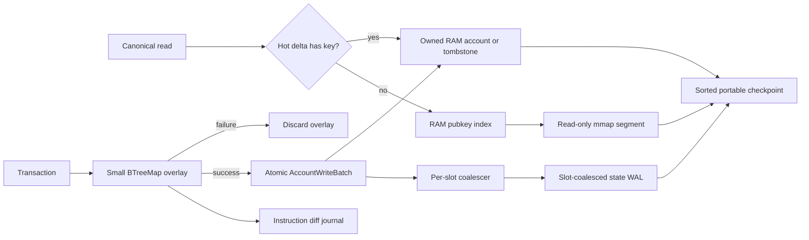

# Replay Account Storage V0

Status: **the in-memory execution backend is implemented; durable
checkpoint/resume, the WAL, mmap segments, and persistent diff journal are the
next storage stage and are not yet implemented**.

This document chooses the account-storage architecture for Blockzilla's
replay-first Solana runtime. The workload is one trusted, ordered chain with
one canonical writer. It is not a validator AccountsDB: it does not need fork
choice, rooting, snapshot distribution, or concurrent voting-path reads. It
does need fast random account access, transaction rollback, exact
instruction/transaction diffs, deterministic checkpoints, and recovery across
separate Compact generations.

The decision is:

- use an in-process `hashbrown::HashMap` for canonical account lookup now;
- retain small `BTreeMap` transaction overlays and publish them atomically;
- represent large fixed-size sysvar changes as validated byte patches;
- add a portable, pubkey-sorted checkpoint/resume format next; and
- evolve the persistent backend into sealed read-only mmap segments, a hot RAM
  delta, and a slot-coalesced state WAL, with instruction diffs in a separate
  journal.

Redis is not canonical replay storage. RocksDB, redb, and LMDB remain benchmark
competitors, not architectural dependencies. A custom hash table is also
deferred until profiling shows that `hashbrown` is the limiting component.

## 1. Required invariants

Storage optimization may not change runtime behavior. Every backend must obey
these rules:

1. An account value contains the full replay state: lamports, owner,
   executable flag, rent epoch, and data. Analytics may suppress a
   lamport-only diff, but storage may not suppress the lamports.
2. A program instruction reads its transaction overlay first and canonical
   state second. It cannot observe another transaction's speculative writes.
3. A successful transaction publishes all of its account writes as one batch.
   An ordinary failed transaction publishes none of its speculative program
   writes. Historical fee and nonce epilogues are separate, explicit batches.
4. Deletion is an explicit runtime decision. The storage layer does not infer
   a tombstone merely because `lamports == 0`; a zero-lamport account can still
   be represented.
5. Hash-table iteration order is never observable. Canonical hashes,
   checkpoints, state-WAL records, and manifests order account keys
   lexicographically by their 32-byte pubkey.
6. Checkpoints are legal only after a Bank has completely frozen. A crash in a
   slot resumes from the last durable frozen slot and executes the interrupted
   slot again.
7. State recovery and analytical diffs are distinct streams. Coalescing state
   writes must never erase an instruction-level mutation or its final
   `Committed`/`RolledBack` disposition.
8. A checkpoint is bound to its replay descriptor, source Compact generation,
   runtime profile, format version, transition version, and predecessor. Slot
   equality alone is insufficient.

## 2. Reference-runtime findings

The reference implementations point to two useful ends of the design space:

| Runtime | Observed account-storage shape | What Blockzilla takes from it |
|---|---|---|
| LiteSVM | In-process `HashMap<Address, AccountSharedData>` | A direct map is an effective execution store for a small, single-process SVM. |
| QuasarSVM | In-process `HashMap<Pubkey, SolanaAccount>` | Keep the initial hot path simple and local. |
| Agave | AccountsDB with an account index and append-oriented account files, plus cleaning/shrinking and snapshot machinery | Separate lookup metadata from immutable account bytes, but omit validator fork and snapshot-distribution complexity. |
| Firedancer | Purpose-built `fd_accdb` with transactional access, fork identifiers, pools, hot cache, and disk paths | Make transaction publication and durable recovery explicit, but specialize for one ordered replay fork. |

The inspected source snapshots are:

- [Agave](https://github.com/anza-xyz/agave/tree/e1566c2ec46ab4ba8f6f12ebb5399bfff62c4dc3)
  `e1566c2ec46ab4ba8f6f12ebb5399bfff62c4dc3`;
- [Firedancer `fd_accdb`](https://github.com/firedancer-io/firedancer/tree/decca0535765f25e1dbe94258db1408d1213c17f/src/flamenco/accdb)
  `decca0535765f25e1dbe94258db1408d1213c17f`;
- [LiteSVM `accounts_db.rs`](https://github.com/LiteSVM/litesvm/blob/8dea7cde73923cf2a60b1c934e40442df9cf20c2/crates/litesvm/src/accounts_db.rs)
  `8dea7cde73923cf2a60b1c934e40442df9cf20c2`;
- [QuasarSVM `svm.rs`](https://github.com/blueshift-gg/quasar-svm/blob/b5a9363de13e0f1e5e4559f4251c77563c3c9986/svm/src/svm.rs)
  `b5a9363de13e0f1e5e4559f4251c77563c3c9986`.

Blockzilla's workload is simpler than Agave's or Firedancer's: execution is
sequential first, the input has already selected the chain, and a frozen Bank
is the only recovery boundary. Reusing a full validator account database would
bring fork-aware lifetime and maintenance work that replay does not need.

## 3. Storage topology



### 3.1 Current in-memory backend

`MemoryAccountStore` owns the canonical
`hashbrown::HashMap<[u8; 32], AccountSnapshot>`. This is the execution path for
the current launch-era replay POC. Capacity is reserved from the genesis
account count so initialization does not repeatedly grow the table.

Transaction and instruction account sets remain `BTreeMap`s. They are small,
short-lived, deterministic overlays, so their tree cost is minor and their
ordered traversal simplifies native-program verification and diff generation.
Changing these overlays to a global concurrent map would add machinery without
improving the sequential path.

`AccountWriteBatch` is the publication boundary. It supports:

- `Put(AccountSnapshot)` for creation or replacement;
- `Delete` for an explicit tombstone; and
- `PatchData { expected_data_len, patches }` for bounded, non-overlapping byte
  changes to an existing value.

Every fallible patch condition is checked before the first mutation, so an
invalid batch leaves canonical state unchanged. The future durable backend
must preserve the same all-or-nothing contract.

SlotHistory demonstrates why patch writes are part of the storage ABI. Its
launch-era account data is 131,097 bytes. Once the account exists, a normal
slot freeze changes the eight-byte history word containing that slot and the
eight-byte `next_slot` field. Skipped slots can touch additional words. The
runtime therefore publishes the changed ranges instead of copying and later
persisting the entire 131,097-byte value on every Bank freeze.

Canonical state hashing uses sorted pubkeys and all account fields. It is
independent of `hashbrown`'s seed, capacity, bucket placement, and insertion
order.

### 3.2 Target persistent backend

The persistent backend has four parts:

1. **Sealed account segments.** Account records are written sequentially into
   deterministic segment files during checkpoint construction. After sealing,
   a segment is immutable and mapped read-only. Records are never updated in
   place.
2. **RAM base index.** On resume, a sorted portable index is validated and
   loaded into a `hashbrown::HashMap<Pubkey, RecordLocation>`. A location is a
   checked `(segment_id, offset, encoded_len)` tuple, not a native pointer.
3. **Hot RAM delta.** Accounts created, replaced, patched, or deleted since the
   sealed checkpoint live in a `HashMap<Pubkey, HotValue>`. Reads consult this
   delta before the base index. Patching a mapped account materializes one
   owned copy in the delta, then applies later patches to that copy.
4. **Slot-coalesced state WAL.** Committed transaction and Bank writes update
   an in-memory per-slot delta. At freeze, only the final operation for each
   pubkey is serialized, in pubkey order, into one checksummed slot record.
   This WAL is the state-recovery stream between checkpoints.

The lookup path is completely in-process. Mapped account bytes may be exposed
as a borrowed `AccountView`; a write promotes them to an owned overlay value.
The current `&AccountSnapshot` interface is transitional and may become a
borrowed-or-owned view when the mmap backend lands.

Checkpoint construction merges the sealed base and hot delta in pubkey order,
writes only current live values to new segment files, and writes a new sorted
index. This is also compaction. Old segments remain reachable until the new
checkpoint is published and all readers have released them; garbage
collection is never part of the replay commit loop.

Segment boundaries are deterministic: V0 defines a fixed maximum payload size,
starts a new segment before the next complete account record would cross that
limit, and never splits an account record. Compression is disabled in V0.
Consequently, identical canonical state and descriptor inputs produce
byte-identical segment, index, runtime-state, and manifest bytes.

## 4. State WAL and diff journal

The two journals have intentionally different information density.

### 4.1 Slot-coalesced state WAL

`StateWalSlotV0` contains:

```text
format_magic, format_version
monotonic_sequence
slot, parent_slot
source_generation_digest
runtime_profile_digest
previous_bank_boundary_hash, final_bank_boundary_hash
sorted account operations[]
canonical_account_state_hash
diff_journal_end_offset, diff_slot_digest
payload_length, payload_checksum
commit_trailer
```

An account operation is `put`, `delete`, or `patch`. Account values encode all
metadata and data. A patch carries the expected pre-patch data length and
sorted, non-overlapping ranges. The frame has a length in its header and
trailer plus a version-selected checksum, allowing recovery to reject a torn
tail. V0 uses CRC32C for individual frames and SHA-256 for manifests, slot
state hashes, and journal-chain digests.

Multiple writes to one pubkey inside a slot are coalesced against the account's
state at the preceding frozen Bank. If patch composition becomes ambiguous,
the coalescer emits one full `put`. A no-op final value may be omitted. This
record is sufficient to reconstruct the next frozen canonical state; it does
not attempt to reconstruct instruction boundaries.

### 4.2 Instruction diff journal

The diff journal records every observed instruction mutation in ledger order,
including slot, transaction index, instruction index, boundary, account,
before/after field values or hashes, changed byte ranges, and final
`Committed` or `RolledBack` disposition. Transaction-epilogue fee and nonce
effects have their own boundary rather than being attributed to the failing
instruction.

Diffs are finalized in memory when the transaction outcome is known, then
appended. A `DiffSlotSealV0` commits the ordered range for one frozen slot. The
following state-WAL slot record binds the diff end offset and seal digest. A
crash after the diff seal but before the state-WAL record leaves an unreferenced
diff tail; recovery ignores it and replays that slot. This prevents duplicate
analytical output without coupling account lookup to diff retention.

The diff journal is product data, not an account database and not a recovery
source for canonical state. It can be partitioned, compressed, or exported
independently as long as its sealed digest stream remains identical.

## 5. Portable checkpoint format

A checkpoint package represents exactly one frozen Bank. Its immutable
directory contains:

```text
manifest.v0
runtime-state.v0
accounts-index.v0
accounts-000000.v0
accounts-000001.v0
...
```

The manifest binds:

- checkpoint format and transition versions;
- replay descriptor and predecessor checkpoint digests;
- Compact generation ID and generation digest;
- frozen slot, parent slot, epoch, and next input position;
- runtime profile and feature-map digests;
- parent and final PoH boundary hashes;
- state-WAL sequence/offset and diff-journal sequence/offset;
- account count, capitalization, and canonical account-state hash;
- Bank runtime-state hash; and
- each package file's name, byte length, and SHA-256.

`runtime-state.v0` includes every non-account continuation value required to
construct the next Bank: recent-blockhash and fee queues, status cache,
signature counters, Bank position, stake/reward working state, last PoH hash,
and any runtime-profile-specific cache. Sysvar accounts remain in the canonical
account set; redundant decoded caches must match their bytes during load.

The account index and segment record stream are sorted by raw pubkey bytes.
Each account record contains:

```text
pubkey[32]
last_modified_slot:u64
deterministic_write_ordinal:u64
lamports:u64
owner[32]
executable:u8
rent_epoch:u64
data_len:u64
data[data_len]
```

The modification slot and write ordinal are storage provenance, not fields
visible to an executing program. The ordinal is assigned from canonical ledger
order, never thread scheduling. Preserving both lets later runtime profiles
reconstruct account-version and Bank-hash inputs without treating an mmap
offset as consensus metadata. The current POC does not yet carry these two
fields, so adding and differentially validating them is part of S2.

The real encoding also carries a record version, total encoded length, and
checksum. All integer fields are explicitly little-endian. Padding bytes, if a
format revision introduces them, are required to be zero and are included in
file hashes. The canonical account-state hash covers the program-visible
account fields; a separate checkpoint/runtime-state hash binds storage
provenance.

### 5.1 Crash-atomic publication protocol

The V0 durability contract assumes a local filesystem that provides atomic
same-directory rename plus meaningful `fsync`/`fdatasync` semantics. Network
filesystems are unsupported until separately qualified.

For a completely frozen Bank at slot `N`, publication is exactly as follows.
The initial implementation holds the replay writer at the frozen-Bank barrier
until it has captured all checkpoint inputs. A later background writer may
replace the pause only by atomically taking an immutable state view.

1. Append all finalized diffs for `N`, then append `DiffSlotSealV0`. Call
   `fdatasync` on the diff journal.
2. Append `StateWalSlotV0`, binding that diff seal and the canonical state hash.
   Call `fdatasync` on the state WAL. At this point slot `N` is recoverable from
   the previous checkpoint even if no new checkpoint is published.
3. Create a fresh `.checkpoint-<slot>.building-<unique>` directory on the same
   filesystem as the final checkpoint directory. Never reuse a prior temporary
   directory.
4. Write account segments, the sorted account index, and runtime state into the
   building directory. Sync every file after its final bytes are written.
5. Write `manifest.v0` last. It lists and hashes every other file and records
   the exact state-WAL and diff-journal high-water marks. Sync the manifest,
   then `fsync` the building directory.
6. Compute the manifest SHA-256 and rename the complete building directory to
   its immutable `checkpoint-<slot>-<manifest_sha256>` name in the same parent
   directory. `fsync` that parent directory. A crash before this step leaves
   only an ignored building directory; a crash after it may leave an
   unreferenced but valid checkpoint.
7. Write a fresh `.CURRENT.next-<unique>` with the final directory name,
   manifest SHA-256, slot, and both journal high-water marks. Sync that file,
   atomically rename it over `CURRENT`, and `fsync` the parent directory.
8. Only after step 7 may a background task retire checkpoints, WAL prefixes,
   diff-journal prefixes, or account segments older than the retained recovery
   window. Deletion is never required to complete publication.

Recovery reads and validates `CURRENT`, all package hashes, the descriptor
binding, and the two journal high-water marks. It rebuilds the ephemeral RAM
hash indexes from the sorted index, then scans complete state-WAL records after
the checkpoint high-water mark. Scanning stops before the first frame with an
invalid length, checksum, trailer, sequence, descriptor, or diff binding.
Unreferenced diff data and torn WAL tails are ignored. If `CURRENT` is absent or
invalid, recovery may select the newest immutable checkpoint whose complete
manifest validates and whose descriptor/predecessor chain matches; it never
selects a directory merely by its slot-shaped name.

The old `CURRENT` and old journal data remain valid throughout the protocol.
Therefore every crash point resolves to either the previous durable checkpoint
plus WAL or the newly published checkpoint, never a mixture of both.

## 6. ARM and x86 portability

Account storage is host-independent. No checkpoint or journal persists a Rust
`usize`, enum layout, pointer, hash-table bucket, native struct image, mmap
address, or host endianness. File offsets and lengths are unsigned 64-bit
little-endian values and are range-checked before conversion to a process
index. Mapped files are read-only byte regions; parsing does not rely on
alignment or `transmute`.

The same package must open on Apple Silicon, Intel macOS, and x86-64 Linux and
must produce the same canonical account-state hash. Hash-table seeds and mmap
addresses can differ without affecting any durable byte.

Native SBF artifacts are a separate cache and are intentionally
architecture-specific. A checkpoint may bind the program ELF hash and compiler
profile, but it must not require an AArch64 machine-code artifact on x86-64 or
vice versa. Missing host-target artifacts are recompiled and installed only
after their source deployment is known to have committed.

## 7. Why not the alternatives

| Candidate | V0 decision | Reason |
|---|---|---|
| Redis | Downstream query/cache/export only | IPC or network framing, serialization, server memory overhead, and independent persistence scheduling sit directly on the random-read and commit hot path. Replay recovery also needs one descriptor-bound atomic state, not a second service's snapshot/AOF policy. |
| Hand-written hash table | Defer | Fixed 32-byte keys and known capacity may eventually justify a specialized table, but `hashbrown` gives a mature baseline. Replace it only after lookup profiles and end-to-end replay measurements show a material win. |
| RocksDB | Benchmark | It offers mature durability, but its WAL, memtables, flushes, and LSM compactions add write amplification and background work that a single ordered replay stream can avoid. |
| redb | Benchmark | An embedded transactional B-tree is attractive operationally; measure random reads, large values, checkpoint ingest, recovery, and file growth before considering it. |
| LMDB | Benchmark | Read-only mmap pages and a single writer align with part of the workload, but page-level copy behavior, map sizing, and value-copy costs must be measured against the append-segment design. |
| Full Agave/Firedancer account DB | Reference, not dependency | Their validator fork, root, snapshot, and concurrent-service requirements are broader than Blockzilla's one-chain replay contract. |

Redis can still serve live APIs after replay publishes a frozen checkpoint or a
diff stream. It must be reconstructible from Blockzilla files and must never be
the only copy of canonical execution state.

## 8. Delivery stages

| Stage | Deliverable | Status |
|---|---|---|
| S0 | `MemoryAccountStore` backed by `hashbrown`, deterministic sorted state hash, atomic `AccountWriteBatch`, BTreeMap transaction overlays | **Implemented** |
| S1 | SlotHistory and other suitable Bank writes use validated byte patches rather than whole-value rewrites | **Implemented for SlotHistory** |
| S2 | Versioned sorted checkpoint writer/reader for the memory backend, including complete Bank continuation state and descriptor binding | **Next** |
| S3 | Split-run resume: one Compact generation ends at a frozen checkpoint and a separate generation continues without genesis reinitialization | **Not implemented** |
| S4 | Persistent diff journal and slot-coalesced state WAL with torn-tail recovery | **Not implemented** |
| S5 | Sealed read-only mmap segments, RAM base index, and hot RAM delta behind the account-store API | **Not implemented** |
| S6 | Deterministic compaction and retention after atomic checkpoint publication | **Not implemented** |
| S7 | Comparable benchmarks for `hashbrown`, a specialized table prototype, RocksDB, redb, and LMDB on the epoch corpus | **Not implemented** |

S2 and S3 precede mmap optimization because deterministic checkpoint/resume is
the functional blocker for continuing from a separately stored epoch-0
generation into epoch 1. The memory backend remains the semantic oracle for
every persistent implementation.

## 9. Acceptance tests

### 9.1 Current memory-store gate

- A batch containing any missing, out-of-bounds, overlapping, or stale-length
  patch fails without applying an earlier valid operation from that batch.
- Put, replace, explicit delete, zero-lamport presence, and byte patch behavior
  are covered independently.
- Two stores populated with the same accounts in different insertion orders
  produce the same canonical hash.
- The ten-slot Compact fixture retains its recorded final state hash
  `e6932abcc1341b859a8700e7ff891183b477301120297bf576612ea240d19eb8`.
- The available Compact prefix through slot 131,071 retains its recorded final
  state hash
  `d425b2088adf01a0fdcbddceb287df4565b42c3358487d942d9b160ba52c65fd`
  and the same committed/rolled-back instruction diff sequence.

### 9.2 Checkpoint and backend parity gate

- Uninterrupted replay and replay split at every selected frozen-slot
  checkpoint produce byte-identical final canonical hashes, runtime-state
  hashes, transaction outcomes, and ordered diff digests.
- Writing the same checkpoint twice from independently constructed hash-table
  insertion orders produces byte-identical files and manifest SHA-256.
- The memory and mmap backends replay the same fixture to identical account,
  Bank-state, WAL-slot, and diff-journal digests.
- Resume rejects a checkpoint with a changed account byte, index offset,
  runtime-state byte, descriptor digest, predecessor digest, journal high-water
  mark, or file inventory.

### 9.3 Crash-recovery gate

- Fault injection terminates the writer before and after every write, sync, and
  rename step in the publication protocol. Recovery always selects the last
  completely durable frozen Bank.
- Truncating every possible byte of the final WAL frame, diff seal, manifest,
  index, and `.CURRENT.next-<unique>` is detected; no partial account batch is
  visible.
- A crash after a diff seal but before its binding state-WAL record neither
  publishes the slot nor duplicates that diff range after replay.
- A crash after checkpoint-directory rename but before `CURRENT` publication
  leaves the old checkpoint active; the orphan is either validated and adopted
  explicitly during recovery or removed later.
- Recovery is idempotent: opening, applying valid WAL records, and immediately
  checkpointing twice yields the same manifest and state hash.

### 9.4 Portability and performance gate

- A checkpoint produced on `aarch64-apple-darwin` opens on x86-64 and vice
  versa with the same canonical state hash; independent writers given the same
  frozen state produce byte-identical package files.
- Parsers reject integer overflow, offsets outside a mapped file, overlapping
  records, duplicate pubkeys, non-zero forbidden padding, and unsupported
  versions before exposing account data.
- Benchmarks report lookup, overlay creation, transaction publication,
  SlotHistory freeze, WAL append/sync, checkpoint write/load, peak RSS, disk
  bytes, and full replay throughput separately.
- The mmap backend is accepted only if it preserves parity and either reduces
  peak RSS or improves restart/checkpoint behavior without a material replay
  throughput regression. A custom hash table or embedded database replaces
  `hashbrown` only with an end-to-end measured advantage, not a microbenchmark
  alone.

## 10. Explicit V0 exclusions

V0 has one canonical writer and one replay branch. It does not provide remote
transactions, distributed locking, validator fork visibility, arbitrary
mid-slot recovery, writable mmap records, live in-place segment mutation, or
cross-process canonical writes. Readers consume only immutable checkpoints and
sealed diff partitions. These exclusions keep the storage design aligned with
the actual objective: replay the selected chain as fast as possible while
preserving exact state and instruction-level evidence.
