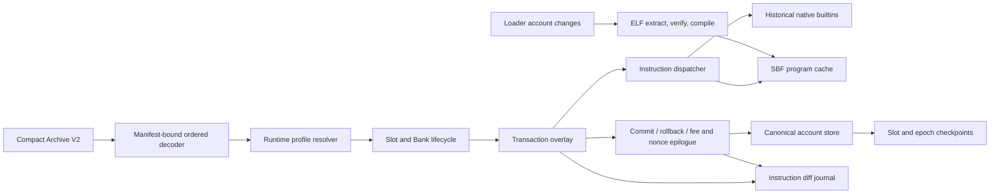

# Blockzilla Replay Runtime V0

Status: **architecture frozen; the bounded local epoch-0 prefix completes
through slot 131,071 with genesis builtins, launch Bank sysvars except
Bank-hash-dependent SlotHashes, native Config/System/Stake/Vote dispatch, and
derived transaction rollback. Ordered Compact generations now share one replay
Bank, and a deterministic frozen-Bank checkpoint round-trips continuation
state. Complete-epoch execution and Bank parity are not yet proven**.

This document specifies a replay-first Solana runtime. Its purpose is to consume
an already trusted, ordered ledger, execute its historical state transitions as
quickly as possible, and emit general account changes at transaction and
instruction boundaries. It is not a validator, a voting node, or a replacement
source of ledger truth.

The runtime has exactly one operational ledger input contract:
manifest-bound **Blockzilla Compact Archive V2**. It does not accept another
ledger container, shreds, or RPC JSON at its execution boundary, and it has no
conversion or fallback path. Replay Projection V1 remains a separate,
non-operational design draft that would require an explicit future decision
before it could become an accepted input. Reference work happens outside the
replay crate and process; replay opens only a separately validated Compact
generation.

The first target is mainnet-beta epoch 0 and epoch 1. Research against the
launch genesis and the launch-era Solana source changes the expected order of
work: those epochs had no BPF loader and no user SBF programs. Faithful replay
of the first two epochs is therefore a historical Bank plus four native
builtins problem. Program extraction and native compilation remain a parallel
track for the loader's later activation.

## 1. Decisions

1. Pin runtime behavior by slot range. Never run old ledger data with whatever
   Agave features happen to be current.
2. Production replay opens only a complete immutable Compact generation whose
   full manifest and registry closure validates. Bounded POC measurements may use an explicitly
   partial, structurally sealed Compact fixture that exercises the same reader
   but is non-publishable and cannot establish epoch parity. Trust shred
   authentication, transaction authorization, ordering, and finality
   established upstream; skip shred and Ed25519 verification in replay. Compact
   consumes only its manifest-bound sidecars.
3. Retain structural transaction sanitation, signer and writable metadata,
   ownership and borrow rules, program authorization, atomic rollback, fees,
   rent, durable nonces, status-cache behavior, and Bank/sysvar lifecycle.
4. Keep lamports in canonical state even when the analytical output suppresses
   lamport-only changes. Rent, fees, account lifetime, and program behavior
   depend on them.
5. Record diffs for every changed account. A PDA is not a distinct on-chain
   account type, so `pda` is optional provenance, not a filter or inferred flag.
6. Emit the mutation observed after every instruction and whether that mutation
   ultimately committed. A later instruction can fail and roll the earlier
   mutation back.
7. Verify every SBF ELF before compiling it to host code. Trusted block order
   does not make program bytes safe compiler input.
8. Install a compiled artifact only after the deployment transaction commits.
   Compilation and visibility rules belong to the selected historical loader
   profile.
9. Establish sequential parity before parallel execution. Optimization is
   accepted only when the canonical checkpoint stream is unchanged.

## 2. Historical target

The mainnet launch genesis identifies the Stable operating profile and contains
exactly these native builtins:

- `solana_config_program`
- `solana_stake_program`
- `solana_system_program`
- `solana_vote_program`

The closest release before genesis is Solana `v1.0.7`, commit
`57abc370fa39e42e8fb84145a30395ddcf891692`. In that source, Stable epoch 0
registers only those four programs, epoch 1 activates no additional program,
and the BPF-loader activation is still a placeholder. The launch-era BPF loader
was later scheduled for epoch 34, beginning at slot 14,688,000. This is strong
evidence that the epoch 0–1 runtime has no SBF execution, SBF CPI stack, SPL
Token program, or user-program PDA derivation. The claim becomes an acceptance
result only after G0 scans the complete corpus and reconstructed executable
account state.

`v1.0.7` is a candidate profile rather than an unqualified oracle. Solana
`v1.0.8` was released during epoch 1 and changed Vote instruction behavior, but
there was no on-chain feature account that records the validator rollout slot.
V0 handles this uncertainty with explicit runtime segments and differential
profiles; it must not guess an activation slot from a release timestamp.

### 2.1 Measured mainnet genesis fingerprint

| Field | Value |
|---|---:|
| Genesis hash | `5eykt4UsFv8P8NJdTREpY1vzqKqZKvdpKuc147dw2N9d` |
| `genesis.bin` SHA-256 | `45296998a6f8e2a784db5d9f95e18fc23f70441a1039446801089879b08c7ef0` |
| `genesis.bin` size | 132,347 bytes |
| Creation time | 2020-03-16 14:29:00 UTC |
| Operating mode | Stable, serialized discriminant `1` |
| Serialized accounts | 431 |
| Genesis capitalization | 500,000,000 SOL |
| Executable serialized accounts | 0 |
| Ticks per slot | 64 |
| Hashes per tick | 12,500 |
| Nominal slot time | 400 ms |
| Slots per epoch | 432,000, no warmup |
| Epoch 0 | slots `[0, 432000)` |
| Epoch 1 | slots `[432000, 864000)` |
| Inflation | disabled |
| Rent | 3,480 lamports/byte-year, threshold 2.0, 100% burn |
| Fee target | 10,000 lamports/signature, range 5,000–100,000, 100% burn |

Bank initialization creates executable NativeLoader accounts for the four
builtins; they are not among the 431 serialized accounts. Each has one lamport,
is executable, is owned by
`NativeLoader1111111111111111111111111111111`, and contains its native shared
object name as ASCII data. The replay POC materializes those four accounts plus
the exact six genesis-Bank sysvars, so its pre-transaction baseline is 441
accounts. SlotHistory is first created when slot 0 freezes; SlotHashes remains
unavailable until replay computes the parent Bank hash.

### 2.2 Epoch corpus

The replay corpus will consist of two complete, manifest-bound Blockzilla
Compact Archive V2 generations:

| Epoch | Slots | Transactions | Transaction metadata | Required runtime artifact |
|---:|---:|---:|---|---|
| 0 | `[0, 432000)` | 1,724,876 | absent | complete Compact Archive V2 epoch 0 generation |
| 1 | `[432000, 864000)` | 12,548,674 | absent | complete Compact Archive V2 epoch 1 generation |

The completed Compact generations already exist in the Blockzilla NAS archive.
The replay workflow does not fetch, open, convert, or fall back to CAR. It
copies only the Compact files required by the ordered decoder, adds the exact
epoch-0 `genesis.bin`, and generates immutable local completion manifests.

The authoritative Compact inventory reports:

| Epoch | Present blocks | Skipped slots | Compact blocks | Index | Registry | Blockhash registry |
|---:|---:|---:|---:|---:|---:|---:|
| 0 | 431,548 | 452 | 74,044,326 B | 22,440,532 B | 14,336 B | 13,809,568 B |
| 1 | 430,517 | 1,483 | 200,625,731 B | 22,386,920 B | 6,752 B | 13,776,544 B |

Including the small metadata files, epoch-1 previous-blockhash tail, and exact
epoch-0 genesis, the replay-minimal transfer is 347,348,691 bytes (331.26 MiB).
The PoH, shredding, signature, vote-hash, and optional block-access sidecars are
not opened by the current signature-free top-level-instruction POC and are not
part of this minimal local replay set. A later status-cache or PoH-parity stage
must extend the manifest and input contract explicitly rather than silently
consulting another source.

Because status metadata is absent for these epochs, the runtime must derive
instruction and transaction outcomes itself. A ledger blockhash is a PoH/ledger
hash, not an account-state root, and cannot by itself prove correct execution.

### 2.3 Measured Compact Archive V2 all-Vote fixture

A local, deliberately partial generation proves that the Compact Archive V2
reader can bind and decode the first ten produced slot records and that the
bounded launch-era native-System/trusted-Vote path can thread account state
across their instructions:

| Field | Measured value |
|---|---|
| Generation ID | `epoch-0-slots-0-9-replay-poc` |
| Generation digest | `bb8ecc3271770df50ad3ddcaec0e70b9fdc3444b14da59c94eec869449849a65` |
| Slot range | `[0, 10)` |
| Slots decoded | 10 |
| Transactions decoded | 34 |
| Top-level instructions decoded | 34, all addressed to the Vote program |
| Launch-era Vote mutations applied | 34 |
| Launch-era System mutations applied | 0 |
| Distinct vote accounts changed | 4 |
| Mutation evidence | one before/after account-data diff per instruction, with lengths, SHA-256 hashes, and changed-byte ranges |
| Runtime profile | `launch-v1.0.7-bank-sysvars-native-config-system-stake-and-trusted-vote-poc` |
| State scope | `serialized-genesis-plus-native-builtins-plus-bank-sysvars-plus-config-system-stake-vote-mutations` |
| Commit model | `implemented-native-errors-derived` |
| Archived outcomes | `observed-not-consumed`; decoded outcome `Unknown` |
| Bank sysvar writes/accounts | 37 / 4 |
| Final replay accounts | 442 |
| SlotHashes | explicitly unavailable |
| POC state hash | `e6932abcc1341b859a8700e7ff891183b477301120297bf576612ea240d19eb8` |
| Genesis source kind | exact `genesis.bin`, not the lossy inline legacy projection |
| `genesis.bin` | 132,347 bytes; SHA-256 `45296998a6f8e2a784db5d9f95e18fc23f70441a1039446801089879b08c7ef0` |

Measured command:

```bash
cargo run -p blockzilla-replay --bin blockzilla-replay-poc -- \
  replay-compact-prefix /private/tmp/blockzilla-epoch0-replay-compact \
  --max-slots 10
```

The run reported runtime profile
`launch-v1.0.7-bank-sysvars-native-config-system-stake-and-trusted-vote-poc`,
the Bank-sysvar state scope above, commit model
`implemented-native-errors-derived`, and
`archived_outcomes=observed-not-consumed`. The all-Vote fixture produced 34
Vote mutations, zero System mutations, four changed vote accounts, and the
POC state hash
`e6932abcc1341b859a8700e7ff891183b477301120297bf576612ea240d19eb8`.
Each mutation emitted an instruction identity plus an account-data diff
containing exact before/after lengths and hashes and bounded changed-byte
ranges. The runtime streamed one independently framed compact block at a time
and dropped its decoded transactions before opening the next block; epoch-scale
input does not require retaining an epoch's transactions in memory.

The POC marks transactions committed when they succeed under its implemented
native subset; it does not consume archived outcomes. The compact launch
corpus has no decoded transaction-status metadata, so these archived outcomes
are `Unknown`. Non-Bank-hash sysvars advance, but SlotHashes, transaction
recent-blockhash/status checks, fee debit, and rent are not complete.
`Committed` diff disposition is therefore POC execution evidence, not
independent historical-success or parity evidence.

The exact `genesis.bin` member was extracted from
`asset/epochs/genesis.tar.bz2`
(archive SHA-256
`133f7eaefcd59466f3b291aadd1b0d3522432072cf5b539445218c6c125ea945`)
and installed in the compact generation before its manifest digest was
computed.

This is **partial POC input evidence, not epoch-0 replay parity**. The local test
manifest is structurally sealed and exercises the same validation path, but
production replay input must be a complete generation. This fixture covers only
slots 0 through 9 and must never be published, registered, or described as a
complete epoch-0 generation. It proves manifest binding, exact-genesis
recovery, ordered compact block/message decoding, registry resolution,
instruction counting, and the measured Vote account-data mutations from an
all-Vote fixture. It materializes the non-Bank-hash sysvar lifecycle but does
**not** apply fee/rent effects, materialize SlotHashes, construct historical
AccountsDB/Bank hashes, verify signatures, or meter compute units. It
consequently proves neither the complete historical transaction pipeline, Bank
parity, checkpoint equality, epoch coverage, nor epoch parity.

### 2.4 Measured native-Stake prefix progression (earlier state scope)

A larger manifest-bound Compact Archive V2 fixture requested epoch-0 slots
`[0, 131072)`. It contains 130,621 present blocks; 451 absolute slots in that
range are missing from the ledger. The native Config/System/Stake/Vote profile
now completes this entire local fixture.

| Field | Measured value |
|---|---|
| Generation ID | `epoch-0-slots-0-131071-failure-search` |
| Generation digest | `1543fd33f34ca7b68b5cdd7e4914aeece69acdee9ab83b2e48a97de3c59d0ba8` |
| Completed present blocks | 130,621, through slot 131,071 |
| Transactions | 521,176 committed; 2 derived failures |
| Committed instructions | 521,177 |
| Rolled-back successful instructions | 2 |
| Mutations | 521,169 Vote; 0 Config; 1 System; 7 Stake |
| Changed accounts | 12 |
| Final replay accounts | 441: 435 baseline plus six transaction-created accounts |
| POC replay-state hash | `f0c4987d548feb1688394e9e0f507bd2f022df192385d00e6bd44c65be16a8c4` |

The Config dispatcher implements the complete v1.0.7 generic byte-store ABI:
short-vector key prefix decoding, positional signer consumption, historical
cardinality/substitution quirks, opaque state bytes, tail preservation, and
generic post-instruction account verification. This bounded corpus contains no
Config instruction, so its zero mutation count is expected and the dispatcher
is covered by direct ABI and transaction-overlay tests.

The launch-era native System path implements the Solana v1.0.7 non-nonce
variants `CreateAccount`, `Assign`, `Transfer`, `CreateAccountWithSeed`,
`Allocate`, `AllocateWithSeed`, and `AssignWithSeed`, plus the context-free
`AuthorizeNonceAccount` path. `AdvanceNonceAccount`, `WithdrawNonceAccount`,
and `InitializeNonceAccount` remain explicit gaps pending their Bank-state and
failed-nonce transaction semantics.

The launch Stake path implements the v1.0.7 `Split`, `Authorize`, and `Withdraw`
variants with launch state layout, instruction-local signer collection, Clock
derivation, empty epoch-0 StakeHistory, and the generic post-instruction account
verifier. Slots 105,368 and 105,532 each execute `AllocateWithSeed`
speculatively, then fail `Split` because the instruction supplies the wrong
authority. Replay derives those failures, marks both allocation diffs
`RolledBack`, discards both transaction overlays, and continues. Slot 105,800
supplies the authorized staker and commits the allocation and Split. Slot
106,440 changes the new account's authorized staker, and five later Withdraws
through slot 109,688 commit.

The bounded Compact generation cannot supply an outcome oracle: all 521,178
transaction rows have flags `0x00000000` and no decoded metadata. Their outcome
is `Unknown`, not successful, so the runtime must derive transaction outcomes
from execution.

| Current result field | Measured value |
|---|---|
| Runtime profile | `launch-v1.0.7-native-config-system-stake-and-trusted-vote-poc` |
| Derived failures | slots 105,368 and 105,532; wrong Split authority |
| First successful Split | slot 105,800 |
| Further Stake effects | Authorize at 106,440; five Withdraws at 108,931–109,688 |
| Unsupported boundary | none in the available Compact generation |

That earlier state scope does not establish fee/rent parity, complete
durable-nonce behavior, SlotHashes, status-cache parity, or historical
AccountsDB/Bank hashes. The partial fixture's locally sealed manifest exercises
the production validation path but is not valid production input and must not
be published as a complete epoch generation.

### 2.5 Measured Bank-sysvar lifecycle prefix

The same bounded generation was rerun with the six exact genesis sysvars and
the launch Bank lifecycle that does not depend on a Bank hash. It again
completed every available row through slot 131,071:

| Field | Measured value |
|---|---|
| Runtime profile | `launch-v1.0.7-bank-sysvars-native-config-system-stake-and-trusted-vote-poc` |
| Bank-boundary writes | 522,481 |
| Distinct Bank-written accounts | 4: SlotHistory, Clock, Fees, RecentBlockhashes |
| SlotHashes | explicitly unavailable; no PoH-hash substitution |
| Final replay accounts | 448 |
| POC replay-state hash | `d425b2088adf01a0fdcbddceb287df4565b42c3358487d942d9b160ba52c65fd` |

Bank writes are accounted separately from instruction mutations, and every
fully replayed Bank receives its SlotHistory freeze write, including the
terminal Bank. Epoch-boundary StakeHistory and zero-inflation Rewards are
implemented and fixture-tested, but the local generation ends before the
epoch-1 boundary. The result still omits fee debit, rent, status-cache checks,
SlotHashes, AccountsDB hashing, and Bank hashing, so it is not state parity.
The fee governor currently counts every transaction reaching the implemented
subset; exact v1.0.7 classification must exclude historical account-load
failures. The measured prefix stays at the 5,000-lamport floor, so this gap does
not prove general Fees parity.

### 2.6 Ordered Compact-generation chain

`replay-compact-chain` accepts one or more generation directories in ledger
order and keeps one `LaunchReplay` Bank alive across them. The first generation
must carry exact genesis. Later epoch-0 shards must bind the same exact genesis;
post-genesis generations must not embed it. Cluster identity, epoch progression,
slots-per-epoch, generation digest uniqueness, parent slot, and previous PoH
blockhash continuity fail closed.

The chain path was run over the complete locally available `[0, 131072)`
Compact prefix. It consumed all 130,621 present blocks and reproduced the
single-generation state hash exactly:

```text
input_mode=streaming-ordered-compact-generation-chain
replay_status=complete
completed_slots=130621
committed_transactions=521176
failed_transactions=2
replay_state accounts=448
replay_state sha256=d425b2088adf01a0fdcbddceb287df4565b42c3358487d942d9b160ba52c65fd
```

This proves that the chain wrapper does not reset state or perturb the existing
prefix. It does not prove the epoch-0/1 transition until the two full Compact
directories are locally reachable and replayed.

The checkpoint POC encodes only a fully completed Bank. Its versioned
little-endian envelope binds the runtime descriptor, Compact generation digest,
registry digest, next index row/slot, canonical accounts, StakeHistory, Bank
sysvar caches, and replay counters under SHA-256. Bounded decoding, corruption
checks, deterministic split/restore parity, and sealed-cursor rejection are
covered by tests. A checkpoint remains bound to its validated Compact
generation; the current cross-generation continuation is the ordered
one-process chain path. Runtime execution methods remain crate-only; external
callers cannot bypass the Compact reader with fabricated probe DTOs.
The envelope checksum detects accidental corruption but is not authentication;
a future durable publisher must bind the complete checkpoint digest in trusted
metadata before path-based restore is exposed. The private codec therefore
fails closed outside epoch 0; epoch-1 execution currently uses the uninterrupted
ordered Compact chain.

## 3. Trust and correctness contract

"No validation" means no duplicate cryptographic work on an immutable input;
it does not mean that execution rules may be removed.

| Operation | Trusted replay action | Reason |
|---|---|---|
| Shred signatures, coding, repair | Skip | Ingestion/finality layer owns authenticity |
| Compact Archive V2 manifest and object binding | Retain | Defines the immutable generation and prevents cross-generation registry/index use |
| Compact block linkage | Consume bound blockhash registry and previous-hash tail | Current replay enforces block parent/previous-hash continuity but deliberately does not open or rederive entry/tick PoH |
| Transaction Ed25519 | Skip | Authorization was established upstream |
| Message decoding and index bounds | Retain | Prevents malformed memory access and defines accounts |
| Signer and writable bits | Retain | Programs and loaders consume these privileges |
| Account owner/borrow/invariant checks | Retain | Consensus-visible execution semantics |
| Recent-blockhash age and fee lookup | Retain | Changes acceptance and fee debit |
| Duplicate/status cache | Retain | Changes whether a transaction executes |
| Rent and account deletion | Retain | Changes canonical state |
| Durable nonce handling | Retain | Failed-transaction commit semantics are special |
| Transaction rollback | Retain | Only successful program mutations commit |
| SBF ELF and bytecode verifier | Retain | Host-safety boundary for native compilation |
| Protocol CU accounting/reporting | Skip | Replay does not schedule or reject work by CU; a separate host-safety watchdog still bounds untrusted native code |

Skipping Ed25519 does **not** authorize changing status-cache equivalence.
Compact Archive V2 keeps exact outer signatures in the generation-bound
`signatures.bin` sidecar and signature ordinals/counts in the hot index and
transaction rows. Replay reads signature bytes only when historical
status-cache or identity behavior needs them; it never verifies them. The
launch-era selected 20-byte first-signature slice and later message-hash rules
are derived directly for that input. The runtime may not replace native
20-byte-slice semantics with full-key equality.
Signature count remains exact because it
contributes to Bank counters/hash state and drives the following Bank's fee
governor.

## 4. Architecture



The components are deliberately separable:

- **Corpus decoder** preserves slot, parent, entry, tick, and transaction order.
- **Runtime profile resolver** selects exact serialized ABIs, builtin code,
  loader rules, syscalls, and lifecycle behavior for a slot range.
- **Bank lifecycle** owns slot creation, recent blockhashes, fees, rent, stakes,
  rewards, sysvars, freeze, and epoch transitions.
- **Transaction overlay** provides isolated account objects and the historical
  commit policy.
- **Instruction dispatcher** invokes the four native builtins initially and SBF
  programs only in later profiles.
- **Diff journal** records observed mutations before the overlay knows whether
  they will commit.
- **Account store** holds full canonical state and deterministic checkpoints.
- **Program pipeline** extracts, verifies, and compiles completed deployments;
  it is not on the epoch 0–1 execution path.

## 5. Runtime descriptor

Every replay run is bound to a durable descriptor resembling:

```text
ReplayDescriptorV0 {
  genesis_sha256
  start_slot
  end_slot_exclusive
  runtime_segments[] {
    first_slot
    end_slot_exclusive
    profile_id
    source_revision
    activation_evidence
  }
  ledger_input = CompactArchiveV2 {
    cluster_id
    epoch_generations[] {
      epoch
      generation_id
      generation_digest
      registry_sha256
    }
    signature_mode = ExactBoundSignaturesNoEd25519
    block_link_mode = ConsumeBoundBlockhashRegistryNoPohVerification
  }
  start_state: ReplayStartStateV1
  start_state_sha256
  status_cache_profile_sha256
  runtime_and_feature_map_sha256
  instrumentation_policy_sha256
  checkpoint_format_sha256
  checkpoint_transition_sha256
  execution_limit_mode
  compiler_profile_id
}
```

`generation_digest` is computed from the Compact Archive V2 manifest's complete
file inventory and binds the generation selected by the run. The reader also
binds registry-derived references to the same generation and refuses an
incomplete production manifest, missing required file, size/hash mismatch,
malformed index, or metadata-footer mismatch. A subrange replay still records
the identity of the complete source generation.

`start_state_sha256` must identify the exact canonical `start_state`: the exact genesis object or predecessor
completion's successor checkpoint, including Bank/accounts/blockhash/status/
feature state; numerical slot equality is insufficient. For epoch 0, the
generation must carry the exact launch `genesis.bin` and its SHA-256 must match
`genesis_sha256`. For later epochs, the predecessor checkpoint is mandatory.
The runtime/feature, instrumentation, checkpoint-format, and checkpoint-transition
digests are immutable run inputs and are included in every progress checkpoint
and final attachment identity.

The initial profile ID is
`solana-mainnet-stable-v1.0.7-compatible-v0`. A possible `v1.0.8` transition is
a separate segment, never an in-place code update. The descriptor and all
source revisions are part of checkpoint identity.

## 6. Epoch 0–1 execution model

### 6.1 Genesis and slots

1. Decode the historical positional-bincode genesis schema exactly.
2. Materialize all serialized accounts and reward pools.
3. Create the four NativeLoader executable accounts using their historical
   names and entrypoints.
4. Initialize genesis sysvars, fee calculator, rent collector, stakes, recent
   blockhash queue, capitalization, and status cache in historical order.
5. Replay slot-0 entries into the genesis Bank and freeze it. Slot 0 does not
   receive a normal child Bank.
6. For each later produced slot, create the Bank from its exact parent. Skipped
   slot numbers do not imply an invented parent or empty Bank.
7. Consume the Compact generation's manifest-bound current/previous blockhash
   registries. Require block ID, slot, parent slot, transaction cardinality,
   and previous-blockhash continuity to agree with the input. Feed those
   recorded Bank boundaries into recent-blockhash and fee-calculator state.
   Entry/tick PoH verification is outside this replay-first POC; the runtime
   never consults another ledger source to fill missing data.
8. Freeze in historical order, including fee/rent burn and SlotHistory work.

At the epoch-1 boundary the rent collector, epoch stakes, reward bookkeeping,
StakeHistory, Rewards, Clock, Fees, RecentBlockhashes, SlotHashes, and other
Bank caches still advance. Zero inflation means no payout; it does not mean the
epoch transition is a no-op.

### 6.2 Transaction pipeline

The transaction path is sequential for the first parity implementation:

```text
decode and structurally sanitize
  -> resolve account keys and privileges
  -> recent-blockhash / nonce / duplicate checks
  -> load accounts and collect rent
  -> debit fee payer as required
  -> execute instructions against an isolated overlay
  -> verify post-instruction account invariants
  -> commit successful program mutations
     OR roll them back and apply only historical fee/nonce/status effects
  -> update transaction and instruction diff dispositions
```

An instruction error can be recorded in the Bank even though ordinary program
mutations roll back. Fee payer and durable-nonce effects have profile-specific
failed-transaction rules and are represented by a separate transaction-epilogue
diff, not falsely attributed to the failing instruction.

The implementation represents at least four outcome classes rather than one
`success` boolean:

- precheck/load failure, whose fee/status behavior is selected by the exact
  historical error path;
- successful execution and full legal commit;
- ordinary `InstructionError`, with program-account rollback and historical
  fee/status handling; and
- durable-nonce `InstructionError`, with the launch-era nonce restore/advance
  and fee behavior.

Modern durable-nonce rollback code is not a substitute for the pinned
launch-era path. Each class receives a differential fixture.

### 6.3 Instruction and account diffs

The journal captures all unique accounts visible to an instruction immediately
before and after invocation and hashes full data independently of the old
runtime's lightweight invariant snapshot.

```text
InstructionDiffV0 {
  slot
  transaction_index
  transaction_key = (slot, transaction_index, signed_message_hash)
  trace_index
  instruction_path[]
  stack_height
  program_id
  result
  disposition = Speculative | Committed | RolledBack
  account_diffs[] {
    pubkey
    created / deleted
    lamports?                 // output policy; always present in state
    owner?
    executable?
    rent_epoch?
    data_before_len / data_after_len
    data_before_hash / data_after_hash
    changed_byte_ranges[]     // bounded; hashes remain when truncated
    pda_provenance?           // only when seeds/program evidence exists
  }
}
```

`transaction_key` is the structural per-slot transaction ordinal plus the exact
signed-message hash. It is never a placeholder signature or an RPC transaction
ID. A diagnostic may additionally display the real outer signature read from
the same Compact generation's bound `signatures.bin` sidecar, but that does not
change the replay key.

Epochs 0–1 need top-level instruction paths only. Later profiles assign nested
paths at the common invocation boundary so CPI mutations receive their own
events. A pubkey must never be labeled a PDA merely because it is owned by a
program; seeds are not stored in normal account state.

The product default can omit lamport-only events, but validation runs must
enable them. Full lamport state is never optional internally.

Fee, nonce, rent, sysvar, reward, and slot-freeze changes use the same
`AccountDiff` payload under a separate runtime-phase event. They are not
attributed to the nearest user instruction. A boundary diff records net state
before/after invocation; a future every-write journal would be a distinct,
more expensive product.

## 7. Program extraction and native compilation

Program compilation is a second track with a synthetic minor-program POC now
and historical integration beginning when a loader exists.

### 7.1 Deployment hooks

- **Launch-era loader:** repeated `Write { offset, bytes }` instructions fill a
  direct program account. Compile only after successful `Finalize`, after rent
  and ELF checks. Publish the artifact only if the transaction commits.
- **Upgradeable loader:** extract active code from ProgramData after successful
  Deploy or Upgrade. Buffers may be precompiled speculatively, but their
  artifacts are not executable cache entries.
- **Modern loaders:** include Extend and loader-v4 lifecycle where the selected
  profile supports them. Preserve deployment-slot visibility rules; current
  Agave commonly makes a deployment effective at `slot + 1`.

Legacy immediate visibility can make successful finalization a barrier: a
later transaction in the same slot may invoke the program. Decoder and I/O work
may proceed concurrently, but canonical execution waits until the artifact is
ready.

### 7.2 Safety and artifact identity

The pipeline is:

```text
loader account bytes
  -> validate loader state and locate code
  -> trim allocation padding to canonical ELF extent
  -> hash canonical ELF
  -> parse and relocate for the selected SBPF version
  -> run the requisite verifier
  -> compile for target ISA and stable VM import ABI
  -> execute interpreter/native differential fixture
  -> publish transaction-locally
  -> merge into the fork cache only on commit
```

At minimum the persistent cache key includes:

```text
hash(
  canonical_program_bytes,
  loader_abi,
  sbpf_version,
  runtime_environment_hash,
  syscall_import_abi,
  compiler_backend_and_version,
  target_triple,
  cpu_features,
  execution_limit_mode
)
```

It also records program address, deployment/effective slot, fork identity, and
feature environment as lookup metadata. Content addressing alone is not enough
to decide visibility.

Current `solana-sbpf` JIT output is mmap-backed x86-64 machine code with embedded
process/runtime assumptions; it is neither a stable `.so` nor portable cache
format. Blockzilla's first Apple Silicon backend uses Cranelift for a narrow
verified SBPFv0 subset and imports checked VM-memory helpers, but its executable
pages are equally process-local. A real persistent AOT backend still needs a
relocatable object format, stable import table, load-time relocation, and full
cache identity. Lowering guest loads and stores to unchecked host pointers is
out of scope because malformed program bytes could corrupt the replay process.

### 7.3 Execution limits

Epochs 0–1 have no SBF meter, so the initial runtime can be exactly CU-free.
For later epochs, removing the meter is not universally semantics-preserving:
historical programs can hit an instruction limit, modern programs can consume
syscall units, and remaining units can be observable by the program.

V0 therefore defines two later-epoch modes:

- `HistoricalLimits`: canonical termination and observable remaining-unit
  behavior, while omitting CU analytics and fee reporting.
- `UnmeteredTrusted`: fastest experimental execution, protected by a host
  watchdog. It is allowed only when static/runtime analysis proves the program
  does not inspect remaining units and the canonical transaction outcome is
  available as an oracle. Otherwise it falls back to `HistoricalLimits`.

Knowing only that a transaction succeeded is insufficient if a CU-dependent
branch can produce different successful state. The runtime must never describe
`UnmeteredTrusted` output as canonical without that guard.

## 8. Checkpoints and correctness oracle

Removing input cryptography does not remove the need to prove state equivalence.
The first oracle is an instrumented build of the historical runtime replaying
the same entries. Public RPC cannot return arbitrary historical account state,
and Old Faithful epochs 0–1 do not contain transaction status metadata.

At every test slot, record:

- parent and final recorded Compact Archive V2 entry hash;
- transaction count and exact result/error code sequence;
- account count and capitalization;
- full sysvar account bytes;
- status-cache/recent-blockhash summaries;
- deterministic account-set hash over pubkey plus every account field;
- committed transaction-diff digest;
- observed and rolled-back instruction-diff digest; and
- compiled-program cache manifest where applicable.

Required fixed checkpoints are genesis initialization, frozen slot 0, slot
431,999, slot 432,000, and slot 863,999, plus dense early-slot and randomized
interior samples. The reference and custom runtime must agree byte-for-byte on
account/sysvar state and transaction outcomes. A matching ledger hash alone is
not acceptance.

## 9. Performance plan

Correct sequential replay is the baseline. Optimization then proceeds in this
order:

1. Stream independently framed Compact Archive V2 blocks and predecode messages
   ahead of execution; coalesce bounded adjacent range reads without changing
   block order.
2. Use a compact append-only account store plus copy-on-write transaction
   overlays; avoid cloning unchanged account data.
3. Hash diff data incrementally and retain byte ranges only under a configured
   budget.
4. Batch native-builtin dispatch and remove formatting/logging from the hot
   path.
5. Cache decoded instructions and program/runtime descriptors.
6. Add deterministic conflict waves using declared readable/writable account
   sets. Commit in ledger order and treat sysvar, nonce, fee/status cache, and
   program deployment changes as barriers where necessary.
7. Add optimistic multi-version execution only after it reproduces the
   sequential checkpoint/diff stream.

The headline metric is canonical transactions per second on a fixed corpus,
reported with input I/O, execution, state commit, and diff materialization
separated. A fast run that suppresses diffs is not directly comparable to the
product configuration.

## 10. Delivery stages and acceptance gates

### G0 — Frozen evidence

- Build and pin complete epoch 0/1 Compact Archive V2 generation manifests,
  generation digests, object hashes, slot coverage, and transaction counts.
- Pin the exact epoch-0 `genesis.bin` hash carried by the compact generation.
- Keep any historical source provenance outside the replay crate and process;
  only the resulting independently validated Compact manifest is a replay
  descriptor or accepted runtime input.
- Pin all source revisions and licenses.
- Scan both epochs' resolved outer instruction program IDs for the BPF loader.
- Assert no loader/executable loader-owned account at boundary checkpoints.

### G1 — Historical profile

- Implement `SolanaV1_0_7Stable` serialized ABIs and exactly four builtins.
- Build a `v1.0.8` Vote compatibility profile.
- Produce a slot-range activation manifest or record the transition as
  unresolved and run both profiles around the candidate divergence.

### G2 — Genesis Bank

- Materialize 431 accounts and four NativeLoader builtin accounts.
- Reproduce genesis sysvar bytes, capitalization, account count, fee/rent
  configuration, and frozen slot-0 state against the historical oracle.

### G3 — Transactions and diffs

- Execute System, Config, Stake, and Vote golden transactions.
- Cover success, instruction failure, fee failure, rent, nonce, duplicate, and
  account deletion cases.
- Prove observed versus committed instruction-diff behavior on rollback.

### G4 — Slot lifecycle

- Replay dense early-slot slices, skipped-slot parent jumps, recent-blockhash
  expiry, and freeze ordering.
- Match historical transaction results, sysvars, account-set hash, and diff
  digest at every selected slot.

### G5 — Epoch 0

- Replay all 432,000 slots and 1,724,876 transactions sequentially.
- Match frozen boundary state and all configured sampled checkpoints.
- Publish wall time, throughput, peak memory, store size, and diff bytes.

### G6 — Epoch 1

- Cross slot 432,000 with exact reward/stake/sysvar lifecycle.
- Resolve or bound the `v1.0.8` rollout ambiguity.
- Match slot 863,999 state and checkpoint stream.

### G7 — Parallel replay

- Enable conflict-wave execution.
- Match G5/G6 checkpoint and ordered diff digests exactly.
- Demonstrate speedup without changing the runtime descriptor.

### G8 — Historical SBF integration

- Join the extraction/compiler track at the actual loader activation profile.
- Cover Write/Finalize, success/failure rollback, same-slot visibility, program
  invocation, memory faults, instruction limits, and interpreter/native parity.
- Add upgradeable and modern loader profiles only at their historical slots.

## 11. Current POC boundary

`runtime/blockzilla-replay` currently proves a small, honest slice of this plan:

- extraction from bare, legacy direct, upgradeable Buffer, and ProgramData
  layouts;
- canonical ELF extent and content hashing;
- SBPFv0 load and requisite bytecode verification;
- execution of a self-contained fixture without protocol CU accounting, while
  retaining a fixed non-consensus instruction watchdog;
- target-adaptive process-local native execution: the current `solana-sbpf`
  JIT on x86-64 and a Cranelift AArch64 lowering for an eight-opcode,
  syscall-free, acyclic SBPFv0 subset, with explicit forced-native versus
  interpreter selection and fail-closed fallback;
- mainnet genesis fingerprint and epoch-window inspection;
- manifest-bound decoding of the partial Compact Archive V2 slots 0–9 fixture,
  including exact `genesis.bin`, 10 slots, 34 transactions, and 34 top-level
  instructions;
- launch-era v1.0.7 native System mutations for `CreateAccount`, `Assign`,
  `Transfer`, `CreateAccountWithSeed`, `Allocate`, `AllocateWithSeed`, and
  `AssignWithSeed`, plus exact context-free nonce authorization;
- launch-era v1.0.7 Stake `Split`, `Authorize`, and `Withdraw`, including the
  200-byte state layout, instruction-local authority set, Bank-materialized
  Clock/StakeHistory inputs, native post-verifier, and zero-lamport purge;
- 34 launch-era Vote mutations from the all-Vote slots-0–9 fixture across four
  genesis vote accounts, with a before/after account-data diff at every
  instruction boundary;
- complete execution of every available row through slot 131,071: two derived
  failed Split transactions with atomic rollback, followed by one committed
  Split, one Authorize, five Withdraws, and no unsupported instruction in the
  local generation;
- six exact genesis-Bank sysvars; child-Bank Clock, Fees, RecentBlockhashes,
  epoch-boundary Rewards/StakeHistory; and per-freeze SlotHistory lifecycle,
  while refusing to substitute PoH hashes for SlotHashes; and
- ordered Compact-generation replay without a Bank reset, including validation
  that a normal epoch-1 generation has no embedded genesis; and
- general account byte-range diffs with speculative/committed/rolled-back
  disposition.

It does not yet implement Solana SBF account-input serialization, syscalls,
native builtins as a complete runtime, the Bank-hash-dependent portion of the
Bank lifecycle, the complete historical transaction-outcome pipeline, or a
persistent native artifact. Its compiler
result must not be called a portable `.so`. The compact paths perform real but
deliberately narrow Config/System/Stake/Vote account mutations. Implemented native
instruction errors are now independently derived, but fee debit/collection,
rent, three durable-nonce variants, SlotHashes, status cache, Bank hashes,
signature cryptography, and CU semantics remain omitted. This is therefore not
complete Bank replay, complete epoch replay, or state parity.

The streaming API can now keep one Bank alive across ordered Compact
generations in a single process. The versioned checkpoint POC now carries
canonical accounts, StakeHistory, fee and recent-blockhash queues, SlotHistory,
the parent PoH hash, exact Compact row cursor, and generation provenance.
Checkpoints are legal only after a completed Bank freeze. Crash-safe file
publication and a public path-based resume command remain to be integrated; a
mid-generation error must restart from the preceding completed checkpoint.

## 12. Open evidence work

1. Add crash-safe checkpoint file publication plus a Compact-path-only resume
   command, then prove a real manifest-bound prefix is byte-identical across a
   stop/restart boundary.
2. Determine the exact mainnet activation slot, if any inside epoch 1, for the
   `v1.0.8` Vote changes from historical validator rollout evidence or state
   divergence.
3. Build and instrument the historical reference runtime as the state oracle.
4. Keep the epoch-0/1 replay acquisition path Compact-only. Pin the locally
   generated Compact manifests and hashes after the minimal NAS sync; do not add
   a CAR, shred, or RPC fallback to replay.
5. Implement and differential-test launch-era recent-blockhash-scoped 20-byte
   status keys from exact Compact signatures, with checkpoint-carried prior
   status state, against both launch-era signature-keyed and later message-hash
   behavior.
6. Choose the production AOT backend and stable import ABI only after the
   historical loader/SBPF environment matrix is complete.
