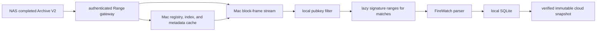

# FireWatch local archive indexing

Status: **developer handoff**. The Blockzilla read SDK and archive gateway cover
completed, immutable Archive V2 generations. The FireWatch adapter, its durable
checkpoint, and active-epoch recovery are not implemented in this repository.

## Outcome

Use the NAS as a read-only Archive V2 origin and do all FireWatch work on the
Mac. This adds read pressure to the NAS, but no FireWatch CPU work, database
writes, or cloud credentials there.



The gateway never serves an active or incomplete epoch. Near-head recovery
continues to use the live Hivezilla/Blockzilla lane until Blockzilla can publish
smaller committed generations.

## Components and trust boundary

- [`blockzilla-read-sdk`](../../crates/blockzilla-read-sdk/README.md) parses and
  validates generation manifests, indexes, registries, metadata, compact block
  frames, filters, and signature ranges.
- [`blockzilla-archive-gateway`](../../services/blockzilla-archive-gateway/README.md)
  exposes only files named by a completed generation manifest. It performs no
  block decoding and opens no archive file for writing.
- The Mac owns its filter snapshot, decoding, FireWatch parsing, SQLite writes,
  checkpoints, and cloud upload.
- The NAS owns the immutable archive. It must not receive FireWatch database or
  cloud-write credentials.

Use TLS and bearer authentication outside local development. Never put the
bearer token in source, documentation, URLs, logs, or command output.
After publishing the manifest, expose the generation through a frozen snapshot
or read-only bind mount. The gateway checks identities and sizes at startup; it
does not continuously re-hash files or make a writable directory immutable.

## Generation contract

The completion marker is `archive-v2-generation.json`:

```json
{
  "schema_version": 1,
  "cluster_id": "mainnet-beta",
  "epoch": 999,
  "generation_id": "epoch-999-final",
  "generation_digest": "<64 lowercase SHA-256 hex characters>",
  "slots_per_epoch": 432000,
  "complete": true,
  "files": [
    {
      "name": "archive-v2-blocks.zstd",
      "size": 123,
      "sha256": "<64 lowercase SHA-256 hex characters>"
    }
  ]
}
```

The required files are:

- `archive-v2-blocks.zstd`
- `archive-v2-blocks.index`
- `archive-v2-meta.wincode`
- `registry.bin`

`signatures.bin` is optional for a generic reader but **required for
FireWatch**. FireWatch must reject the generation during preflight when it is
absent; a slot number or transaction index is not a substitute for a Solana
transaction signature.

The manifest is published last, after the offline generator validates the
archive's index/metadata/signature structure and hashes every allowlisted file.
Individual zstd frames are decoded and structurally checked by the reader
during the epoch pass. Consumers pin `generation_digest`, not just the epoch
number. See the gateway README for the canonical digest preimage and
manifest-generation command.

## Gateway API

```text
GET|HEAD /healthz
GET|HEAD /v1/catalog
GET|HEAD /v1/epochs/{epoch}/manifest
GET|HEAD /v1/epochs/{epoch}/files/{name}
```

File responses support a single bounded range:

```http
Authorization: Bearer <token>
Range: bytes=<start>-<inclusive-end>
```

The client must require `206 Partial Content`, an exact `Content-Range`, and the
requested byte count. Redirects are rejected so credentials cannot cross an
origin.

## Mac processing flow

### 1. Pin and cache control files

1. Select a completed epoch from the catalog.
2. Fetch and validate its manifest, then save `archive-v2-generation.json` in
   the local cache.
3. Create a staging directory named by `generation_digest`.
4. Download `registry.bin`, `archive-v2-blocks.index`, and
   `archive-v2-meta.wincode`.
5. Verify the exact size and SHA-256 of each cached file.
6. Atomically rename staging into the local generation cache.

Enable the SDK's optional `http` feature. Use its overlay source with the
verified local cache as primary and the authenticated gateway as fallback.
Open it with `HashVerification::ControlFiles`; the default `AllFiles` policy is
for a fully local audit and deliberately reads every blocks/signatures byte.
Block frames and matching signature ranges then remain remote while the
manifest and small control files are local. Compare the locally parsed
generation digest with the checkpoint before opening the overlay.

The manifest hashes describe the full immutable files. Cached files can be
verified immediately. A sequential pass can compute the full block-file digest
as it reads every frame. Sparse reads from `signatures.bin` cannot independently
prove its full-file digest, so they rely on TLS, the authenticated read-only
gateway, and the gateway's publication-time validation. Do not describe sparse
range reads as end-to-end full-file verification.

### 2. Freeze the FireWatch filter

Build one sorted pubkey snapshot before starting. It must include everything
used by FireWatch live ingestion:

- loaders and curated program IDs;
- treasuries and IDL metadata accounts;
- the Solana Pay recipient;
- active wallet subscriptions;
- program IDs referenced by active IDL alert rules.

Persist a digest of the sorted snapshot. Resolve each pubkey to the epoch's
one-based registry ID. Registry IDs are valid only with the pinned generation
and registry hash; never reuse them across epochs.

### 3. Stream and filter compact blocks

Read hot-index rows in ascending slot order. Coalesce adjacent block ranges to
avoid one HTTP request per block, while keeping memory bounded. Each range in
`archive-v2-blocks.zstd` contains independent zstd frames, so frames can be
decompressed and released one block at a time.

For every frame, validate at least:

- compressed and uncompressed bounds;
- decoded slot against the index row;
- block and transaction ordering;
- transaction count and per-row message/metadata ranges;
- signature ordinals and counts against the index.

Account matching examines static message keys plus metadata-loaded writable and
readonly keys. It also compares `CompactPubkey::Raw` values directly. Filtering
has three results:

- `Match`: a watched key is definitely present;
- `NoMatch`: safely skip it;
- `Indeterminate`: raw transaction fallback, unresolved registry data, or
  unavailable V0 loaded addresses prevents a safe filter answer.

Never turn `Indeterminate` into `NoMatch`. The first FireWatch integration
should stop and report the slot so it cannot silently omit an event. A future
adapter can route that transaction through a lossless fallback decoder.

`Match` describes account filtering only. It can still carry absent or raw
fallback transaction metadata. FireWatch requires decoded metadata to reproduce
live failed-transaction filtering, logs, balances, and inner instructions; stop
or use a lossless fallback when a matched transaction is not parser-ready.

Only after `Match`, calculate the transaction's signature ordinal:

```text
block.first_signature_ordinal
  + sum(signature_count of preceding transaction rows)
```

Fetch only `signature_count * 64` bytes from `signatures.bin`. The first
64-byte signature, base58 encoded, is the FireWatch transaction identity.

### 4. Adapt a matched transaction to FireWatch

Map compact data into FireWatch's `ResolvedTransaction`:

| FireWatch field | Archive V2 source |
| --- | --- |
| `signature` | first 64-byte transaction signature, base58 encoded |
| `primary_signer` | first static key when required-signature count is nonzero |
| `account_keys` | static, then loaded writable, then loaded readonly keys |
| top-level instructions | hot message instructions, restoring canonical instruction bytes |
| inner instructions | `CompactMetaV1.inner_instructions` |
| token balances | compact pre/post balances with registry-resolved pubkeys |
| log messages | rendered `CompactLogStream` |
| ingestion `slot`, `block_time` arguments | hot-block header |

FireWatch does not currently need blockhash registry sidecars. It does need the
signature for event identity, deduplication, and links.

Match the existing live subscription semantics: exclude failed and vote
transactions. Classify votes before reconstructing instruction bytes. The
`HAS_COMPACT_VOTE_IX` row flag is useful but is not, by itself, a proven
replacement for Yellowstone's vote classification. Compact vote variants also
need vote-hash sidecar data to reconstruct canonical bytes; either skip those
transactions first or publish and consume the required vote-hash/access
sidecar. Run historical parser calls with deliveries and live metric evaluation
disabled:

```text
enqueue_deliveries = false
evaluate_metric_alerts = false
```

This prevents a historical rebuild from emitting Telegram alerts or treating
old observations as new live thresholds.

## Checkpoint and restart contract

Do not reuse FireWatch's current bare `last_processed_slot`. Store a dedicated
archive checkpoint containing at least:

```text
consumer_id
cluster_id
epoch
generation_id
generation_digest
filter_digest
parser_revision
last_completed_block_id
last_completed_slot
```

Advance it only after every matching transaction in the block is durable. The
ideal implementation writes block effects and the checkpoint in one SQLite
transaction. Until FireWatch exposes that transaction boundary, restart from
the whole incomplete block and depend on its stable signature-based event IDs
for idempotency.

A generation, cluster, filter, projection, or parser revision mismatch requires
an explicit new run. Resume inclusively and deduplicate. Corruption, a missing
signature, or a non-sequential archive `block_id` stops the run rather than
skipping forward. Solana slot gaps are normal; proving that an expected
canonical block is missing needs explicit availability or skipped-slot data,
not a `slot + 1` assumption.

## SQLite snapshot and cloud cutover

After the epoch is complete and its final checkpoint is durable, create a
consistent snapshot rather than copying a live SQLite file:

```sh
sqlite3 indexer.db ".backup 'indexer-snapshot.db'"
sqlite3 indexer-snapshot.db "PRAGMA quick_check;"
zstd -T0 -19 indexer-snapshot.db
shasum -a 256 indexer-snapshot.db.zst
```

Upload under an immutable generation/timestamp key, then publish its checksum
manifest last. If FireWatch uses an external blob directory, upload every blob
referenced by the database before publishing the database snapshot.

Do not overwrite a running cloud SQLite file. Restore to a new path or volume,
verify the checksum, decompress, run `PRAGMA quick_check`, apply migrations,
catch up with an inclusive overlap, stop the old writer, switch atomically, and
retain the previous database for rollback.

## FireWatch implementation references

These paths are in the separate `ferno-watcher` repository and were inspected
read-only for this handoff:

| Responsibility | Existing FireWatch code |
| --- | --- |
| transaction model and parser | `backend/src/solana.rs:123`, `backend/src/solana.rs:843` |
| live dynamic account filter | `backend/src/solana.rs:590` |
| signature extraction and event ID | `backend/src/solana.rs:771`, `backend/src/solana.rs:1453` |
| current slot state, unsuitable as archive checkpoint | `backend/src/solana.rs:385`, `backend/src/solana.rs:530` |
| existing protobuf historical adapter | `backend/src/block_backfill.rs:912` |
| current historical account filter | `backend/src/block_backfill.rs:1162` |
| SQLite connection and app-state checkpoint | `backend/src/database.rs:410`, `backend/src/database.rs:7668` |
| idempotent event insertion | `backend/src/database.rs:1951` |

Useful Blockzilla decoding references are the
[hot-block format](../reference/archive-v2-hot-block-format.md), the validated
index reader in `crates/blockzilla-format/src/v2/archive.rs`, and the existing
message/metadata rendering path in
`services/blockzilla-get-block/src/worker.rs`.

## Acceptance gate

Before using the resulting database, test all of the following:

- missing `signatures.bin` rejects a FireWatch run;
- multi-signature ordinals select the correct first signature;
- static and address-table-loaded pubkeys both match;
- raw transaction fallback and unavailable V0 loaded-address data produce
  `Indeterminate`, never a false negative;
- a matched transaction with absent/raw metadata is rejected as not
  parser-ready;
- failed and vote transactions are skipped;
- compact instructions and logs reproduce parser-compatible bytes and strings;
- protobuf and compact ingestion produce identical FireWatch event IDs for a
  shared fixture;
- termination midway through a block and restart produce no duplicate events;
- changed generation, registry, filter, or parser digests refuse silent resume;
- corrupt sizes, hashes, frames, rows, slots, or counts stop processing;
- an incomplete epoch never appears as consumable;
- final SQLite `PRAGMA quick_check` succeeds and the cloud checksum matches.
