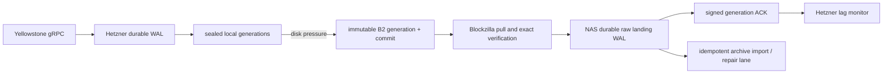

# Live gRPC backup synchronization

Date: 2026-07-14

## Decision

Use Backblaze B2 as an outbound-only durable mailbox between the Hetzner
recorder and the Blockzilla NAS. Hetzner always records to local disk first. In
the current interim deployment it retains sealed generations locally and uses
B2 only as a pressure spill; a future Blockzilla puller will accept only
immutable committed generations and publish a signed durable receipt for the
exact generation it accepted.

The proposed 500 MB memory-first window is **not implemented**. Memory may later
cache recent metadata and payloads, but today every block remains protected by
the existing per-record WAL sync before any cursor advances. There is not yet a
signed Blockzilla durable ACK that can authorize forgetting a memory-only slot;
waiting for a missed ping before the first disk write would lose the critical
pre-failure window if the recorder itself crashed.

This topology needs no public listener on Hetzner or the NAS. Both sides make
outbound HTTPS requests to B2. A later direct mTLS link may reduce latency. B2
is the catch-up source for generations that have actually been committed there;
newer local-only generations remain authoritative on Hetzner until pressure
spills them or a future signed handoff acknowledges them.

## Current behavior

The deployed recorder fsyncs each raw gRPC block and seals bounded local
generations without closing the Yellowstone subscription at a routine byte
rotation. The cap-crossing block is retained across the in-process cutover and
written into the successor before another stream update is polled. With healthy
disk headroom, sealed generations remain local and B2 is not in the publication
path. When free space falls below the larger of 25%
of filesystem capacity or `MIN_FREE + MAX_GENERATION`, it uploads the oldest
sealed generation first, publishes `manifest.json` and `_COMMITTED`, and writes
a chained local receipt. It drains without an artificial retry delay until free
space reaches the larger of 35% or `MIN_FREE + 2*MAX_GENERATION`.

Pressure publication verifies each single-PUT object using the signed request
SHA-256, Backblaze's returned version ID and content ETag, then prefix-scoped
Native `b2_list_file_versions` metadata for the exact account, bucket, key,
file ID, length, MD5, SHA-1, and SHA-256. It deliberately issues no S3 HEAD or
GET for a new generation. Full payload hashing still happens when Blockzilla or
an operator restores the exact versions. Only after the exact remote commit and
local receipt verify does the recorder remove that sealed local copy. B2 has no
automatic lifecycle deletion.

Blockzilla does not currently pull or acknowledge those generations. Therefore
today's local removal means only “B2 accepted an exact version-pinned copy whose
remote metadata and ETag were verified,” not “Blockzilla processed this
generation.”

## Three independent watermarks

Track these separately for each `(cluster_id, origin_node_id, journal_id)`:

1. `captured`: exact observations are durable in the Hetzner WAL.
2. `b2_committed`: the immutable B2 generation and predecessor chain were
   accepted under exact version IDs and their remote metadata/ETags verified.
3. `blockzilla_raw_durable`: Blockzilla has downloaded, verified, atomically
   installed, and fsynced that exact generation.
4. `blockzilla_archive_committed`: every observation is committed to the
   canonical archive or durably retained in its conflict/repair lane.

The UI may render the last slot for each watermark, but a scalar “through slot
X” is status, not deletion authority. Solana slots may be skipped or forked and
adjacent recorder generations intentionally share one copied tail record. The
authoritative cursor is the committed manifest hash and generation chain.

## Rolling generation policy

Keep the existing byte-bounded generation and add low-latency rotation at the
first of:

- 100 newly durable block observations;
- 60 seconds after the first new observation in the generation;
- 384 MiB of logical generation data.

The successor still begins with the exact verified tail record from its
predecessor. A tail-only successor is never sealed until at least one new block
arrives. Slot count is not a memory or disk bound, so byte limits remain
mandatory.

At the measured 5–6 GiB/hour, 100 produced slots are roughly 55–70 MiB and about
40 seconds, although large blocks can make either estimate wrong. This cadence
creates more objects and verification work than the current 384 MiB cadence;
the byte and time caps remain configurable so it can be tuned from live data.

## B2 commit and discovery

Each generation remains immutable beneath its stream prefix. The existing
manifest must continue to bind every object's key, exact B2 version ID, length,
and SHA-256. Add a coverage section that also binds:

- stable stream identity and monotonic generation sequence;
- predecessor manifest SHA-256;
- observation sequence range and record count;
- first and last `(slot, blockhash, protobuf_sha256)`;
- copied-tail identity;
- creation and commit timestamps.

`_COMMITTED` remains the only publication boundary. A small mutable `head.json`
may point at the latest commit for efficient discovery, but it is never proof:
the consumer must verify the immutable commit, exact manifest version, and full
predecessor chain.

## Blockzilla pull transaction

For exactly the next generation in its durable chain, the NAS puller:

1. pins and downloads the exact `_COMMITTED` version;
2. verifies the commit payload and its manifest SHA-256/version ID;
3. validates all object keys as safe relative paths and rejects duplicate paths,
   keys, version IDs, or inconsistent counts;
4. streams each exact object version into a private staging directory while
   recomputing its hash and enforcing its declared size;
5. fsyncs every file and staging directory;
6. runs the Rust raw-WAL audit and complete-PoH verification;
7. requires the copied first record to match the prior generation's exact tail;
8. atomically renames the generation into the NAS raw landing area and fsyncs
   its parent directory;
9. appends and fsyncs a local generation receipt;
10. only then publishes a signed ACK to B2.

The first production ACK should mean “exact raw generation is durable on the
NAS.” The current archive writer is not yet crash-idempotent across all of its
sidecars, so canonical import gets a separate watermark and receipt. Duplicate
pulls and lost replies are harmless because the manifest hash is the idempotency
key.

## Signed ACK

An ACK binds at least:

- protocol version, cluster, stream identity, and generation sequence;
- generation ID, manifest SHA-256/version ID, and commit SHA-256/version ID;
- predecessor manifest SHA-256;
- first/last observation sequence, first/last slot, record count, and exact tail
  identity;
- Blockzilla primary ID and monotonically fenced primary term;
- durable landing LSN and disposition;
- signing key ID, creation time, and Ed25519 signature.

B2 credentials authenticate object access but are not deletion proof. The
receipt private key exists only on Blockzilla; Hetzner stores trusted public
keys and accepts old plus new keys during rotation. A plain ping, generic
`/healthz`, unsigned slot number, wrong primary term, digest mismatch, partial
generation, or rejected record never advances the durable watermark.

The existing `ReplicationOffer`, `PrimaryReceipt`, exact content identity, raw
spool, and receipt-WAL primitives in `crates/live-producer/src/ingest/` provide
the record-level foundation. The B2 transport needs a generation-level envelope
that binds that evidence to the immutable manifest.

## Local and remote retention

Backblaze objects remain indefinite under the current policy. Neither a
Blockzilla ACK nor cache cleanup deletes B2 objects or hidden versions. A 10 GB
account cap therefore limits how much pressure spill can be accepted; it is not
indefinite capacity.

The exact 3 GiB Hetzner cache cannot require a Blockzilla ACK for every local
eviction while also promising continuous capture: at the current rate it fills
in roughly 25–30 minutes. The deployed interim policy is:

- normally retain all sealed generations locally while free space remains at or
  above the spill-start watermark;
- under cache pressure, upload and evict only the oldest whole generation after
  a fully verified B2 commit and durable local B2 receipt;
- stop spilling once the recovery watermark is restored;
- Blockzilla can later catch up from each committed B2 copy once its puller is
  implemented;
- if B2 itself is unavailable, never evict the unverified local generation and
  pause capture at the hard disk floor.

The later 500 MB memory window, sync-event promotion to disk, and signed
Blockzilla ACK deletion watermark still require an authenticated protocol and
crash-safety design. They are not active configuration knobs in this recorder.
If strict “local delete only after Blockzilla ACK” is selected later, the
documented consequence is that capture must pause when all durable tiers fill.

## Monitoring and Telegram incidents

Monitor progress, not just process liveness:

- `primary_ping_stale`: no recent valid signed Blockzilla status object;
- `primary_sync_stale`: B2 committed head advanced but the raw-durable ACK did
  not advance for 180 seconds;
- `primary_sync_lag`: raw-durable ACK is more than 500 slots, two generations,
  or a configured byte budget behind the B2 head;
- `primary_receipt_invalid`: bad signature, key, term, identity, chain, or
  digest;
- `primary_catchup`: Blockzilla switched from the hot path to older B2 data;
- recovery only after the corresponding signed watermark advances.

A healthy ping never clears a sync-lag incident. When B2 has no newer committed
generation, an unchanged ACK is normal rather than stale.

The existing Yellowstone `grpc_stale` incident remains separate: it reports
that the Hetzner recorder itself stopped durably receiving blocks.

Telegram sends one opening per active incident, one message if its severity
escalates, and one recovery. It does not send periodic reminders. Incident
state lives on the recorder volume, so a container rebuild cannot resend every
open problem. The 15-minute setting is a reopen debounce: a quick
fail/recover/fail flap stays silent unless it remains open beyond the debounce.
Only a pressure-triggered upload failure and the resulting hard-floor pressure
are reported as one `Backup pipeline blocked` incident with human-readable
capacity, current capture state, impact, and cap-specific action. A healthy
sealed local backlog is intentional and silent. A second strictly validated
resume-gap event is coalesced into its already-delivered incident instead of
generating another message or blocking capture. A malformed event or a failed
send remains pending and is never silently marked delivered.

If the provider has already discarded the requested replay slot, recovery is
explicit rather than silent. The recorder accepts only a typed gRPC
`OutOfRange` response whose exact requested slot matches the subscription and
whose advertised available slot is strictly newer. Before resubscribing, the
supervisor fsyncs an immutable gap record inside the active generation and a
validated resume-floor marker under `monitoring/`. It then resumes the same
generation at that floor, retaining the old durable tail as the coverage anchor.
Because the provider's oldest replayable slot can move during a new TLS/gRPC
handshake, the selected resume slot defaults to 100 slots above the advertised
floor. Schema-2 evidence records the provider-confirmed unavailable interval and
this deliberate reconnect cushion as separate ranges; the cushion is never
misreported as provider data loss. The headroom is configurable with
`BLOCKZILLA_RAW_REPLAY_RESUME_HEADROOM_SLOTS`.
The first later block therefore records the exact uncovered interval and raises
a Telegram incident. A normal ping, restart, or later successful append never
rewrites that interval as synchronized; the gap record is included when the
generation is committed to B2.

## Failure behavior

| Failure | Required result |
| --- | --- |
| Blockzilla offline | Today the independent Hetzner recorder continues locally and spills only under disk pressure. Signed ACK lag detection and Blockzilla catch-up are not implemented yet. |
| B2 offline | No unverified local deletion; the 3 GiB recorder pauses safely at its floor and alerts. |
| Lost ACK response | Blockzilla republishes the same idempotent signed receipt; no cursor jumps. |
| Crash before NAS fsync | No ACK is published. Staging is recovered or removed on restart. |
| Crash after NAS fsync but before ACK | The local receipt is replayed and the same ACK is republished. |
| Digest, fork, or tail conflict | Generation is quarantined durably; the normal ACK chain stops and alerts. |
| Provider replay window expired | Preserve the durable tail, commit immutable provider-floor and reconnect-policy evidence, alert, and resume only from the selected slot after the validated provider floor. Never report the uncovered interval as synchronized. |
| Hetzner replacement | Resume only from an externally preserved signed chain checkpoint and stable stream identity; never infer continuity from a slot number. |

## Implementation sequence

1. Keep the deployed disk-first pressure spill, exact B2 verification, and
   account-wide capacity alerts. This preserves today's live backup without
   treating a healthy sealed backlog as an incident.
2. Add generation sequence/coverage metadata plus 100-record/60-second rotation.
3. Add exact-version B2 download, staging, verification, and durable raw landing
   on the NAS. Do not emit canonical-archive ACKs yet.
4. Add concrete Ed25519 signing/verification, generation receipts, signed status
   objects, and Telegram lag/invalid-receipt alerts.
5. Add idempotent replay into the canonical archive and conflict lane, then
   expose the separate archive-committed watermark in Hivezilla.
6. Run disconnect, lost-ACK, expired-key, fork, corrupted-object, disk-full,
   `kill -9`, and power-loss tests before any ACK affects retention policy.

Only after those ACK and crash tests should a bounded 500 MB memory cache be
considered as a latency optimization; it must never be presented as durable
backup before a signed Blockzilla receipt or local WAL fsync exists.
