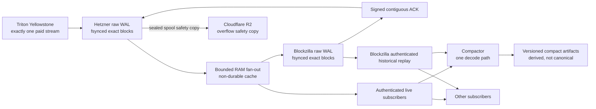

# Single-source live gRPC gateway

Date: 2026-07-15

## Decision

Hetzner is the only process allowed to hold the paid Triton Yellowstone token.
Every accepted full-block envelope is appended and fsynced to the Hetzner raw
WAL before it enters the bounded in-memory fan-out ring. RAM is a delivery cache,
never a durability tier. Blockzilla stores the same exact raw stream durably and
returns a signed contiguous ACK. Only that ACK can authorize removal of a
durable local or R2 copy. Cloudflare R2 is an overflow safety copy for sealed
spools, not an acknowledgement and not the normal subscriber replay service.
Blockzilla is the target historical replay authority for every other subscriber.

No downstream consumer may silently fall back to Triton. A second upstream is
failover, not load balancing, and requires an exclusive fenced lease.

## Why

The Triton export for 2026-07-01 through 2026-07-15 attributes $389.76 of
$407.80 (95.6%) to gRPC bandwidth. The JSON-RPC `getBlock` backfill appears as
Block Cache and cost $17.42 (4.3%). July 15 alone delivered 834,045 MB of gRPC
data through only nine gRPC requests, which is sustained full-stream or replay
traffic rather than an RPC backfill. This matches [Triton's published
bandwidth price](https://www.triton.one/pricing) of $0.08/GB.

Every current full consumer requests all confirmed blocks with transactions and
entries. NAS capture, NAS raw safety capture, Hetzner capture, and manual bridges
therefore multiply paid bandwidth. A single upstream plus local fan-out removes
that multiplication.

## Non-negotiable invariants

1. Only one active Triton full-block subscription exists account-wide.
2. Every accepted block and its handoff row are fsynced on Hetzner before live
   publication. Evicting the RAM ring never removes the durable WAL copy.
3. Blockzilla ACKs a monotonic delivery sequence and rolling content-digest
   chain only after its exact raw WAL and cursor are fsynced. A slot number,
   Ping, or health response is not an acknowledgement.
4. A slow consumer is disconnected with an explicit retryable cursor error. It
   is never allowed to miss data silently.
5. The relay supports only full block filters needed by Blockzilla. Account,
   transaction, slot, deshred, and arbitrary filter subscriptions are rejected.
6. All downstream connections are TLS-protected and authenticated. Tokens are
   loaded from files and never logged.
7. The local cache is the first durability tier. If its hard disk floor is
   reached before Blockzilla ACK permits cleanup, capture pauses. Copying a
   generation to R2 does not by itself authorize local eviction.
8. R2 keys are immutable. `manifest.json` is published after payloads and
   `_COMMITTED` is published last.
9. Local and R2 durable objects become deletable only after Blockzilla has
   published a valid signed durable ACK covering their exact observation/digest
   chain. RAM fan-out entries may be evicted because the WAL already owns the
   durable copy. R2 deletes a whole verified generation, `_COMMITTED` first;
   bucket-wide, prefix-free, or unsigned slot-based deletion is forbidden.
10. Authentication, exhausted credit, and invalid replay-floor failures open
    one action-required incident and enter long backoff; they do not hot-loop.

## WAL-first publication order

For every accepted upstream block:

1. validate the protobuf block and complete PoH requirements;
2. encode and compress the exact `SubscribeUpdate`;
3. append and sync the raw WAL record;
4. append and sync the handoff journal row;
5. publish the durable observation to the in-process fan-out hub;
6. update health/progress state.

Publishing with no connected relay consumer is valid and recording continues.
If the relay itself cannot accept the durable publication, recording stops
rather than create an unserved cursor. If a consumer lags beyond the bounded
live ring, the relay closes that subscription
with the last delivered durable cursor and the earliest cursor still available.
The current relay returns explicit `OutOfRange`; the target client reconnects to
Blockzilla's historical service instead of opening another Triton stream.

The bounded ring can discard its oldest entry at any time because that entry is
already recoverable from the raw WAL. Blockzilla ACK state is deliberately not
coupled to RAM lifetime. ACK controls durable retention only.

## Downstream subscription contract

The first production interface is the exact Yellowstone full-block envelope,
not the current compact archive representation. That lets existing consumers
change only their endpoint and credential, preserves all fields required to
rebuild future formats, and avoids making an epoch-finalized registry layout a
live protocol. The compactor is one relay consumer. A later `compact-v1`
interface may serve products that need a stable subset, but it is explicitly a
versioned derivative and can always be rebuilt from the raw WAL/R2 record.

The first request must contain exactly one or more block filters whose payload
shape is compatible with the recorded stream:

- transactions included;
- accounts excluded;
- entries included;
- confirmed commitment;
- optional `from_slot`.

The server rewrites response filter labels for each subscriber. Subsequent ping
messages are answered without advancing the durable-data idle timer. Changing
filters on an established stream is rejected; the client reconnects instead.

The initial snapshot and live handoff are race-free: the subscriber registers
for live publications before taking a ring snapshot, records the snapshot
watermark, emits snapshot rows through that watermark, then ignores duplicate
live rows at or below it.

## R2 layout and 1 TB safety budget

The dedicated namespace is:

`live-grpc-backup/v1/<cluster>/<origin>/slot-<20-digit-slot>/`

The existing `blockzilla` bucket contains unrelated data. This recorder uses the
dedicated `blockzilla-live-grpc` bucket and its validated receipt chain. R2 is
not the normal subscriber replay archive and an R2 upload is not proof that
Blockzilla consumed a spool. It is a safety copy used when local retention grows
or Blockzilla is unavailable.

Initial thresholds:

- warning: 800 GB;
- critical: 950 GB;
- recovery target after ACK-driven cleanup: 900 GB;
- hard safety budget: 1 TB;
- keep at least two newest generations and a minimum age window regardless of
  byte pressure.

Byte pressure never authorizes deletion by itself. The authoritative sync
watermark is the newest contiguous, signed Blockzilla generation ACK bound to
the exact R2 manifest/commit and predecessor chain. A heartbeat, `/healthz`, an
unsigned slot, or a verified R2 upload receipt is telemetry/evidence only. At
950 GB without enough ACKed generations to recover space, capture pauses and
opens one clear alert; it never evicts unacknowledged data to satisfy the byte
target.

Both local eviction and remote pruning remain locked until the signed ACK
producer, verifier, durable ACK journal, and whole-generation audit are
implemented. The existing remote planner remains dry-run only. The eventual
apply order is oldest acknowledged spool first: `_COMMITTED`, manifest, then
payloads, followed by a synced completion receipt. An interrupted prune must
resume idempotently and can never make a partial old generation look committed.

## Current and target status

Current:

- every accepted block is WAL-fsynced before relay publication;
- the authenticated bounded live relay is implemented;
- sealed generations can be copied and verified in the dedicated R2 bucket;
- Blockzilla's bounded mTLS raw receiver and signed cumulative ACK producer are
  implemented and locally tested, including crash recovery, persistent stream
  limits, cancellation-safe admission, and disk-first durability ordering;
- the Hetzner replication sender, its durable verified-ACK journal integration,
  Blockzilla historical reader, and production deployment are not complete;
- therefore local and remote durable-copy deletion must remain disabled.

Target:

- Blockzilla fsyncs the exact raw payload and cursor before signing a cumulative
  sequence/digest-chain ACK;
- Hetzner fsyncs that ACK locally before a whole generation becomes GC-eligible;
- local and R2 cleanup remove only fully acknowledged generations, oldest first;
- other subscribers use Hetzner for the live tail and Blockzilla for historical
  replay; they never open another paid Triton stream.

## Failover

Hetzner is the normal upstream owner. A standby may connect to Triton only after
an exclusive lease with a monotonically increasing fencing term has expired and
been acquired. A simple process check, Telegram ping, DNS record, or R2 object
age is not sufficient ownership proof.

Until the fenced lease exists, failover is manual:

1. confirm the Hetzner upstream is stopped;
2. record the last committed durable cursor;
3. start exactly one standby from the bounded overlap cursor;
4. verify the overlap blockhash and PoH;
5. repoint downstream clients;
6. alert once that failover is active.

## Rollout gate

Do not top up Triton until all of these pass:

1. one upstream block appears once in two simultaneous downstream clients;
2. reconnect from a recent `from_slot` produces an exact overlap and no gap;
3. an old subscriber cursor replays from Blockzilla; R2 restore can repopulate
   Blockzilla after a primary outage;
4. a lagged client is disconnected without affecting the recorder or peers;
5. wrong/missing downstream credentials fail without leaking token material;
6. R2 collision, outage, and 1 TB dry-run retention tests fail closed;
7. only the Hetzner service has the Triton token mounted;
8. NAS legacy, NAS raw shadow, Mac bridge, and direct consumer subscriptions are
   disabled;
9. gRPC response compression is observed and its billing effect is measured;
10. Telegram reports one concise action-required incident for exhausted credit;
11. without a valid signed Blockzilla ACK, neither a local generation nor an R2
    generation can be deleted in failure-injection tests.
