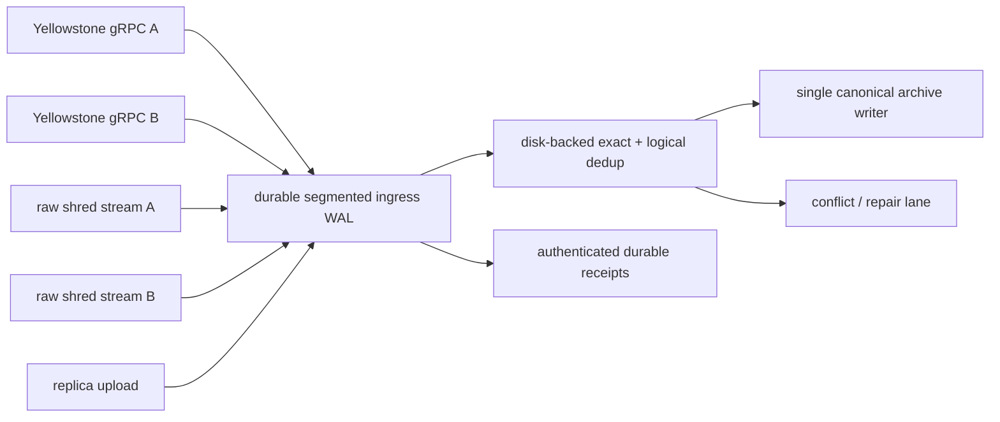

# Redundant live ingest and replica protocol

Date: 2026-07-13

## Decision

Keep ingestion in `blockzilla-live-producer` as a separately deployable durable service. Hivezilla
observes it, schedules repair/finalization, and exposes status through its API, but it must not own
the long-lived gRPC/shred sockets.

All sources feed one raw durable spool, one deterministic dedup/merge stage, and one canonical
archive writer:



Do not run several instances of the current `capture-grpc` writer against one archive. It assigns
dense block ids and appends every sidecar directly, so replay or concurrent feeds would duplicate
blocks, signatures, and pubkey counts.

## Non-negotiable invariants

1. An upstream cursor or replica record is acknowledged only after the raw event is in the local
   WAL and `fdatasync`/`sync_data` has succeeded.
2. Transports are at-least-once. Canonical archive effects are idempotent and exactly once through
   durable identities and replay.
3. Deduplication never uses only a slot. Fork candidates and conflicting shreds are retained.
4. Payload queues are bounded by bytes, not merely record count. Overflow spills to disk; it is
   never silently evicted.
5. One writer owns canonical order and dense block ids. All derived sidecars are rebuildable from
   the WAL or protected by a committed offset manifest.
6. A replica deletes local data only after it has persisted and synced an authenticated primary
   receipt for the exact observation and content digest.
7. A stream EOF, timeout, or first provider crossing an epoch boundary is not proof that an epoch
   is complete.

## Identities and deduplication

Three identities solve different problems:

- `ObservationId = (origin_node_id, journal_uuid, sequence)` detects transport replay and illegal
  sequence reuse.
- `ContentDigest = hash(domain, chain_id, event_kind, canonical_payload)` shares exact bytes across
  sources and replicas.
- `LogicalKey` groups candidates:
  - block: `(slot, blockhash)`
  - entry: `(slot, entry_index, entry_hash)`
  - shred: `(slot, data_or_coding, shred_index, fec_set_index)`

The chain/genesis identity scopes every journal and index even if it is stored once in a segment
header rather than repeated per record.

Dedup dispositions are deliberately explicit:

- exact same observation and digest: replay;
- new observation, existing logical key and digest: exact duplicate, merge provenance;
- existing logical key, different digest: conflicting payload, retain both;
- same block slot, different blockhash: fork candidate, retain both until canonical selection;
- same observation id with different digest: identity violation, quarantine;
- same digest resolving to a different logical key: corrupt input or digest-domain bug, quarantine.

Source rank is a last deterministic tie-breaker after commitment and completeness. It must never
silently overwrite a conflicting finalized candidate.

## WAL and bounded-memory model

Use append-only segments, initially 256 MiB by default:

```text
spool/<source-id>/<journal-uuid>/segment-000000.wal
spool/<source-id>/<journal-uuid>/segment-000001.wal
spool/replication/receipts.wal
index/dedup/
quarantine/
```

Each record frame needs magic/version, bounded lengths, observation id, logical key, payload
length, digest, payload, checksum, and an end/commit marker. Recovery truncates an incomplete tail;
interior corruption is quarantined and alerted.

Keep payload bytes in segments. A disk-backed index stores only observation/content/logical-key
metadata. A recent LRU may accelerate the head but is never authoritative. Keep only active fork
candidates and current reconstruction windows in memory.

Every queue has both `max_events` and `max_bytes`. Replication chunks should normally be no larger
than 1 MiB. A Yellowstone block arrives as one decoded protobuf message, so the effective floor is
one maximum allowed record plus small conversion buffers. Raw UDP shreds need a separate disk quota
and receive/drop counters.

At disk high watermark, pause replayable gRPC streams and replication uploads. At the critical
watermark, stop accepting data where backpressure is possible and alert loudly. UDP cannot provide
an absolute loss guarantee through finite-disk exhaustion or machine failure; redundant receivers
and immediate durable spooling minimize that window.

## Reconnect and epoch closure

Each source owns a durable cursor. Reconnect uses exponential backoff with jitter and resumes
inclusively with a small overlap; dedup absorbs replay. A cursor must never advance from an
in-memory “seen” set.

Close an epoch only when required source watermarks, commitment, replay coverage, and an explicit
gap policy agree. A slow optional source gets a bounded grace period. Late prior-epoch events enter
the repair lane instead of being appended to the next epoch.

PoH entries and shreds remain separate evidence. Yellowstone entries do not imply that raw
shredding metadata is present. A reconstructed shred candidate enriches a gRPC block only after
its final PoH/block hash matches; a mismatch remains a fork/conflict.

## Primary/replica protocol

Use `primary` and `replica` in configuration and APIs. `slave` may be accepted only as a deprecated
configuration alias.

The replica is a complete independent ingester. It writes its own durable WAL, then offers its
oldest unacknowledged observations to the primary. Payload transfer is content-addressed and
chunked, with a negotiated byte window.

```text
replica local WAL durable
  -> offer observation + logical key + digest + length
  -> primary asks for payload or finds an exact durable mapping
  -> bounded payload chunks (when needed)
  -> primary validates, appends complete WAL frame, syncs, updates idempotency index
  -> primary signs exact durable receipt
  -> replica verifies receipt identity/signature
  -> replica appends receipt to local receipt WAL and syncs
  -> only now is that exact record/fully-acked segment GC eligible
```

Deletion-capable receipt dispositions are allow-listed:

- `durably_stored`: raw event and observation metadata are synced on the primary;
- `already_committed`: exact content-to-archive mapping is durable;
- `durably_stored_conflict`: the conflicting variant is synced in quarantine.

Rejected, malformed, merely received, same-slot, unsigned, wrong-cluster, wrong-primary, or
wrong-digest responses never allow deletion. Garbage collection removes only whole segments for
which every record has a durable local receipt.

Lost replies are harmless: the replica resends and the primary returns the same idempotent durable
disposition. Split-brain promotion is out of scope for v1; later promotion requires an externally
fenced monotonically increasing primary term.

## Authentication and key rotation

Use mTLS for connection/node identity and signed durable receipts for deletion authority. Prefer
Ed25519 receipt keys. A TLS session alone is not a persistent proof once the connection closes.

Configuration contains only secret references:

- per-source gRPC token environment variable or `0600` file;
- TLS CA, client/server certificate, and private-key paths;
- receipt signing private-key path on the primary;
- one or more trusted receipt public-key paths on replicas;
- stable cluster id, node id, peer id, and key id.

Never serialize secret values into status/API structures or logs. Rotate by distributing new trust
first, switching the signer only after every replica reports it, and retaining the previous public
key longer than the maximum receipt/spool retention window.

## Implementation sequence

1. Harden single-source intake: durable segmented raw WAL, inclusive reconnect, replay, recovery,
   and a single archive-writer commit boundary.
2. Add local multi-source tasks, per-source credentials/cursors, disk-backed dedup, deterministic
   merge, conflict journal, and byte-budget metrics.
3. Add primary/replica streaming, mTLS, signed receipts, receipt WAL, resend, and segment GC.
4. Add isolated raw UDP shred spooling and classification. Initially reconstruct only complete
   contiguous data-shred sets.
5. Add Reed-Solomon recovery, Merkle/signature validation, and leader-schedule verification in a
   version-pinned reconstructor crate/process rather than bloating the socket capture loop.
6. Run power-loss, `kill -9`, partial-frame, disconnect, lost-ACK, key-rotation, disk-watermark,
   conflicting-provider, and lagging-source fault tests before production cutover.

## Foundation implemented on 2026-07-13

The first code slice now provides:

- validated multi-source primary/replica JSON configuration with global and per-source byte/event
  limits, reconnect policy, secret references, mTLS files, receipt signer/trust-key rotation, and
  redacted summaries;
- domain-separated SHA-256 content identities that bind cluster, logical key, payload format, and
  exact payload bytes;
- bounded dedup-index queries and explicit replay/duplicate/conflict/fork/identity-violation
  decisions;
- a segmented raw spool with per-record sync, header/payload CRC32C, commit markers, incomplete-tail
  recovery, sealed-segment validation, exclusive writer locks, no-follow regular-file opens, and
  fail-stop poisoning after ambiguous I/O errors;
- canonical receipt signing bytes and a checksummed/committed receipt WAL with the same lock,
  recovery, corruption, and no-follow safeguards;
- deletion safety that binds a verified receipt to the exact durable local spool token. It exposes
  only per-record `EligibleAfterSegmentAudit`; no segment unlink API exists yet.

Still required before production cutover: source socket tasks, provider cursor persistence, the
disk-backed dedup implementation, spool quota/free-space enforcement, concrete mTLS/Ed25519 network
transport, sealed-segment ACK manifests/tombstones/GC, canonical archive-writer replay, and the full
power-loss fault matrix. The running NAS capture is therefore not replaced by this slice. The
canonical remaining-work checklist is tracked in
[`TODO.md`](../TODO.md#redundant-live-ingest).
